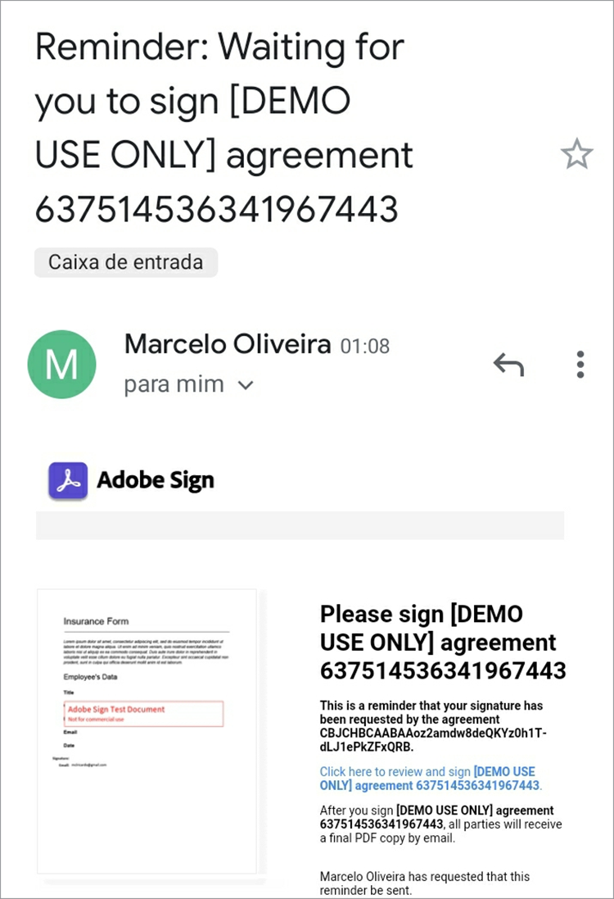

# Aan de slag met de Adobe Sign API

[ Acrobat Sign API ](https://developer.adobe.com/adobesign-api/) is een grote manier om de manier te verbeteren u ondertekende overeenkomsten beheert. Ontwikkelaars kunnen hun systemen eenvoudig integreren met de Sign-API, die een betrouwbare, eenvoudige manier biedt om documenten te uploaden, deze ter ondertekening te verzenden, herinneringen te verzenden en e-handtekeningen te verzamelen.

## Wat je kunt leren

In deze praktische zelfstudie wordt uitgelegd hoe ontwikkelaars Sign API kunnen gebruiken om toepassingen en workflows te verbeteren die zijn gemaakt met [!DNL Adobe Acrobat Services] . [!DNL Acrobat Services] omvat [ de Diensten API van Adobe PDF ](https://developer.adobe.com/document-services/apis/pdf-services), [ Adobe PDF bedt API ](https://developer.adobe.com/document-services/apis/pdf-embed/) (vrij) in, en [ de Generatie API van het Document van de Adobe ](https://developer.adobe.com/document-services/apis/doc-generation).

Leer meer bepaald hoe u de Acrobat Sign API in uw toepassing opneemt om handtekeningen en andere informatie te verzamelen, zoals werknemersinformatie op een verzekeringsformulier. Algemene stappen met vereenvoudigde HTTP-aanvragen en -reacties worden gebruikt. U kunt deze verzoeken in uw favoriete taal implementeren. U kunt een PDF tot stand brengen gebruikend een combinatie [[!DNL Acrobat Services]  APIs ](https://developer.adobe.com/document-services/homepage/), uploadt het aan het Teken API als a [ voorbijgaande ](https://opensource.adobe.com/acrobat-sign/developer_guide/index.html#!adobedocs/adobe-sign/master/overview/terminology.md) document, en verzoek eindgebruikerhandtekeningen gebruikend de overeenkomst of [ widget ](https://opensource.adobe.com/acrobat-sign/developer_guide/index.html#!adobedocs/adobe-sign/master/overview/terminology.md) werkschema.

## Een PDF-document maken

Maak eerst een Microsoft Word-sjabloon en sla deze op als een PDF. U kunt de pijplijn ook automatiseren met de API voor het genereren van documenten om een sjabloon te uploaden dat in Word is gemaakt en vervolgens een PDF-document te genereren. De Generatie API van het document maakt deel uit van [!DNL Acrobat Services], [ vrij voor zes maanden dan betaal-als-u-gaat voor enkel of $0.05 per documenttransactie ](https://developer.adobe.com/document-services/pricing/main).

In dit voorbeeld is de sjabloon slechts een eenvoudig document met een paar ondertekenaarsvelden die u kunt invullen. Geef de velden nu een naam en voeg later de daadwerkelijke velden in deze zelfstudie in.


## Het geldige API-toegangspunt detecteren

Alvorens met Teken API te werken, [ creeer een vrije ontwikkelaarrekening ](https://acrobat.adobe.com/ca/en/sign/developer-form.html) om tot API toegang te hebben, test uw documentuitwisseling en uitvoering, en test de e-maileigenschap.

Adobe verspreidt de Acrobat Sign API over de hele wereld in veel implementaties die ‘shards’ worden genoemd. Elk shard dient de account van een klant, zoals NA1, NA2, NA3, EU1, JP1, AU1, IN1 en andere. De shard-namen komen overeen met geografische locaties. Deze shards vormen de basis-URI (toegangspunten) van de API-eindpunten.

Als u toegang wilt tot de Sign-API, moet u eerst het juiste toegangspunt voor uw account vinden. Dit kan api.na1.adobesign.com, api.na4.adobesign.com, api.eu1.adobesign.com of andere zijn, afhankelijk van uw locatie.

```
  GET /api/rest/v6/baseUris HTTP/1.1
  Host: https://api.adobesign.com
  Authorization: Bearer {YOUR-INTEGRATION-KEY-HERE}
  Accept: application/json

  Response Body (example):

  {
    "apiAccessPoint": "https://api.na4.adobesign.com/", 
    "webAccessPoint": "https://secure.na4.adobesign.com/" 
  }
```

In het bovenstaande voorbeeld is dit een reactie met de waarde als toegangspunt.

>[!IMPORTANT]
>
>In dit geval moeten alle volgende verzoeken die u voor de Sign-API indient, gebruikmaken van dat toegangspunt. Als u een toegangspunt gebruikt dat uw regio niet aanbiedt, krijgt u een fout.

## Een tijdelijk document uploaden

Met Adobe Sign kunt u verschillende stromen maken die documenten voorbereiden voor ondertekening of gegevensverzameling. Ongeacht de stroom van uw toepassing, moet u eerst een document uploaden, dat slechts zeven dagen beschikbaar blijft. De volgende API-aanroepen moeten dan verwijzen naar dit tijdelijke document.

Het document wordt met een verzoek van de POST geüpload naar het eindpunt van `/transientDocuments` . De multipart-aanvraag bestaat uit de bestandsnaam, een bestandsstroom en het MIME-type (media) van het documentbestand. De eindpuntreactie bevat een id die het document identificeert.

Bovendien kan uw toepassing een callback-URL opgeven die door Acrobat Sign wordt gepingeld, zodat de toepassing op de hoogte wordt gesteld wanneer het ondertekeningsproces is voltooid.


```
  POST /api/rest/v6/transientDocuments HTTP/1.1
  Host: {YOUR-API-ACCESS-POINT}
  Authorization: Bearer {YOUR-INTEGRATION-KEY-HERE}
  x-api-user: email:your-api-user@your-domain.com
  Content-Type: multipart/form-data
  File-Name: "Insurance Form.pdf"
  File: "[path]\Insurance Form.pdf"
  Accept: application/json

  Response Body (example):

  {
     "transientDocumentId": "3AAA...BRZuM"
  }
```

## Een webformulier maken

Webformulieren (voorheen ondertekeningswidgets genoemd) zijn gehoste documenten die iedereen die toegang heeft, kan ondertekenen. Voorbeelden van webformulieren zijn aanmeldingsformulieren, afstandsverklaringen en andere documenten die veel mensen online openen en ondertekenen.

Als u een nieuw webformulier wilt maken met de Sign-API, moet u eerst een tijdelijk document uploaden. Het verzoek van de POST aan het `/widgets` eindpunt gebruikt het teruggekeerde `transientDocumentId`.

In dit voorbeeld is het webformulier `ACTIVE` , maar u kunt het maken in een van de volgende drie statussen:

* CONCEPT — het webformulier stapsgewijs samenstellen

* ONTWERPEN — formuliervelden toevoegen of bewerken in het webformulier

* ACTIEF — om het webformulier direct te hosten

De informatie over de deelnemers van het formulier moet ook worden gedefinieerd. De eigenschap `memberInfos` bevat gegevens over de deelnemers, zoals e-mail. Momenteel ondersteunt deze set niet meer dan één lid. Maar omdat de e-mail van de webformulierondertekenaar onbekend is op het moment dat u een webformulier maakt, moet de e-mail leeg blijven, zoals in het volgende voorbeeld. De eigenschap `role` definieert de rol die de leden in `memberInfos` (zoals SIGNER en APPROVER) hebben overgenomen.

```
  POST /api/rest/v6/widgets HTTP/1.1
  Host: {YOUR-API-ACCESS-POINT}
  Authorization: Bearer {YOUR-INTEGRATION-KEY-HERE}
  x-api-user: email:your-api-user@your-domain.com
  Content-Type: application/json

  Request Body:

  {
    "fileInfos": [
      {
      "transientDocumentId": "YOUR-TRANSIENT-DOCUMENT-ID"
      }
     ],
    "name": "Insurance Form",
      "widgetParticipantSetInfo": {
          "memberInfos": [{
              "email": ""
          }],
      "role": "SIGNER"
      },
      "state": "ACTIVE"
  }

  Response Body (example):

  {
     "id": "CBJ...PXoK2o"
  }
```

U kunt een webformulier maken als `DRAFT` of `AUTHORING` en vervolgens de status ervan wijzigen terwijl het formulier door de toepassingspijplijn loopt. Om een staat van de Vorm van het Web te veranderen, verwijs naar het [ PUT /widgets/{widgetId} /state ](https://secure.na4.adobesign.com/public/docs/restapi/v6#!/widgets/updateWidgetState) eindpunt.

## De webformulier-host-URL lezen

De volgende stap bestaat uit het zoeken naar de URL die als host fungeert voor het webformulier. Het /widgets eindpunt wint een lijst van de gegevens van de Vorm van het Web, met inbegrip van ontvangen URL van de Vorm van het Web terug die u aan uw gebruikers door:sturen, om handtekeningen en andere vormgegevens te verzamelen.

Dit eindpunt retourneert een lijst, zodat u de specifieke vorm kunt vinden aan de hand van de id in de `userWidgetList` voordat u de URL ophaalt die als host fungeert voor de webvorm:

```
  GET /api/rest/v6/widgets HTTP/1.1
  Host: {YOUR-API-ACCESS-POINT}
  Authorization: Bearer {YOUR-INTEGRATION-KEY-HERE}
  Accept: application/json

  Response Body:

  {
    "userWidgetList": [
      {
        "id": "CBJCHB...FGf",
        "name": "Insurance Form",
        "groupId": "CBJCHB...W86",
        "javascript": "<script type='text/javascript' ...
        "modifiedDate": "2021-03-13T15:52:41Z",
        "status": "ACTIVE",
        "Url":
        "https://secure.na4.adobesign.com/public/esignWidget?wid=CBFCIB...Rag*",
        "hidden": false
      },
      {
        "id": "CBJCHB...I8_",
        "name": "Insurance Form",
        "groupId": "CBJCHBCAABAAyhgaehdJ9GTzvNRchxQEGH_H1ya0xW86",
        "javascript": "<script type='text/javascript' language='JavaScript'
        src='https://sec
        "modifiedDate": "2021-03-13T02:47:32Z",
        "status": "ACTIVE",
        "Url":
        "https://secure.na4.adobesign.com/public/esignWidget?wid=CBFCIB...AAB",
        "hidden": false
      },
      {
        "id": "CBJCHB...Wmc",
```

## Uw webformulier beheren

Dit formulier is een PDF-document dat gebruikers kunnen invullen. U moet de editor van het formulier echter wel vertellen welke velden gebruikers moeten invullen en waar ze zich in het document bevinden:


In het document hierboven worden de velden nog niet weergegeven. Ze worden toegevoegd tijdens het definiëren van de velden die de informatie van de ondertekenaar en hun grootte en positie verzamelen.

Nu, ga naar het [ lusje van de Vormen van het Web ](https://secure.na4.adobesign.com/public/agreements/#agreement_type=webform) op de &quot;Uw pagina van overeenkomsten&quot;en vind de vorm u creeerde.


Klik **uitgeven** om het document te openen dat pagina uitgeeft. De beschikbare vooraf gedefinieerde velden staan in het rechterdeelvenster.


Met de editor kunt u tekst- en handtekeningvelden slepen en neerzetten. Nadat u alle vereiste velden hebt toegevoegd, kunt u deze vergroten, verkleinen en uitlijnen om het formulier te perfectioneren. Tot slot klik **sparen** om de vorm tot stand te brengen.


## Een webformulier verzenden voor ondertekening

Nadat u het webformulier hebt voltooid, moet u het verzenden, zodat gebruikers het kunnen invullen en ondertekenen. Nadat u het formulier hebt opgeslagen, kunt u de URL en de ingesloten code weergeven en kopiëren.

**Vorm URL van het Web van het Exemplaar**: gebruik dit URL om gebruikers naar een ontvangen versie van deze overeenkomst voor overzicht en handtekening te verzenden. Bijvoorbeeld:

[https://secure.na4.adobesign.com/public/esignWidget?wid=CBFCIBAA3...babw\*](https://secure.na4.adobesign.com/public/esignWidget?wid=CBFCIBAA3AAABLblqZhCndYscuKcDMPiVfQlpaGPb-5D7ebE9NUTQ6x6jK7PIs8HCtTzr3HOx8U6D5qqbabw*)

**de Vorm van het Web van het Exemplaar bedt code** in: voeg de overeenkomst aan uw website toe door deze code te kopiëren en het in uw HTML te kleven.

Bijvoorbeeld:

```
<iframe
src="https://secure.na4.adobesign.com/public/esignWidget?wid=CBFC
...yx8*&hosted=false" width="100%" height="100%" frameborder="0"
style="border: 0;
overflow: hidden; min-height: 500px; min-width: 600px;"></iframe>
```


Wanneer uw gebruikers toegang krijgen tot de gehoste versie van uw formulier, bekijken ze het tijdelijke document dat eerst is geüpload met de velden die op de opgegeven positie staan.


De gebruiker vult vervolgens de velden in en ondertekent het formulier.

 selecteert

Vervolgens ondertekent uw gebruiker het document met een eerder opgeslagen handtekening of met een nieuwe handtekening.


Wanneer de gebruiker **** van toepassing is, instrueert de Adobe hen om hun e-mail te openen en de handtekening te bevestigen. De handtekening blijft in behandeling totdat de bevestiging is ontvangen.


Deze verificatie voegt meervoudige verificatie toe en versterkt de beveiliging van het ondertekeningsproces.


## Voltooide webformulieren lezen

Nu is het tijd om de formuliergegevens op te halen die gebruikers hebben ingevuld. Met het eindpunt van `/widgets/{widgetId}/formData` haalt u de gegevens op die de gebruiker in een interactief formulier heeft ingevoerd bij de ondertekening van het formulier.

```
GET /api/rest/v6/widgets/{widgetId}/formData HTTP/1.1
Host: {YOUR-API-ACCESS-POINT}
Authorization: Bearer {YOUR-INTEGRATION-KEY-HERE}
Accept: text/csv
```

De resulterende CSV-bestandsstroom bevat formuliergegevens.

```
Response Body:
"Agreement
name","completed","email","role","first","last","title","company","agreementId",
"email verified","web form signed/approved"
"Insurance Form","","myemail@email.com","SIGNER","John","Doe","My Job Title","My
Company Name","","","2021-03-07 19:32:59"
```

## Een overeenkomst maken

Als alternatief voor webformulieren kunt u overeenkomsten maken. In de volgende secties vindt u enkele eenvoudige stappen voor het beheren van overeenkomsten met de Sign-API.

Als u een document ter ondertekening of goedkeuring naar opgegeven ontvangers verzendt, wordt er een overeenkomst gemaakt. U kunt de status en voltooiing van een overeenkomst volgen met behulp van API&#39;s.

U kunt een overeenkomst tot stand brengen gebruikend a [ voorbijgaand document ](https://helpx.adobe.com/sign/kb/how-to-send-an-agreement-through-REST-API.html), [ bibliotheekdocument ](https://opensource.adobe.com/acrobat-sign/developer_guide/index.html#!adobedocs/adobe-sign/master/samples/send_using_library_doc.md), of URL. In dit voorbeeld is de overeenkomst gebaseerd op de `transientDocumentId` , net als het eerder gemaakte webformulier.

```
POST /api/rest/v6/agreements HTTP/1.1
Host: {YOUR-API-ACCESS-POINT}
Authorization: Bearer {YOUR-INTEGRATION-KEY-HERE}
x-api-user: email:your-api-user@your-domain.com
Content-Type: application/json
Accept: application/json
Request Body:
{
    "fileInfos": [
      {
      "transientDocumentId": "{transientDocumentId}"
      }
     ],
    "name": "{agreementName}",
    "participantSetsInfo": [
      {
      "memberInfos": [
          {
          "email": "{signerEmail}"
          }
        ],
        "order": 1,
        "role": "SIGNER"
      }
    ],
    "signatureType": "ESIGN",
    "state": "IN_PROCESS"
  }
```

In dit voorbeeld wordt de overeenkomst gemaakt als IN_PROCESS, maar u kunt de overeenkomst maken in een van de volgende drie statussen:

* CONCEPT — de overeenkomst stapsgewijs opbouwen voordat deze wordt verzonden

* ONTWERPEN — formuliervelden toevoegen of bewerken in de overeenkomst

* IN_PROCESS — om de overeenkomst onmiddellijk te verzenden

Als u een overeenkomststatus wilt wijzigen, gebruikt u het eindpunt `PUT /agreements/{agreementId}/state` om een van de toegestane statusovergangen hieronder uit te voeren:

* CONCEPT NAAR ONTWERPEN

* ONTWERPEN NAAR IN_PROCESS

* IN_PROCES NAAR GEANNULEERD

De eigenschap `participantSetsInfo` hierboven bevat e-mails van personen die geacht worden deel te nemen aan de overeenkomst en welke actie zij uitvoeren (ondertekenen, goedkeuren, erkennen, enzovoort). In het bovenstaande voorbeeld is er slechts één deelnemer: de ondertekenaar. Schriftelijke handtekeningen zijn beperkt tot vier per document.

Wanneer u een overeenkomst maakt, verzendt de Adobe deze, in tegenstelling tot webformulieren, automatisch ter ondertekening. Het eindpunt retourneert de unieke id van de overeenkomst.


```
  Response Body:

  {
     id (string): The unique identifier of the agreement
  }
```

## Informatie over overeenkomstleden ophalen

Als u een overeenkomst hebt gemaakt, kunt u het eindpunt van `/agreements/{agreementId}/members` gebruiken om informatie over de leden van de overeenkomst op te halen. U kunt bijvoorbeeld controleren of een deelnemer de overeenkomst heeft ondertekend.

```
GET /api/rest/v6/agreements/{agreementId}/members HTTP/1.1
Host: {YOUR-API-ACCESS-POINT}
Authorization: Bearer {YOUR-INTEGRATION-KEY-HERE}
Accept: application/json
```

De resulterende JSON-responsstructuur bevat informatie over de deelnemers.

```
  Response Body:

  {
     "participantSets":[
        {
           "memberInfos":[
              {
                 "id":"CBJ...xvM",
                 "email":"participant@email.com",
                 "self":false,
                 "securityOption":{
                    "authenticationMethod":"NONE"
                 },
                 "name":"John Doe",
                 "status":"ACTIVE",
                 "createdDate":"2021-03-16T03:48:39Z",
                 "userId":"CBJ...vPv"
              }
           ],
           "id":"CBJ...81x",
           "role":"SIGNER",
           "status":"WAITING_FOR_MY_SIGNATURE",
           "order":1
        }
     ],
```

## Overeenkomstopinneringen verzenden

Afhankelijk van de bedrijfsregels kan een deadline deelnemers verhinderen de overeenkomst na een bepaalde datum te ondertekenen. Als de overeenkomst een vervaldatum heeft, kunt u deelnemers eraan herinneren dat die datum nadert.

Op basis van de informatie van de overeenkomstleden die u hebt ontvangen na het aanroepen van het `/agreements/{agreementId}/members` -eindpunt in de laatste sectie, kunt u e-mailherinneringen verzenden aan alle deelnemers die de overeenkomst nog steeds niet hebben ondertekend.

Een verzoek van de POST aan het `/agreements/{agreementId}/reminders` eindpunt leidt tot een herinnering voor de gespecificeerde deelnemers van een overeenkomst die door de `agreementId` parameter wordt geïdentificeerd.

```
POST /agreements/{agreementId}/reminders HTTP/1.1
Host: {YOUR-API-ACCESS-POINT}
Authorization: Bearer {YOUR-INTEGRATION-KEY-HERE}
x-api-user: email:your-api-user@your-domain.com
Content-Type: application/json
Accept: application/json
  Request Body:

  {
    "recipientParticipantIds": [{agreementMemberIdList}],
    "agreementId": "{agreementId}",
    "note": "This is a reminder that you haven't signed the agreement yet.",
    "status": "ACTIVE"
  }

  Response Body:

  {
     id (string, optional): An identifier of the reminder resource created on the
     server. If provided in POST or PUT, it will be ignored
  }
```

Nadat u de herinnering hebt geplaatst, ontvangen de gebruikers een e-mail met de gegevens van de overeenkomst en een koppeling naar de overeenkomst.



## Voltooide overeenkomsten lezen

Net als webformulieren kunt u gegevens lezen over overeenkomsten die de ontvangers hebben ondertekend. Het `/agreements/{agreementId}/formData` eindpunt wint gegevens terug die door de gebruiker waren ingegaan toen zij de Vorm van het Web ondertekenden.

```
GET /api/rest/v6/agreements/{agreementId}/formData HTTP/1.1
Host: {YOUR-API-ACCESS-POINT}
Authorization: Bearer {YOUR-INTEGRATION-KEY-HERE}
Accept: text/csv
Response Body:
"completed","email","role","first","last","title","company","agreementId"
"2021-03-16 18:11:45","myemail@email.com","SIGNER","John","Doe","My Job Title","My
Company Name","CBJCHBCAABAA5Z84zy69q_Ilpuy5DzUAahVfcNZillDt"
```

## Volgende stappen

Met de Acrobat Sign API kunt u documenten, webformulieren en overeenkomsten beheren. De vereenvoudigde maar volledige workflows die zijn gemaakt met webformulieren en -overeenkomsten, worden op een algemene manier uitgevoerd, zodat ontwikkelaars ze in elke taal kunnen implementeren.

Voor een overzicht van hoe het Teken API werkt, kunt u voorbeelden in de [ Gids van de Ontwikkelaar van het Gebruik API van het Gebruik ](https://opensource.adobe.com/acrobat-sign/developer_guide/index.html#!adobedocs/adobe-sign/master/api_usage.md) vinden. Deze documentatie bevat korte artikelen over veel van de stappen die in het hele artikel worden gevolgd en andere gerelateerde onderwerpen.

Acrobat Sign API is beschikbaar door verscheidene lagen van [ enig en multiuser e-handtekeningsplannen ](https://acrobat.adobe.com/nl/nl/sign/pricing/plans.html), zodat kunt u een het tarief model kiezen dat het beste uw behoeften aanpast. Nu u weet hoe gemakkelijk het Sign API in uw apps moet opnemen, kunt u in andere eigenschappen zoals [ Acrobat Sign Webhooks ](https://opensource.adobe.com/acrobat-sign/developer_guide/index.html#!adobedocs/adobe-sign/master/webhooks.md), een op duw-gebaseerd programmeringsmodel geinteresseerd zijn. In plaats van te vereisen dat uw app frequente controles uitvoert in Acrobat Sign-gebeurtenissen, kunt u met Webhooks een HTTP-URL registreren waarvoor de Sign-API een callback-aanvraag voor POSTEN uitvoert wanneer een gebeurtenis plaatsvindt. Webhooks bieden krachtige programmeermogelijkheden door uw toepassing te voorzien van real-time en onmiddellijke updates.

Controle uit [ betaal-als-u-gaat tarifering ](https://developer.adobe.com/document-services/pricing/main), voor wanneer uw zes maanden vrije API van de Diensten van Adobe PDF proef beëindigt, en vrije Adobe PDF Embed API.

Ga aan de slag met [[!DNL Adobe Acrobat Services] ](https://www.adobe.io/apis/documentcloud/dcsdk/gettingstarted.html) als u geweldige functies wilt toevoegen, zoals het automatisch maken van documenten en het ondertekenen van documenten in uw app.
