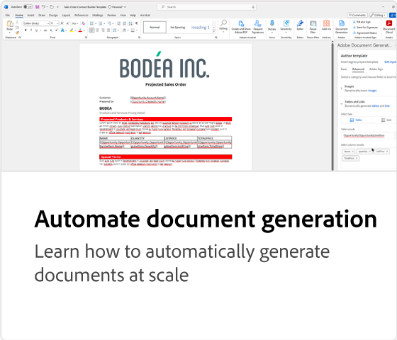

# Zelfstudies voor API voor het genereren van documenten

Met de API voor het genereren van documenten maakt u PDF- en Word-documenten van Word-sjablonen en JSON-gegevens.

>[!NOTE]
>
>De API voor het genereren van documenten is opgenomen in de PDF Services-API.

## Documenten genereren

<table style="table-layout:fixed">
<tr>
  <td>
    
    

      <a href="automate-doc-gen.md"><strong> Automatisch documentgeneratie </strong></a>
      

      Leer hoe u documenten automatisch op schaal kunt genereren
       
  </td>
 <td>
       
       

        
 </td>
 <td>
       
       

        
 </td>
 <td>
       
       

        
 </td>
</tr>
</table>

## Sjablonen maken

De API voor het genereren van documenten accepteert een documentsjabloon (met sjabloontags) samen met de invoergegevens om het definitieve document te genereren. Het uiteindelijke document wordt gegenereerd door alle sjabloonlabels in de documentsjabloon te vervangen door de dynamische inhoud op basis van de werkelijke waarden die overeenkomen met de gegevensinvoer.

<!-- START CARDS HTML - DO NOT MODIFY BY HAND -->

    

        

            

                <figure class="image x-is-16by9">
                    
                </figure>
            

            

                

                    

                        <a href="https://experienceleague.adobe.com/en/docs/acrobat-services-learn/tutorials/docgen/docgentemplates/taggeroverview" target="_self" rel="referrer" title="Overzicht van de Adobe voor het genereren van documenten"> Overzicht van Tagger van de Generatie van het Document van de Adobe </a>
                    

                    
Bekijk een overzicht van de Adobe Document Generation Tagger die is ontworpen voor gebruik met de Adobe Document Generation API

                

                <a href="https://experienceleague.adobe.com/en/docs/acrobat-services-learn/tutorials/docgen/docgentemplates/taggeroverview" target="_self" rel="referrer" class="spectrum-Button spectrum-Button--outline spectrum-Button--primary spectrum-Button--sizeM" style="align-self: flex-start; margin-top: 1rem;">
                     Controle 
                </a>
            

        

    

    

        

            

                <figure class="image x-is-16by9">
                    
                </figure>
            

            

                

                    

                        <a href="https://experienceleague.adobe.com/en/docs/acrobat-services-learn/tutorials/docgen/docgentemplates/taggeraddtexttags" target="_self" rel="referrer" title="Tekstlabels toevoegen"> Toevoegend tekstmarkeringen </a>
                    

                    
Leer hoe u tekstcodes toevoegt aan Microsoft Word-sjablonen met behulp van Adobe voor het genereren van documenten

                

                <a href="https://experienceleague.adobe.com/en/docs/acrobat-services-learn/tutorials/docgen/docgentemplates/taggeraddtexttags" target="_self" rel="referrer" class="spectrum-Button spectrum-Button--outline spectrum-Button--primary spectrum-Button--sizeM" style="align-self: flex-start; margin-top: 1rem;">
                     Controle 
                </a>
            

        

    

    

        

            

                <figure class="image x-is-16by9">
                    
                </figure>
            

            

                

                    

                        <a href="https://experienceleague.adobe.com/en/docs/acrobat-services-learn/tutorials/docgen/docgentemplates/taggeraddimagetags" target="_self" rel="referrer" title="Afbeeldingstags toevoegen"> Toevoegend beeldmarkeringen </a>
                    

                    
Leer hoe u afbeeldingstags toevoegt aan Microsoft Word-sjablonen met behulp van Adobe Document Generation Tagger om afbeeldingen dynamisch in documenten te duwen

                

                <a href="https://experienceleague.adobe.com/en/docs/acrobat-services-learn/tutorials/docgen/docgentemplates/taggeraddimagetags" target="_self" rel="referrer" class="spectrum-Button spectrum-Button--outline spectrum-Button--primary spectrum-Button--sizeM" style="align-self: flex-start; margin-top: 1rem;">
                     Controle 
                </a>
            

        

    

    

        

            

                <figure class="image x-is-16by9">
                    
                </figure>
            

            

                

                    

                        <a href="https://experienceleague.adobe.com/en/docs/acrobat-services-learn/tutorials/docgen/docgentemplates/taggertables" target="_self" rel="referrer" title="Tabellen en lijstcodes toevoegen"> Toevoegend lijsten en lijstmarkeringen </a>
                    

                    
Leer hoe u tabellen en lijstcodes toevoegt aan Microsoft Word-sjablonen met behulp van Adobe Document Generation Tagger om dynamisch tabel- of lijstrijen toe te voegen op basis van gegevens

                

                <a href="https://experienceleague.adobe.com/en/docs/acrobat-services-learn/tutorials/docgen/docgentemplates/taggertables" target="_self" rel="referrer" class="spectrum-Button spectrum-Button--outline spectrum-Button--primary spectrum-Button--sizeM" style="align-self: flex-start; margin-top: 1rem;">
                     Controle 
                </a>
            

        

    

    

        

            

                <figure class="image x-is-16by9">
                    
                </figure>
            

            

                

                    

                        <a href="https://experienceleague.adobe.com/en/docs/acrobat-services-learn/tutorials/docgen/docgentemplates/taggercalculations" target="_self" rel="referrer" title="Numerieke berekeningscodes instellen"> plaatsend numerieke berekeningsmarkeringen </a>
                    

                    
Leer hoe u numerieke berekeningscodes instelt in Microsoft Word-sjablonen met behulp van Adobe Document Generation Tagger om aggregaties of rekenkundige van gegevenswaarden te berekenen

                

                <a href="https://experienceleague.adobe.com/en/docs/acrobat-services-learn/tutorials/docgen/docgentemplates/taggercalculations" target="_self" rel="referrer" class="spectrum-Button spectrum-Button--outline spectrum-Button--primary spectrum-Button--sizeM" style="align-self: flex-start; margin-top: 1rem;">
                     Controle 
                </a>
            

        

    

    

        

            

                <figure class="image x-is-16by9">
                    
                </figure>
            

            

                

                    

                        <a href="https://experienceleague.adobe.com/en/docs/acrobat-services-learn/tutorials/docgen/docgentemplates/taggerconditional" target="_self" rel="referrer" title="Voorwaardelijke inhoud instellen"> plaatsend voorwaardelijke inhoud </a>
                    

                    
Leer hoe u secties in Microsoft Word-sjablonen instelt met behulp van de Adobe van Tagger voor het genereren van documenten om secties van een document dynamisch op basis van gegevens op te nemen of uit te sluiten

                

                <a href="https://experienceleague.adobe.com/en/docs/acrobat-services-learn/tutorials/docgen/docgentemplates/taggerconditional" target="_self" rel="referrer" class="spectrum-Button spectrum-Button--outline spectrum-Button--primary spectrum-Button--sizeM" style="align-self: flex-start; margin-top: 1rem;">
                     Controle 
                </a>
            

        

    

<!-- END CARDS HTML - DO NOT MODIFY BY HAND -->
