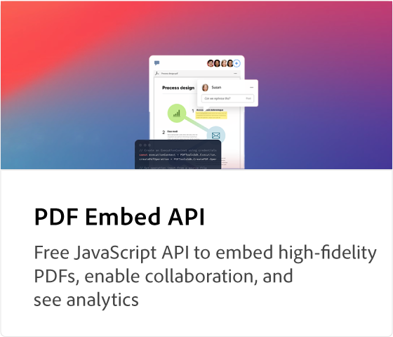

# [!DNL Adobe Acrobat Services] API-zelfstudies

[!DNL Adobe Acrobat Services] heeft zes hoofd-API&#39;s:

* [!DNL Adobe PDF Services API]
* [!DNL Adobe PDF Embed API]
* [!DNL Adobe Document Generation API]
* [!DNL Adobe PDF Electronic Seal API]
* [!DNL Adobe PDF Extract API]
* [!DNL Adobe PDF Accessibility Auto-Tag API]

De laatste twee API&#39;s en hun SDK&#39;s zijn gebundeld in [!DNL Adobe PDF Services API] als onderdeel van een betaald aanbod. [!DNL PDF Embed API] is een gratis aanbieding. Deze API&#39;s automatiseren het genereren, manipuleren en transformeren van documentinhoud via een reeks moderne cloudgebaseerde webservices. Ze helpen je om eenvoudigere, snellere en merkgebonden ervaringen te bieden, zodat je de gebruikersinteractie met je documenten kunt beheren, workflows voor PDF kunt stroomlijnen en gebruik en behoud kunt bevorderen. Deze tutorials helpen je om sneller eenvoudige, snellere, merkgebonden ervaringen te bieden met de [!DNL Adobe Acrobat Services] API&#39;s.

<table style="table-layout:fixed">
<tr>
 <td>
   
  </td>
  <td>
   
  </td>
  <td>
   
  </td>
  <td>
   
  </td>
</tr>
<tr>
  <td>
   
  </td>
 <td>
   
  </td>
 <td>
   
  </td>
 <td>
   
  </td>
</tr>
</table>
