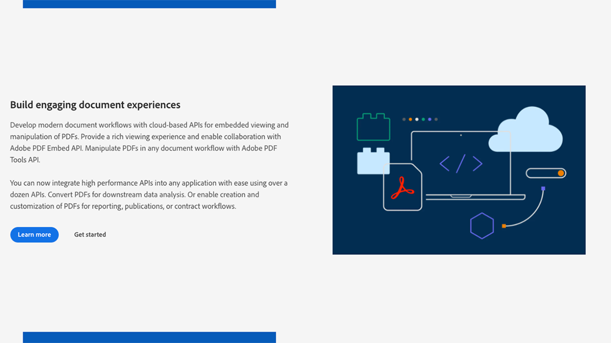
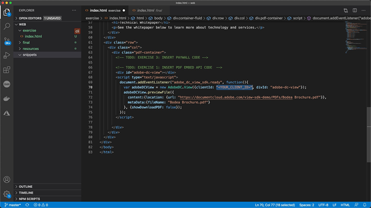

# Beheer je online PDF-ervaring en verzamel analytics

Plaatst uw organisatie PDF op uw website? Leer hoe u de Adobe PDF Embed API kunt gebruiken om het uiterlijk te beheren, samenwerking in te schakelen en analytics te verzamelen over de interactie van de gebruiker met PDF, waaronder de tijd die op een pagina wordt doorgebracht en zoekopdrachten. Om met dit 4 deel hands-on leerprogramma te beginnen, selecteer *die met PDF wordt begonnen bed API* in.

<table style="table-layout:fixed">
<tr>
  <td>
    <a href="controlpdfexperience.md#part1">
        
    </a>
    <div>
    <a href="controlpdfexperience.md#part1"><strong> Deel 1: Het worden begonnen met PDF Embed API </strong></a>
    </div>
  </td>
  <td>
    <a href="controlpdfexperience.md#part2">
        
    </a>
    <div>
    <a href="controlpdfexperience.md#part2"><strong> Deel 2: Het toevoegen van PDF sluit API aan een webpagina </strong></a> in
    </div>
  </td>
  <td>
   <a href="controlpdfexperience.md#part3">
      
   </a>
    <div>
    <a href="controlpdfexperience.md#part3"><strong> Deel 3: Toegang tot Analytics APIs </strong></a>
    </div>
  </td>
  <td>
   <a href="controlpdfexperience.md#part4">
      
   </a>
    <div>
    <a href="controlpdfexperience.md#part4"><strong> Deel 4: Voeg interactiviteit toe die op gebeurtenissen </strong></a> wordt gebaseerd
    </div>
  </td>
</tr>
</table>

## Deel 1: Aan de slag met de PDF Embed-API {#part1}

In deel 1 leert u hoe u aan de slag kunt gaan met alles wat u nodig hebt voor onderdelen 1-3. U begint met het ophalen van API-referenties.

**wat u** nodig hebt

* De middelen van het leerprogramma [&#x200B; download &#x200B;](https://github.com/benvanderberg/adobe-pdf-embed-api-tutorial)
* Adobe ID [&#x200B; krijgt hier &#x200B;](https://account.adobe.com/)
* Webserver (Node JS, PHP, enz.)
* Werkkennis van HTML / JavaScript / CSS

**wat wij** gebruiken

* Een basiswebserver (knooppunt)
* Visual Studio Code
* GitHub

### Inloggegevens ophalen

1. Ga naar de {[&#128279;](https://developer.adobe.com/) website 0} Adobe.io.
1. Klik **[!UICONTROL Leer meer]** onder Bouw aansprekende documentervaringen.

   

   Hiermee gaat u naar de [!DNL Adobe Acrobat Services] -startpagina.

1. Klik **[!UICONTROL worden Begonnen]** in de navigatiebar.

   U zult een optie in **zien worden begonnen met [!DNL Acrobat Services] APIs** **tot Nieuwe Geloofsbrieven** of **leiden Bestaande Geloofsbrieven**.

1. Klik **[!UICONTROL krijgen Begonnen]** knoop onder **[!UICONTROL creëren Nieuwe Geloofsbrieven]**.

   

1. Kies de **[!UICONTROL PDF bed API]** radioknoop in en voeg een credentienaam van uw keus en een toepassingsdomein in het volgende venster toe.

   >[!NOTE]
   >
   >Deze referenties kunnen alleen worden gebruikt in het toepassingsdomein dat hier wordt vermeld. U kunt elk gewenst domein gebruiken.

   

1. Klik **[!UICONTROL creeer Referenties]**.

   Op de laatste pagina van de wizard vindt u de gegevens van de clientreferenties. Laat dit venster open zodat u er weer naar kunt terugkeren en de client-id (API-sleutel) voor later gebruik kunt kopiëren.

1. Klik **[!UICONTROL Documentatie van de Mening]** om naar de documentatie met gedetailleerde informatie te gaan over hoe te om deze API te gebruiken.

   

## Deel 2: API voor insluiten van PDF toevoegen aan een webpagina {#part2}

In deel 2 leert u hoe u de PDF Embed-API gemakkelijk kunt insluiten in een webpagina. U doet dit door de online demo van de Adobe PDF Embed API te gebruiken om onze code te maken.

### De oefencode ophalen

We hebben code gemaakt die je kunt gebruiken. Terwijl u uw eigen code kunt gebruiken, zullen de demonstraties plaatsvinden in de context van de leermiddelen. Download steekproefcode [&#x200B; hier &#x200B;](https://github.com/benvanderberg/adobe-pdf-embed-api-tutorial).

1. Ga naar [[!DNL Adobe Acrobat Services]  website &#x200B;](https://developer.adobe.com/document-services/homepage/).

   ![&#x200B; Screenshot van [!DNL Adobe Acrobat Services] website &#x200B;](assets/ControlPDF_6.png)

1. Klik **[!UICONTROL APIs]** in de navigatiebar, dan ga naar de **[!UICONTROL PDF bed API]** pagina in de drop-down verbinding in.

   

1. Klik **[!UICONTROL probeer de demo]**.

   Er verschijnt een nieuw venster met de ontwikkelaarssandbox voor PDF Embed API.

   

   Hier ziet u de opties voor de verschillende weergavemodi.

1. Klik op de verschillende weergavemodi voor Volledig venster, Container met grootte, In-line en Lichtbak.

   

1. Klik **[!UICONTROL Volledige het bekijken van het Venster]** wijze, dan klik **[!UICONTROL pas]** knoop aan knevel opties aan en weg.

   

1. Schakel **[!UICONTROL de optie van de Download]** PDF uit.
1. Klik **[!UICONTROL produceer de knoop van de Code]** om de codevoorproef te zien.
1. Exemplaar **[!UICONTROL identiteitskaart van de Cliënt]** van het venster van de Referenties van de Cliënt van Deel 1.

   

1. Open het **[!UICONTROL Web]** -> **[!UICONTROL middelen]** -> **[!UICONTROL js]** -> **[!UICONTROL dc-config.js]** dossier in uw coderedacteur.

   U zult zien dat de clientID variabele daar is.

1. Plak uw clientreferenties tussen de dubbele aanhalingstekens om de client-id in te stellen op uw referentie.

1. Ga terug naar de codevoorvertoning van de ontwikkelaarssandbox.

1. Kopieer de tweede regel met het Adobe-script:

   ```
   <script src=https://documentccloud.adobe.com/view-sdk/main.js></script>
   ```

   

1. Ga naar uw coderedacteur en open het **[!UICONTROL Web]** -> **[!UICONTROL oefening]** -> **[!UICONTROL index.html]** dossier.

1. Plak de manuscriptcode in `<head>` van het dossier op lijn 18 onder de commentaar dat zegt: **TODO: EXERCISE 1: TUSSENVOEGSEL API SCRIPT TAG**.

    te kleven

1. Ga terug naar de codevoorvertoning van de ontwikkelaarssandbox en kopieer de eerste coderegel die het volgende bevat:

   ```
   <div id="adobe-dc-view"></div>
   ```

    te kopiëren

1. Ga naar uw coderedacteur en open het **[!UICONTROL Web]** -> **[!UICONTROL oefening]** -> **[!UICONTROL index.html]** dossier opnieuw.

1. Plak de `<div>` code in `<body>` van het dossier op lijn 67 onder de commentaar dat **TODO zegt: EXERCISE 1: DE CODE VAN DE PDF EMBED API VAN HET TUSSENVOEGSEL**.

    te kleven

1. Ga terug naar de codevoorvertoning van de ontwikkelaarssandbox en kopieer de coderegels voor de onderstaande `<script>` code:

   ```
   <script type="text/javascript">
       document.addEventListener("adobe_dc_view_sdk.ready",             function(){ 
           var adobeDCView = new AdobeDC.View({clientId:                     "<YOUR_CLIENT_ID>", divId: "adobe-dc-view"});
           adobeDCView.previewFile({
               content:{location: {url: "https://documentcloud.                adobe.com/view-sdk-demo/PDFs/Bodea Brochure.                    pdf"}},
               metaData:{fileName: "Bodea Brochure.pdf"}
           }, {showDownloadPDF: false});
       });
   </script>
   ```

1. Ga naar uw coderedacteur en open het **[!UICONTROL Web]** -> **[!UICONTROL oefening]** -> **[!UICONTROL index.html]** dossier opnieuw.

1. Plak de `<script>` -code in de `<body>` van het bestand op regel 68 onder de `<div>` -tag.

1. Wijzig lijn 70 van het zelfde **index.html** dossier om de clientID variabele te omvatten die eerder werd gecreeerd.

   

1. Wijzig lijn 72 van het zelfde **index.html** dossier om de plaats van het dossier van de PDF bij te werken om een lokaal dossier te gebruiken.

   Er is één beschikbaar in de leerprogramma&#39;s in **/resources/pdfs/whitepaper.pdf**.

1. Sla de gewijzigde bestanden op en bekijk een voorvertoning van uw website door naar **`<your domain>`/Summit21/web/oefening/** te bladeren.

   U moet de technische whitepaper weergeven in de modus Volledig venster van uw browser.

## Deel 3: Toegang tot API&#39;s voor Analytics {#part3}

Nu u een webpagina hebt gemaakt met PDF Embed API-rendering voor een PDF, kunt u in deel 3 nu onderzoeken hoe u JavaScript-gebeurtenissen kunt gebruiken om analyses te meten om te begrijpen hoe gebruikers PDF gebruiken.

### Documentatie zoeken

Er zijn veel verschillende JavaScript-gebeurtenissen beschikbaar als onderdeel van de PDF Embed-API. U kunt ze openen vanuit de [!DNL Adobe Acrobat Services] -documentatie.

1. Navigeer aan de [&#x200B; documentatieplaats &#x200B;](https://developer.adobe.com/document-services/docs/overview).
1. Bekijk de verschillende gebeurtenistypen die beschikbaar zijn als onderdeel van de API. Deze zijn handig als referentie en zijn ook handig voor toekomstige projecten.

   

1. Kopieer de voorbeeldcode die op de website staat.

   Gebruik dit als basis voor onze code en wijzig deze.

    te kopiëren

   ```
   const eventOptions = {
     //Pass the PDF analytics events to receive.
      //If no event is passed in listenOn, then all PDF         analytics events will be received.
   listenOn: [ AdobeDC.View.Enum.PDFAnalyticsEvents.    PAGE_VIEW, AdobeDC.View.Enum.PDFAnalyticsEvents.DOCUMENT_DOWNLOAD],
     enablePDFAnalytics: true
   }
   
   
   adobeDCView.registerCallback(
     AdobeDC.View.Enum.CallbackType.EVENT_LISTENER,
     function(event) {
       console.log("Type " + event.type);
       console.log("Data " + event.data);
     }, eventOptions
   );
   ```

1. Vind de codesectie u vroeger toevoegde die als hieronder kijkt en voeg de code hierboven na deze code in **index.html** toe:

    te kleven

1. Laad de pagina in uw webbrowser en open de Console om de consoleuitvoer van de verschillende gebeurtenissen te bekijken terwijl u met de PDF viewer werkt.

   

   

### Schakel toevoegen voor het vastleggen van gebeurtenissen

Nu u de gebeurtenissen hebt die aan console.log worden uitgevoerd, laten we het gedrag veranderen op basis van welke gebeurtenissen. Om dit te doen, zult u een schakelaarvoorbeeld gebruiken.

1. Navigeer aan **snippets/eventsSwitch.js** en kopieer de inhoud van het dossier in de zelfstudiecode.

    te kopiëren

1. Plak de code in de gebeurtenislistenerfunctie.

    te kleven

1. Bevestig dat de consoleoutput correct wanneer de pagina wordt geladen en u met de PDF Kijker in wisselwerking staat.

### Adobe Analytics

Als u Adobe Analytics-ondersteuning wilt toevoegen aan uw viewer, kunt u de instructies op de website volgen.

>[!IMPORTANT]
>
>Adobe Analytics moet al op de pagina in de koptekst zijn geladen.

Navigeer aan de [&#x200B; documentatie van Adobe Analytics &#x200B;](https://www.adobe.com/devnet-docs/dcsdk_io/viewSDK/howtodata.html#adobe-analytics) en overzicht als u Adobe Analytics reeds hebt toegelaten op uw webpagina. Volg de instructies om een rapportsuite in te stellen.

### Googles Analytics


Adobe PDF Embed API biedt kant-en-klare integratie met Adobe Analytics. Omdat alle gebeurtenissen echter beschikbaar zijn als JavaScript-gebeurtenissen, is het mogelijk om met Googles Analytics te integreren door PDF-gebeurtenissen vast te leggen en de functie ga() te gebruiken om de gebeurtenis toe te voegen aan Adobe Analytics.

1. Navigeer aan **snippets/eventsSwitchGA.js** om te zien hoe u met Googles Analytics kunt integreren.
1. Bekijk en gebruik deze code als voorbeeld als uw webpagina wordt bijgehouden met Adobe Analytics en al is ingesloten op de webpagina.

   

## Deel 4: Interactiviteit toevoegen op basis van gebeurtenissen {#part4}

In deel 4 gaat u door hoe u boven op uw PDF-viewer een paywall kunt toevoegen die wordt weergegeven nadat u voorbij de tweede pagina hebt geschoven.

### Paywall-voorbeeld

Ga aan dit [&#x200B; voorbeeld van een PDF achter een paywall &#x200B;](https://www3.technologyevaluation.com/research/white-paper/the-forrester-wave-digital-decisioning-platforms-q4-2020.html). In dit voorbeeld leert u interactiviteit toevoegen boven op een PDF-kijkervaring.

### paywall-code toevoegen

1. Ga naar snippets/paywallCode.html en kopieer de inhoud.
1. Zoek naar `<!-- TODO: EXERCISE 3: INSERT PAYWALL CODE -->` in exercise/index.html.

    te kopiëren

1. Plak de gekopieerde code na de opmerking.
1. Ga naar **snippets/paywallCode.js** en kopieer de inhoud.

    te kleven

1. Plak de code op die locatie.

### Demo uitproberen met Paywall

Nu kunt u de demo bekijken.

1. Laad **index.html** op uw website opnieuw.
1. Schuif omlaag naar een pagina > 2.
1. Het dialoogvenster weergeven verschijnt om de gebruiker na de tweede pagina uit te dagen.

   

## Extra bronnen

De extra middelen kunnen worden gevonden [&#x200B; hier &#x200B;](https://developer.adobe.com/document-services/docs/overview).
