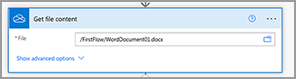

# Maak je eerste flow in Microsoft Power Automate

Leer hoe je je eerste flow maakt in [Microsoft Power Automate](https://flow.microsoft.com) met de [Adobe PDF Services](https://us.flow.microsoft.com/nl-nl/connectors/shared_adobepdftools/adobe-pdf-services/) -connector.

In deze praktische zelfstudie leert u hoe u:

* Word-documenten converteren naar PDF
* PDF-documenten combineren tot één PDF
* Protect een PDF-document met een wachtwoord

## Voorbereiding

### Wat je nodig hebt

* **Referenties voor proefversie of productie voor Adobe PDF Services**
Meer informatie over het ophalen en configureren van gebruikersgegevens in Microsoft Power Automate [hier](https://experienceleague.adobe.com/docs/document-services/tutorials/pdfservices/getting-credentials-power-automate.html).
* **Microsoft Power Automated met Premium-connectoren**
Leer hoe u het licentieniveau voor Power Automate kunt controleren [hier](https://docs.microsoft.com/en-us/power-platform/admin/power-automate-licensing/types).
* **OneDrive**
In deze zelfstudie wordt de OneDrive-opslagconnector gebruikt, maar elke opslagconnector kan worden vervangen.

### Voorbeeldbestanden

Er zijn twee [voorbeeldbestanden](assets/sample-assets.zip) die u moet uitpakken en uploaden naar OneDrive:

* WordDocument01.docx
* WordDocument02.docx

### Inloggegevens ophalen

Om deze zelfstudie te voltooien, hebt u uw aanmeldingsgegevens nodig die al zijn geconfigureerd in Microsoft Power Automate for Adobe PDF Services. Als u deze stap niet hebt voltooid, raadpleegt u de [instructies hier](https://experienceleague.adobe.com/docs/document-services/tutorials/pdfservices/getting-credentials-power-automate.html).

## Deel 1: Nieuwe flow maken en Word converteren naar PDF

### De flow maken

In dit deel maakt u een nieuwe flow in [Microsoft Power Automate](https://flow.microsoft.com) met een instant flow kunt u parameters toevoegen, bestanden ophalen van OneDrive en omzetten in PDF.

1. Navigeer naar [Microsoft Power Automate](https://flow.microsoft.com) en meld u aan met uw referenties.
1. Selecteer in het zijpaneel de optie **[!UICONTROL Maken]**.

   

1. Selecteren **[!UICONTROL Directe flow]**.
1. Geef uw flow een naam.
1. Onder *Kiezen hoe deze flow wordt geactiveerd* selecteert u **[!UICONTROL Handmatig een flow activeren]**.
1. Selecteer **[!UICONTROL Maken]**.

### Bestandsinhoud ophalen van bestanden

Vervolgens haalt u de bestandsinhoud op van de voorbeeldbestanden.

>[!PREREQUISITES]
>
>Als u de [voorbeeldbestanden](assets/sample-assets.zip) in OneDrive, decomprimeer ze en upload ze.


1. In [Power Automate](https://flow.microsoft.com)selecteert u **[!UICONTROL + Nieuwe stap]**.
1. Zoeken naar *OneDrive* in de zoekbalk.
1. Kies uw werk of uw persoonlijke OneDrive-account door **[!UICONTROL OneDrive voor Bedrijven]** of **[!UICONTROL OneDrive]**.
1. Zoeken naar *Bestandsinhoud ophalen* in de zoekbalk.
1. In het dialoogvenster **[!UICONTROL Bestand]** veld, selecteert u het pictogram Map om naar het *WordDocument01.docx* bestand in OneDrive.

   

### Bestand converteren naar PDF

Nu u de bestandsinhoud hebt, kunt u het document converteren naar PDF.

1. In [Power Automate](https://flow.microsoft.com)selecteert u **[!UICONTROL + Nieuwe stap]**.
1. Zoeken naar *Adobe PDF Services* in de zoekbalk.
1. Selecteren **[!UICONTROL Adobe PDF Services]**.
1. Zoeken naar *Word naar PDF converteren* in de zoekbalk.
1. In **[!UICONTROL Bestandsnaam]** geeft u het bestand de gewenste naam, maar het moet eindigen met *.docx*. Deze extensie is nodig voor het converteren van documenten van Word naar PDF.
1. Plaats de cursor in het **[!UICONTROL Bestandsinhoud]** veld.
1. Met de **[!UICONTROL Dynamische inhoud]** deelvenster selecteert u **[!UICONTROL Bestandsinhoud]**.

   

### Sla het bestand op in OneDrive

Nadat het document is gegenereerd, slaat u het bestand weer op in OneDrive.

1. In [Microsoft Power Automate](https://flow.microsoft.com)selecteert u **[!UICONTROL + Nieuwe stap]**.
1. Zoeken naar *OneDrive* in de zoekbalk.
1. Kies uw werk of uw persoonlijke OneDrive-account door **[!UICONTROL OneDrive voor Bedrijven]** of **[!UICONTROL OneDrive]**.
1. Zoeken naar *Bestandsinhoud ophalen* in de zoekbalk.
1. Zoeken naar *Bestand maken* in de zoekbalk.
1. Selecteren **[!UICONTROL Bestand maken]**.
1. In het dialoogvenster **[!UICONTROL Mappad]** selecteert u het mappictogram om op te geven waar u het bestand in OneDrive wilt opslaan.
1. In **[!UICONTROL Bestandsnaam]** geeft u het bestand de gewenste naam, maar het moet eindigen met *.docx*. Deze extensie is nodig voor het converteren van documenten van Word naar PDF.
1. In het dialoogvenster **[!UICONTROL Bestandsinhoud]** veld, gebruiken **[!UICONTROL Dynamische inhoud]** om de PDF File Content-variabele in te voegen.

### Stroom uitproberen

1. Selecteer in de linkerbovenhoek **[!UICONTROL Naamloos]** om de naam van de flow te wijzigen.
1. Selecteer **[!UICONTROL Opslaan]**.
1. Selecteren **[!UICONTROL Testen]**.
1. Selecteren **[!UICONTROL Handmatig]** en dan **[!UICONTROL Opslaan en testen]**.
1. Selecteer **[!UICONTROL Doorgaan]**.
1. Selecteren **[!UICONTROL Stroom uitvoeren]**.

In de map OneDrive ziet u nu de omgezette PDF.


## Deel 2: Een dynamisch document genereren op basis van een sjabloon

Dit volgende deel bouwt verder op Deel 1 en gebruikt het *Document uit Word genereren* sjabloon om gegevens dynamisch samen te voegen in uw document.

### De documentsjabloon bekijken

Openen *WordDocument02_.docx* van uw voorbeeldbestanden in OneDrive. Het Word-document bevat verschillende tekstcodes die plaatsen aangeven waar gegevens in het document worden ingevuld.

### Te activeren parameters toevoegen

Als u dynamische gegevens in het document wilt opnemen, moet u een paar parameters voor de trigger maken om naar waarden te vragen.

1. Selecteer **[!UICONTROL Handmatig een flow activeren]** om de actie uit te breiden.
1. Selecteren **[!UICONTROL Een invoer toevoegen]**.
1. Selecteren **[!UICONTROL Tekst]**.
1. Geef het veld een naam *Voornaam*.

Herhaal stap 2-4 om de volgende velden toe te voegen:

* Achternaam
* Salary


### Bestandsinhoud van een sjabloon ophalen

Als u een document wilt genereren, moet u eerst de bestandsinhoud van de Word-sjabloon ophalen.

1. Selecteer + **[!UICONTROL Nieuwe stap]**.
1. Zoeken naar *OneDrive* in de zoekbalk.
1. Kies uw werk of uw persoonlijke OneDrive-account door **[!UICONTROL OneDrive voor Bedrijven]** of **[!UICONTROL OneDrive]**.
1. Zoeken naar *Bestandsinhoud ophalen* in de zoekbalk.
1. In het dialoogvenster **[!UICONTROL Bestand]** veld, selecteert u het pictogram Map om naar het *WordDocument02.docx* bestand in OneDrive.


### Document genereren op basis van sjabloon

1. Selecteer in Power Automate de optie **[!UICONTROL + Nieuwe stap]**.
1. Zoeken naar *Adobe PDF Services* in de zoekbalk.
1. Selecteren **[!UICONTROL Adobe PDF Services]**.
1. Selecteer de **[!UICONTROL Document genereren op basis van Word-sjabloon]** actie .
1. In het dialoogvenster **[!UICONTROL Naam sjabloonbestand]** veld, geef het bestand de gewenste naam, maar het moet eindigen met *.docx*.

#### Gegevens samenvoegen

Met de *Document genereren op basis van Word-sjabloon* kunt u gegevens uit een van de verschillende variabelen die eerder in de flow stonden, samenvoegen in uw document met behulp van dynamische inhoud.

Kopieer de JSON-gegevens hieronder naar de **Gegevens samenvoegen** veld:

```
{
    "FirstName": "",
    "LastName": "",
    "Salary": ""
}
```

1. Plaats de cursor in het veld tussen de twee aanhalingstekens voor de *FirstName* waarde.
1. Met de **[!UICONTROL Dynamische inhoud]** paneel, invoegt u de *Voornaam* waarde uit Handmatig een stroomactie triggeren.

   

1. Herhaal stap 7-8 voor de **[!UICONTROL LastName]** en **[!UICONTROL Salary]** velden.
1. In het dialoogvenster **[!UICONTROL Inhoud sjabloonbestand]** veld gebruiken **[!UICONTROL Dynamische inhoud]** paneel om in te voegen **[!UICONTROL Bestandsinhoud]** waarde uit de *Bestandsinhoud ophalen* stap.


>[!TIP]
>
>De *Document genereren op basis van Word-sjabloon* handeling maakt gebruik van Adobe-API voor documentgeneratie. Hier volgen een paar bronnen voor meer informatie over het maken van sjablonen:
>
>* [Meer informatie over Adobe-documentgeneratie](https://developer.adobe.com/document-services/apis/doc-generation/)
>* [Tagger voor het genereren van Adobe-documenten voor Microsoft Word](https://appsource.microsoft.com/en-US/product/office/WA200002654)
>* [Adobe Documentgeneratie API-documentatie](https://developer.adobe.com/document-services/docs/overview/document-generation-api/)

### Sla het bestand op in OneDrive

Nadat het document is gegenereerd, kunt u het bestand weer opslaan in OneDrive.

1. Selecteer in Power Automate de optie **+ [!UICONTROL Nieuwe stap]**.
1. Zoeken naar *OneDrive* in de zoekbalk.
1. Kies uw werk of uw persoonlijke OneDrive-account door **[!UICONTROL OneDrive voor Bedrijven]** of **[!UICONTROL OneDrive]**.
1. Zoeken naar *Bestand maken* in de zoekbalk.
1. Selecteren **[!UICONTROL Bestand maken]**.
1. In het dialoogvenster **[!UICONTROL Mappad]** selecteert u het mappictogram om op te geven waar u het bestand in OneDrive wilt opslaan.
1. In het dialoogvenster **[!UICONTROL Bestandsnaam]** de naam van het bestand in. Omdat de uitvoer een PDF is, moet uw bestandsnaam eindigen met de extensie .pdf.
1. Gebruik de **[!UICONTROL Dynamische inhoud]** deelvenster om de PDF-variabele Bestandsinhoud in te voegen in het dialoogvenster **[!UICONTROL Bestandsinhoud]** veld.

### Stroom uitproberen


1. Selecteer **[!UICONTROL Opslaan]**.
1. Selecteren **[!UICONTROL Testen]**.
1. Selecteren **[!UICONTROL Handmatig]** en dan **[!UICONTROL Opslaan en testen]**.
1. Selecteer **[!UICONTROL Doorgaan]**.
1. Voer waarden in voor *Voornaam*, *Achternaam*, en *Salary*.
1. Selecteren **[!UICONTROL Stroom uitvoeren]**.

In de map OneDrive ziet u nu een PDF die uit het Word-document is gegenereerd. Wanneer u het PDF-document opent in OneDrive, ziet u dat de gegevens worden samengevoegd met de tekstlabellocaties.


## Deel 3: PDF combineren tot één

Nu u een Word-document hebt gegenereerd en omgezet in een PDF, bestaat het volgende onderdeel uit het combineren van meerdere PDF-documenten.

>[!NOTE]
>
>In de vorige handelingen hebt u een kopie van het document als bestand opgeslagen in OneDrive. Als u gereedschappen wilt gebruiken zoals PDF samenvoegen, hoeft u het bestand niet op te slaan in OneDrive. In plaats daarvan kunt u de uitvoer rechtstreeks van de ene handeling naar de andere doorgeven. Dit is beter dan het na elke handeling opslaan in OneDrive. Maar voor demonstratiedoeleinden slaat u deze bestanden op in OneDrive.

### PDF-stap samenvoegen toevoegen

1. Selecteer **[!UICONTROL + Volgende stap]** om een handeling toe te voegen aan het einde van de flow.
1. Zoeken naar *Adobe PDF Services* in de zoekbalk.
1. Selecteren **[!UICONTROL Adobe PDF Services]**.
1. Selecteer de **[!UICONTROL PDF samenvoegen]** handeling.
1. In het dialoogvenster **[!UICONTROL PDF-bestandsnaam samenvoegen]** in, voert u de gewenste bestandsnaam in (bijv.*combinedDocument.pdf*).
1. In het dialoogvenster **[!UICONTROL Bestandsinhoud -1]** veld gebruiken **[!UICONTROL Dynamische inhoud]** paneel om in te voegen *Inhoud PDF-bestand* waarde uit de **[!UICONTROL Word naar PDF converteren]** stap.
1. Selecteer **+ [!UICONTROL nieuw item toevoegen]**.
1. In het dialoogvenster **[!UICONTROL Bestandsinhoud - 2]** veld gebruiken **[!UICONTROL Dynamische inhoud]** paneel om in te voegen **[!UICONTROL Inhoud uitvoerbestand]** waarde uit de *Document genereren op basis van Word-sjabloon* stap.


### Samengevoegde PDF opslaan naar OneDrive

Nadat het document is gecombineerd, kunt u het weer opslaan in OneDrive.

1. Selecteer in Power Automate de optie **+ [!UICONTROL Nieuwe stap]**.
1. Zoeken naar *OneDrive* in de zoekbalk.
1. Kies uw werk of uw persoonlijke OneDrive-account door **[!UICONTROL OneDrive voor Bedrijven]** of **[!UICONTROL OneDrive]**.
1. Zoeken naar *Bestand maken* in de zoekbalk.
1. Selecteren **[!UICONTROL Bestand maken]**.
1. In het dialoogvenster **[!UICONTROL Mappad]** selecteert u het mappictogram om op te geven waar u het bestand in OneDrive wilt opslaan.
1. In het dialoogvenster **[!UICONTROL Bestandsnaam]** de naam van het bestand in. Aangezien de uitvoer een PDF is, moet uw bestandsnaam eindigen op .pdf.
1. In het dialoogvenster **[!UICONTROL Bestandsinhoud]** veld, gebruiken **[!UICONTROL Dynamische inhoud]** paneel om in te voegen *Inhoud PDF-bestand* waarde uit de **[!UICONTROL PDF samenvoegen]** stap.

   

### Stroom uitproberen

1. Selecteer **[!UICONTROL Opslaan]**.
1. Selecteren **[!UICONTROL Testen]**.
1. Selecteren **[!UICONTROL Handmatig]** en dan **[!UICONTROL Opslaan en testen]**.
1. Selecteer **[!UICONTROL Doorgaan]**.
1. Voer waarden in voor *Voornaam*, *Achternaam*, en *Salary*.
1. Selecteren **[!UICONTROL Stroom uitvoeren]**.

In de map OneDrive ziet u de gecombineerde PDF met pagina&#39;s uit het eerste en tweede document.

## Deel 4: Protect PDF-document

Nadat u het document hebt gegenereerd, kunt u het beschermen tegen bewerking door een extra stap op te nemen voordat u het opslaat op OneDrive.

### PDF beveiligen

1. Selecteer tijdens het bewerken van uw stroom in Power Automate **+** tussen de **[!UICONTROL PDF samenvoegen]** en de **[!UICONTROL Bestand 3 maken]** handeling.

   

1. Selecteren **[!UICONTROL Een handeling toevoegen]**.
1. Zoeken naar *Adobe PDF Services* in de zoekbalk.
1. Selecteren **[!UICONTROL Adobe PDF Services]**.
1. Selecteer de **[!UICONTROL Protect PDF van weergave]** handeling.
1. In het dialoogvenster **[!UICONTROL Bestandsnaam]** , stelt u de naam in op uw gewenste naam, zolang deze eindigt met de extensie .pdf.
1. Stel de **[!UICONTROL Wachtwoord]** aan uw opgegeven wachtwoord toe om het document te openen.
1. In het dialoogvenster **[!UICONTROL Bestandsinhoud]** veld gebruiken **[!UICONTROL Dynamische inhoud]** paneel om in te voegen *Inhoud PDF-bestand* waarde uit de **[!UICONTROL PDF samenvoegen]** stap.

### Opslaan naar OneDrive bijwerken

Als het document is beveiligd, kunt u het bestand weer opslaan in OneDrive. In dit voorbeeld werkt u het bestaande **Bestand 3 maken** actie met een nieuwe *Bestandsinhoud* waarde.

1. Selecteer de cursor in het dialoogvenster **[!UICONTROL Bestandsinhoud]** in het veld **[!UICONTROL Bestand 3 maken]** handeling.
1. Gebruik de **[!UICONTROL Dynamische inhoud]** paneel om in te voegen *Inhoud PDF-bestand* waarde uit de **Protect PDF van weergave** stap.

### Stroom uitproberen

1. Selecteer **[!UICONTROL Opslaan]**.
1. Selecteren **[!UICONTROL Testen]**.
1. Selecteren **[!UICONTROL Handmatig]** en dan **[!UICONTROL Opslaan en testen]**.
1. Selecteer **[!UICONTROL Doorgaan]**.
1. Voer waarden in voor *Voornaam*, *Achternaam*, en *Salary*.
1. Selecteren **[!UICONTROL Stroom uitvoeren]**.

In de OneDrive-map ziet u de gecombineerde PDF waarin u nu wordt gevraagd een wachtwoord in te voeren om het document te bekijken.

## De volgende stappen

In deze zelfstudie hebt u een Word-document geconverteerd naar een PDF, een document gegenereerd op basis van gegevens, documenten samengevoegd en beveiligd met een wachtwoord. Voor meer informatie verkent u enkele andere acties die beschikbaar zijn in de Adobe PDF Services-connector in Microsoft Power Automate:

* Bekijk de vooraf gemaakte sjablonen die beschikbaar zijn in Microsoft Power Automate.
* Leren van [artikelen](https://medium.com/adobetech/tagged/microsoft-power-automate) op Adobe Tech Blog.
* Revisie [documentatie](https://developer.adobe.com/document-services/docs/overview/document-generation-api/) voor Adobe Document Generation API.
