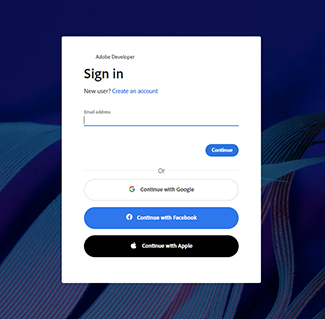
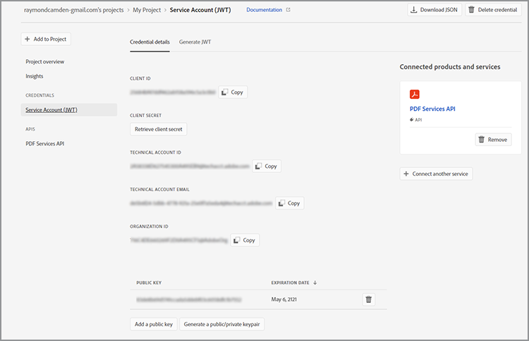

# Referenties ophalen voor Microsoft Power Automate

[ de Macht van Microsoft ](https://powerautomate.microsoft.com/nl-nl/) verstrekt een krachtige manier voor burgerontwikkelaars en ontwikkelaars om krachtige geautomatiseerde processen tot stand te brengen om hun ondernemingen te verbeteren zonder code te schrijven. [&#128279;](https://us.flow.microsoft.com/en-us/connectors/shared_adobepdftools/adobe-pdf-services/) schakelaar van de Diensten van 0&rbrace; Adobe PDF, als deel van [[!DNL Adobe Acrobat Services] ](https://developer.adobe.com/document-services), staat gebruikers toe om het even welke acties uit te voeren beschikbaar in de Diensten API van Adobe PDF binnen de Macht van Microsoft automatiseren.

In deze zelfstudie leert u hoe u referenties kunt ophalen om Adobe PDF Services te gebruiken of te triggeren. Afhankelijk van het feit of u een proefgebruiker of een bestaande klant bent, wordt in deze zelfstudie stapsgewijs ingegaan op de juiste stappen om referenties op te halen.

## Hoe kunnen Microsoft Power Automate-gebruikers de Adobe PDF Services-connector gaan gebruiken?

De bestaande Macht van Microsoft automate gebruikers kan [ proefgeloofsbrieven ](https://www.adobe.com/go/powerautomate_getstarted) voor de Diensten van Adobe PDF krijgen. De bovenstaande koppeling is een speciale link voor aanmelding die specifiek bedoeld is voor Microsoft Power Automate-gebruikers.




>[!IMPORTANT]
> Als u zich aanmeldt voor een proefversie, moet u een Adobe ID gebruiken en niet een Enterprise ID. Als u geen huidige abonnee bent van de Adobe PDF Services API en u probeert u aan te melden met uw Enterprise ID, krijgt u mogelijk een machtigingsfout omdat uw onderneming u niet heeft gemachtigd om de Adobe PDF Services API te gebruiken. Daarom wordt u aangeraden een gratis persoonlijke Adobe ID te gebruiken.
>

1. Nadat u zich hebt aangemeld, wordt u gevraagd een naam voor uw nieuwe referenties te selecteren. Ga uw *Referentienaam* in.
1. Schakel het selectievakje in om akkoord te gaan met de voorwaarden voor ontwikkelaars.
1. Selecteer **[!UICONTROL creeer Referenties]**.

   

Deze referenties betreffen vijf verschillende waarden:

* Klant-ID (API-sleutel)
* Klantgeheim
* Organisatie-ID
* Technisch Account-ID
* Base64 (gecodeerde persoonlijke sleutel)


Er wordt ook automatisch een JSON-bestand met al deze waarden naar uw systeem gedownload. Dit bestand heeft de naam `pdfservices-api-pa-credentials.json` en ziet er als volgt uit:

```json
{
 "client_id": "client id value",
 "client_secret": "client secret value",
 "organization_id": "organized id value",
 "account_id": "account id value",
 "base64_encoded_private_key": "base64 version of the private key"
}
```

Sla dit bestand op een beveiligde locatie op, omdat het niet mogelijk is om opnieuw een kopie van de persoonlijke sleutel op te halen.

### Verbinding toevoegen in Microsoft Power Automate

Nu u uw aanmeldingsgegevens hebt, kunt u deze gaan gebruiken in Microsoft Power Automate-flows.

1. In het sidebar menu, open het **[!UICONTROL menu van Gegevens]** en selecteer **Verbindingen**:

   

1. Selecteer **+ [!UICONTROL &#x200B; Nieuwe Verbinding]**.

1. In het volgende scherm ziet u een lijst met mogelijke verbindingstypen. Typ &quot;adobe&quot; in de rechterbovenhoek om de opties te filteren:

   

1. Selecteer **[!UICONTROL de Diensten van Adobe PDF (voorproef)]**.
1. Voer in het modale venster alle vijf waarden in die u eerder hebt gegenereerd. Selecteer **[!UICONTROL creeer]** wanneer gedaan.

    in te gaan

U kunt nu Adobe PDF Services gebruiken in Microsoft Power Automate.

### Referenties openen nadat ze zijn gemaakt

Als u reeds geloofsbrieven creeerde en de gedownloade geloofsbrieven misplaatste, kunt u hen opnieuw terugwinnen in [ de Console van de Ontwikkelaar van Adobe ](https://developer.adobe.com/console).

1. Na het programma openen aan [ Console van de Ontwikkelaar van Adobe ](https://developer.adobe.com/console), vind eerst uw project en selecteer het.
1. In het linkermenu onder *Referenties*, uitgezochte **Rekening van de Dienst (JWT)**:

   

1. Noteer de vijf waarden die hier worden voorgesteld: *identiteitskaart van de Cliënt*, *Geheime Cliënt*, *Technische identiteitskaart van de Rekening*, *Technische Rekening E-mail van de Rekening*, en *identiteitskaart van de Organisatie*.

Helaas kunt u de vorige persoonlijke sleutel niet downloaden, maar u kunt de knop &quot;Generate a public/private keypair&quot; gebruiken om een nieuwe te maken.

## Bestaande Adobe PDF Services-gebruikersgegevens gebruiken

Als u bestaande Adobe PDF Services API-referenties van de [!DNL Adobe Acrobat Services] -website hebt gegenereerd, kunt u deze gebruiken met Microsoft Power Automate. Als u een SDK hebt gedownload terwijl u zich aanmeldde, werden uw bestaande referenties weergegeven in de vorm van een JSON-bestand met de meest waarschijnlijke naam `pdfservices-api-credentials.json` . Dat JSON-bestand bevat de vijf sleutels die nodig zijn om uw verbindingsgegevens te maken. Kopieer elke waarde van het JSON-bestand naar het corresponderende verbindingsveld.

De waarde van uw persoonlijke sleutel komt uit een tweede bestand met de naam `private.key` .

U kunt de waarden ook ophalen uit de Adobe Developer Console, zoals hierboven is beschreven.

## Hoe kunnen [!DNL Adobe Acrobat Services] -gebruikers beginnen te werken met Microsoft Power Automate?

Om aan de slag te gaan met Power Automate, ga eerst naar <https://powerautomate.microsoft.com> en gebruik de knop &quot;Start free&quot;. Als u geen Microsoft-account hebt, moet u er een maken. Na het aanmelden krijgt u het dashboard Power Automate te zien.


Zoals aan het begin van deze zelfstudie wordt beschreven, maakt u een nieuwe flow, voegt u een stap toe en zoekt u de Adobe PDF Services. Selecteer een actie en mogelijk wordt u gewaarschuwd dat een Premium-account vereist is.


Zoals het bovenstaande screenshot laat zien, kunt u overschakelen op een werkaccount of een nieuwe organisatieaccount instellen. Als u eenmaal beschikt, kunt u de Adobe PDF Services-actie toevoegen.

Voor een dieper onderzoek naar het creëren van uw eerste Macht van Microsoft automatiseer stroom met [!DNL Adobe Acrobat Services], zie [ uw eerste werkschema in de Macht van Microsoft ](https://experienceleague.adobe.com/nl/docs/acrobat-services-learn/tutorials/pdfservices/create-workflow-power-automate) automatiseren.

## Extra bronnen

Hier volgt een lijst met aanvullende bronnen om u meer te helpen:

* Eerst zijn er de Adobe PDF Services Power Automate-documenten: <https://docs.microsoft.com/en-us/connectors/adobepdftools/> . Deze bronnen vormen een aanvulling op wat je hier hebt geleerd.
* Hebt u voorbeelden nodig? U kunt talrijke [ Macht vinden automatisch malplaatjes ](https://powerautomate.microsoft.com/en-us/connectors/details/shared_adobepdftools/adobe-pdf-services/) aantonend de Diensten van de PDF.
* Onze levende videoinhoud, [ Clips van het Papier ](https://www.youtube.com/playlist?list=PLcVEYUqU7VRe4sT-Bf8flvRz1XXUyGmtF), bevat ook video&#39;s die het gebruik van de Macht tonen automatiseren.
* Het [ TechBlog van de Adobe ](https://medium.com/adobetech/tagged/microsoft-power-automate) heeft vele artikelen bij het werken met Macht automatiseren.
* Tot slot ben zeker om de kern [ PDF Services ](https://developer.adobe.com/document-services/docs/overview/) documentatie eveneens te raadplegen.
