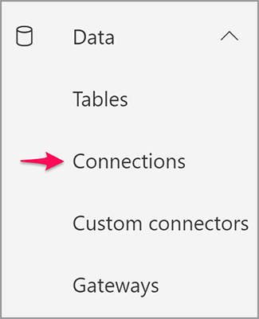

# Referenties ophalen voor Microsoft Power Automate

[Microsoft Power Automate](https://powerautomate.microsoft.com/nl-nl/) biedt een krachtige manier voor burgerontwikkelaars en -ontwikkelaars om krachtige geautomatiseerde processen te creëren om hun bedrijf te verbeteren zonder code te schrijven. [Adobe PDF Services](https://us.flow.microsoft.com/nl-nl/connectors/shared_adobepdftools/adobe-pdf-services/) -connector, als onderdeel van [[!DNL Adobe Acrobat Services]](https://developer.adobe.com/document-services), stelt gebruikers in staat om alle acties uit te voeren die beschikbaar zijn in de Adobe PDF Services API binnen Microsoft Power Automate.

In deze zelfstudie leert u hoe u referenties kunt ophalen om Adobe PDF Services te gebruiken of te triggeren. Afhankelijk van het feit of u een proefgebruiker of een bestaande klant bent, wordt in deze zelfstudie stapsgewijs ingegaan op de juiste stappen om referenties op te halen.

## Hoe kunnen Microsoft Power Automate-gebruikers de Adobe PDF Services-connector gaan gebruiken?

Bestaande Microsoft Power Automate-gebruikers kunnen [proefgegevens ophalen](https://www.adobe.com/go/powerautomate_getstarted) voor Adobe PDF Services. De bovenstaande koppeling is een speciale link voor aanmelding die specifiek bedoeld is voor Microsoft Power Automate-gebruikers.


>[!IMPORTANT]
> Als u zich aanmeldt voor een proefversie, moet u een Adobe ID gebruiken en niet een Enterprise ID. Als u geen huidige abonnee bent van de Adobe PDF Services API en u probeert u aan te melden met uw Enterprise ID, krijgt u mogelijk een machtigingsfout omdat uw onderneming u niet heeft gemachtigd om de Adobe PDF Services API te gebruiken. Daarom wordt u aangeraden een gratis persoonlijke Adobe ID te gebruiken.
>

1. Nadat u zich hebt aangemeld, wordt u gevraagd een naam voor uw nieuwe referenties te selecteren. Voer uw *Referentienaam*.
1. Schakel het selectievakje in om akkoord te gaan met de voorwaarden voor ontwikkelaars.
1. Selecteren **[!UICONTROL Referenties maken]**.

   

Deze referenties betreffen vijf verschillende waarden:

* Klant-ID (API-sleutel)
* Klantgeheim
* Organisatie-ID
* Technisch Account-ID
* Base64 (gecodeerde persoonlijke sleutel)


Er wordt ook automatisch een JSON-bestand met al deze waarden naar uw systeem gedownload. Dit bestand krijgt de naam `pdfservices-api-pa-credentials.json` en ziet er als volgt uit:

```json
{
 "client_id": "client id value",
 "client_secret": "client secret value",
 "organization_id": "organized id value",
 "account_id": "account id value",
 "base64_encoded_private_key": "base64 version of the private key"
}
```

Sla dit bestand op een beveiligde locatie op, omdat het niet mogelijk is om opnieuw een kopie van de persoonlijke sleutel op te halen.

### Verbinding toevoegen in Microsoft Power Automate

Nu u uw aanmeldingsgegevens hebt, kunt u deze gaan gebruiken in Microsoft Power Automate-flows.

1. Open in het zijbalkmenu het menu **[!UICONTROL Gegevens]** menu en selecteer **Verbindingen**:

   

1. Selecteren **+ [!UICONTROL Nieuwe verbinding]**.

1. In het volgende scherm ziet u een lijst met mogelijke verbindingstypen. Typ &quot;adobe&quot; in de rechterbovenhoek om de opties te filteren:

   

1. Selecteren **[!UICONTROL Adobe PDF Services (preview)]**.
1. Voer in het modale venster alle vijf waarden in die u eerder hebt gegenereerd. Selecteren **[!UICONTROL Maken]** als u klaar bent.

   

U kunt nu Adobe PDF Services gebruiken in Microsoft Power Automate.

### Referenties openen nadat ze zijn gemaakt

Als u al aanmeldingsgegevens hebt gemaakt en de gedownloade gegevens hebt misplaatst, kunt u deze opnieuw ophalen in [Adobe Developer Console](https://developer.adobe.com/console).

1. Nadat u zich hebt aangemeld bij [Adobe Developer Console](https://developer.adobe.com/console), zoekt u eerst uw project en selecteert u het.
1. In het linkermenu onder *Referenties* selecteert u **Serviceaccount (JWT)**:

   

1. Let op de vijf waarden die hier worden weergegeven: *Client-id*, *Clientgeheim*, *Technische account-id*, *E-mail technische account*, en *Organisatie-id*.

Helaas kunt u de vorige persoonlijke sleutel niet downloaden, maar u kunt de knop &quot;Generate a public/private keypair&quot; gebruiken om een nieuwe te maken.

## Bestaande Adobe PDF Services-gebruikersgegevens gebruiken

Als u bestaande Adobe PDF Services API-referenties hebt gegenereerd op basis van [!DNL Adobe Acrobat Services] met Microsoft Power Automate. Als u een SDK hebt gedownload terwijl u zich aanmeldde, werden uw bestaande referenties weergegeven in de vorm van een JSON-bestand met waarschijnlijk de naam `pdfservices-api-credentials.json`. Dat JSON-bestand bevat de vijf sleutels die nodig zijn om uw verbindingsgegevens te maken. Kopieer elke waarde van het JSON-bestand naar het corresponderende verbindingsveld.

De waarde van uw persoonlijke sleutel komt uit een tweede bestand met de naam `private.key`.

U kunt de waarden ook ophalen uit Adobe Developer Console zoals hierboven is beschreven.

## Hoe kan [!DNL Adobe Acrobat Services] Gebruikers beginnen te werken met Microsoft Power Automate?

Om aan de slag te gaan met Power Automate, begin met <https://powerautomate.microsoft.com> en gebruik de knop &quot;Start free&quot;. Als u geen Microsoft-account hebt, moet u er een maken. Na het aanmelden krijgt u het dashboard Power Automate te zien.


Zoals aan het begin van deze zelfstudie wordt beschreven, maakt u een nieuwe flow, voegt u een stap toe en zoekt u de Adobe PDF Services. Selecteer een actie en mogelijk wordt u gewaarschuwd dat een Premium-account vereist is.


Zoals het bovenstaande screenshot laat zien, kunt u overschakelen op een werkaccount of een nieuwe organisatieaccount instellen. Als u eenmaal beschikt, kunt u de Adobe PDF Services-actie toevoegen.

Ga dieper in op het creëren van je eerste Microsoft Power Automated-flow met [!DNL Adobe Acrobat Services], zie [Maak je eerste workflow in Microsoft Power Automate](https://experienceleague.adobe.com/docs/document-services/tutorials/pdfservices/create-workflow-power-automate.html).

## Extra bronnen

Hier volgt een lijst met aanvullende bronnen om u meer te helpen:

* Eerst zijn er de Adobe PDF Services Power Automate-documenten: <https://docs.microsoft.com/en-us/connectors/adobepdftools/>. Deze bronnen vormen een aanvulling op wat je hier hebt geleerd.
* Hebt u voorbeelden nodig? U kunt een groot aantal [Automatiseer sjablonen](https://powerautomate.microsoft.com/en-us/connectors/details/shared_adobepdftools/adobe-pdf-services/) het demonstreren van de PDF Services.
* Onze live video-inhoud, [Papierclips](https://www.youtube.com/playlist?list=PLcVEYUqU7VRe4sT-Bf8flvRz1XXUyGmtF), bevat ook video&#39;s waarin het gebruik van Power Automate wordt gedemonstreerd.
* De [Adobe Tech Blog](https://medium.com/adobetech/tagged/microsoft-power-automate) heeft veel artikelen over werken met Power Automate.
* Tot slot ben zeker om de kern te raadplegen [PDF Services](https://developer.adobe.com/document-services/docs/overview/) ook documentatie.
