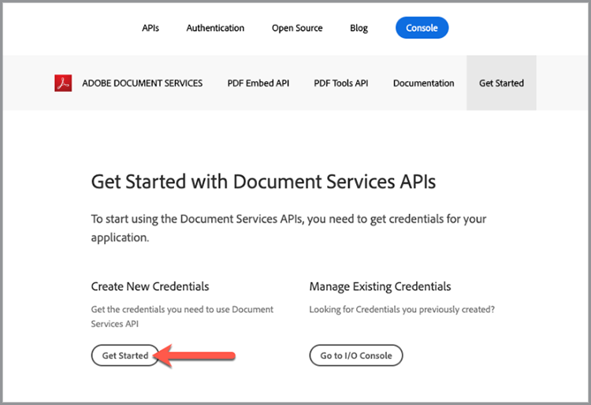

# Aan de slag met Adobe PDF Services API en .Net

Ontwikkelaars kunnen binnen een paar minuten aan de slag met de gebruiksklare voorbeeldbestanden voor toegang tot alle beschikbare webservices. Deze zelfstudie begeleidt u door alle stappen om de steekproeven in werking te stellen gebruikend PDF Services .Net SDK:

## Stap 1: Referenties verkrijgen en voorbeeldbestanden downloaden

De eerste stap is het verkrijgen van een referentie (API-sleutel) om het gebruik te ontgrendelen. [Meld je hier aan voor de gratis proefversie](https://www.adobe.io/apis/documentcloud/dcsdk/gettingstarted.html) en klik op Aan de slag om uw nieuwe referenties te maken.

Het is belangrijk om een &#39;Persoonlijk account&#39; te kiezen om u aan te melden voor de gratis proefversie:

In de volgende stap kiest u de PDF Services API Service en voegt u vervolgens een naam en een beschrijving toe voor uw referenties.

Er is een selectievakje voor &#39;Een gepersonaliseerd codevoorbeeld maken&#39;. Kies deze optie als u uw nieuwe referenties automatisch wilt laten toevoegen aan uw voorbeeldbestanden. Hiermee slaat u de handmatige stap op om deze toe te voegen aan uw project.

Kies vervolgens Node.js als uw taal om de specifieke voorbeelden Node.js te ontvangen en klik op de knop &#39;Referenties maken&#39;.

U ontvangt een ZIP-bestand dat u kunt downloaden met de naam PDFToolsSDK-.NetSamples.zip en dat u kunt opslaan in uw lokale bestandssysteem.

## Stap 2: Stel uw .Net-omgeving in en voer de voorbeeldcode uit

1. Download en installeer de [.Net SDK](https://dotnet.microsoft.com/learn/dotnet/hello-world-tutorial/install)
1. Het gedownloade **[!UICONTROL PDFToolsSDK-.NetSamples.zip]** en decomprimeer de inhoud
1. cd naar de hoofdmap van de samples **[!UICONTROL adobe-DC.PDFTools.SDK.NET.Samples]**
1. Voer vanuit de hoofdmap samples uit `dotnet build`

   C:\Temp\PDFToolsAPI\ PDFToolsSDK-.NetSamples\adobe-DC.PDFTools.SDK.NET.Samples>dotnet maken

   U kunt nu de voorbeeldbestanden uitvoeren!

   In de volgende laatste stappen ziet u hoe u het eerste voorbeeld uitvoert met de bewerking PDF maken van Word:

1. Van de map samples hoofdmap naar de map CreatePDFFromDocx, cd CreatePDFFromDocx/

   C:\Temp\PDFToolsAPI\ PDFToolsSDK-.NetSamples\adobe-DC.PDFTools.SDK.NET.Samples>cd CreatePDFFromDocx/

1. run `dotnet run CreatePDFFromDocx.csproj`

   C:\Temp\PDFToolsAPI\ PDFToolsSDK-.NetSamples\adobe-DC.PDFTools.SDK.NET.Samples\CreatePDFFromDocx>dotnet run CreatePDFFromDocx.csproj

Uw PDF wordt gemaakt op de locatie die is aangegeven in de uitvoer. Standaard is dit dezelfde map.

## Definitieve gedachten

De PDF Services API kan je helpen handmatige processen te elimineren door gemeenschappelijke workflows te automatiseren en de verwerkingsbelasting over te hevelen naar de cloud. In een wereld waarin elke browser PDF anders behandelt en de Adobe PDF Embed-API samen met de PDF Services-API gebruikt, kunt u gestroomlijnde, betrouwbare en voorspelbare processen maken die correct worden uitgevoerd en weergegeven **elke keer** ongeacht platform of apparaat.

## Bronnen en volgende stappen

* Ga voor meer hulp en ondersteuning naar de [[!DNL Adobe Acrobat Services] API&#39;s](https://community.adobe.com/t5/document-cloud-sdk/bd-p/Document-Cloud-SDK?page=1&amp;sort=latest_replies&amp;filter=all) communautair forum

* PDF Services API [Documentatie](https://www.adobe.com/go/pdftoolsapi_doc)

* [Veelgestelde vragen](https://community.adobe.com/t5/document-cloud-sdk/faq-for-document-services-pdf-tools-api/m-p/10726197) voor PDF Services API-vragen

* [Contact opnemen](https://www.adobe.com/go/pdftoolsapi_requestform) voor vragen over licenties en prijzen

* Verwante artikelen

   [De nieuwe PDF Services API biedt nog meer functies voor documentworkflows](https://community.adobe.com/t5/document-services-apis/new-pdf-tools-api-brings-more-capabilities-for-document-services/m-p/11294170)

   [Release van juli [!DNL Adobe Acrobat Services]: PDF Embed and PDF Services](https://medium.com/adobetech/july-release-of-adobe-document-services-pdf-embed-and-pdf-tools-17211bf7776d)
