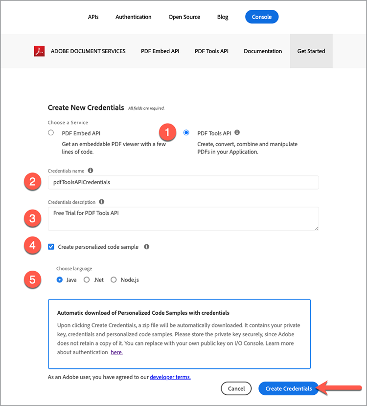

# Aan de slag met Adobe PDF Services API en .Net

Ontwikkelaars kunnen binnen een paar minuten aan de slag met de gebruiksklare voorbeeldbestanden voor toegang tot alle beschikbare webservices. Deze zelfstudie begeleidt u door alle stappen om de steekproeven in werking te stellen gebruikend PDF Services .Net SDK:

## Stap 1: Referenties verkrijgen en voorbeeldbestanden downloaden

De eerste stap is het verkrijgen van een referentie (API-sleutel) om het gebruik te ontgrendelen. [&#x200B; Teken omhoog voor de vrije proef hier &#x200B;](https://www.adobe.io/apis/documentcloud/dcsdk/gettingstarted.html) en klik op &quot;krijg Begonnen&quot;om uw nieuwe geloofsbrieven tot stand te brengen.

Het is belangrijk om een &#39;Persoonlijk account&#39; te kiezen om u aan te melden voor de gratis proefversie:

In de volgende stap kiest u de PDF Services API Service en voegt u vervolgens een naam en een beschrijving toe voor uw referenties.

Er is een selectievakje voor &#39;Een gepersonaliseerd codevoorbeeld maken&#39;. Kies deze optie als u uw nieuwe referenties automatisch wilt laten toevoegen aan uw voorbeeldbestanden. Hiermee slaat u de handmatige stap op om deze toe te voegen aan uw project.

Kies vervolgens Node.js als uw taal om de specifieke voorbeelden Node.js te ontvangen en klik op de knop &#39;Referenties maken&#39;.

U ontvangt een ZIP-bestand dat u kunt downloaden met de naam PDFToolsSDK-.NetSamples.zip en dat u kunt opslaan in uw lokale bestandssysteem.

## Stap 2: Opstelling uw milieu .Net en stel de steekproefcode in werking

1. Download en installeer de [&#x200B; .Net SDK &#x200B;](https://dotnet.microsoft.com/learn/dotnet/hello-world-tutorial/install)
1. Extraheer gedownload **[!UICONTROL PDFToolsSDK-.NetSamples.zip]** en decomprimeer de inhoud
1. cd aan de folder van de monsterwortel **[!UICONTROL adobe-DC.PDFTools.SDK.NET.Samples]**
1. Voer `dotnet build` uit vanuit de hoofdmap met voorbeelden

   C:\Temp\PDFToolsAPI\ PDFToolsSDK-.NetSamples\adobe-DC.PDFTools.SDK.NET.Samples>dotnet maken

   U kunt nu de voorbeeldbestanden uitvoeren!

   In de volgende laatste stappen ziet u hoe u het eerste voorbeeld uitvoert met de bewerking PDF maken van Word:

1. Van de map samples hoofdmap naar de map CreatePDFFromDocx, cd CreatePDFFromDocx/

   C:\Temp\PDFToolsAPI\ PDFToolsSDK-.NetSamples\adobe-DC.PDFTools.SDK.NET.Samples>cd CreatePDFFromDocx/

1. run `dotnet run CreatePDFFromDocx.csproj`

   C:\Temp\PDFToolsAPI\ PDFToolsSDK-.NetSamples\adobe-DC.PDFTools.SDK.NET.Samples\CreatePDFFromDocx>dotnet run CreatePDFFromDocx.csproj

Uw PDF wordt gemaakt op de locatie die is aangegeven in de uitvoer. Standaard is dit dezelfde map.

## Definitieve gedachten

De PDF Services API kan je helpen handmatige processen te elimineren door gemeenschappelijke workflows te automatiseren en de verwerkingsbelasting over te hevelen naar de cloud. In een wereld waar elke browser PDF anders behandelt, leveraging Adobe PDF Embed API samen met de PDF Services API, kunt u gestroomlijnde, betrouwbare, en voorspelbare processen tot stand brengen die **lopen en correct** ongeacht platform of apparaat tonen.

## Bronnen en volgende stappen

* Voor extra hulp en steun, bezoek het [[!DNL Adobe Acrobat Services]  APIs &#x200B;](https://community.adobe.com/t5/document-cloud-sdk/bd-p/Document-Cloud-SDK?page=1&sort=latest_replies&filter=all) communautaire forum

* PDF Services API [&#x200B; Documentatie &#x200B;](https://www.adobe.com/go/pdftoolsapi_doc)

* [&#x200B; Veelgestelde vragen &#x200B;](https://community.adobe.com/t5/contentarchivals/contentarchivedpage/message-uid/10726197) voor de vragen van de Diensten API van PDF

* [&#x200B; Contact ons &#x200B;](https://www.adobe.com/go/pdftoolsapi_requestform) voor vragen over vergunning en tarifering

* Verwante artikelen

  [&#x200B; de Nieuwe Diensten API van de PDF biedt nog meer eigenschappen voor documentworkflows &#x200B;](https://community.adobe.com/t5/acrobat-services-api-discussions/new-pdf-tools-api-brings-more-capabilities-for-document-services/m-p/11294170) aan

  [&#x200B; Versie van juli van  [!DNL Adobe Acrobat Services]: PDF bedde en de Diensten van de PDF &#x200B;](https://medium.com/adobetech/july-release-of-adobe-document-services-pdf-embed-and-pdf-tools-17211bf7776d) in
