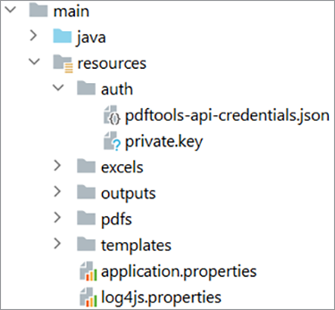

# Workflows voor financiële documenten beheren in Java


De financiële sector gebruikt veel PDF-bestanden om gegevens uit te wisselen, omdat hierdoor de indeling, het ontwerp en de structuur van documenten beter behouden blijven. Dankzij deze krachtige indeling kunnen financiële analisten en adviseurs hun cliënten helpen met kennis van zaken beslissingen te nemen.

De PDF-indeling kan echter lastig zijn om te verwerken en te automatiseren, vooral wanneer meerdere databronnen worden gecombineerd — een veelvoorkomend geval in de financiële sector. Een aangepaste oplossing voor het verwerken van PDF-documenten is een optie, maar het is niet nodig om te veel tijd en geld in software en infrastructuur te investeren. [!DNL Adobe Acrobat Services] biedt alle gereedschappen, services en functies die nodig zijn om gegevens uit PDF-documenten te verwerken en te extraheren.

## Wat je kunt leren

Leer in deze praktische zelfstudie hoe u [!DNL Adobe Acrobat Services] API&#39;s voor [!DNL Java Spring Boot] toepassingen. U maakt een MVC-app (model-view-controller) die inhoud uit PDF-documenten extraheert, deze omzet in andere gegevensindelingen zoals Excel, meerdere PDF combineert en de bronnen beschermt met een wachtwoord. In deze zelfstudie wordt uitgelegd hoe u PDF-documenten verwerkt en op uw websites weergeeft met de Adobe [PDF Embed-API](https://www.adobe.io/apis/documentcloud/dcsdk/pdf-embed.html).

## Relevante API&#39;s en bronnen

* [PDF Services API](https://opensource.adobe.com/pdftools-sdk-docs/release/latest/index.html)

* [PDF Embed-API](https://www.adobe.com/devnet-docs/dcsdk_io/viewSDK/index.html)

* [Projectvoorbeelden](https://github.com/adobe/pdftools-java-sdk-samples)

## Instellen

[!DNL Adobe Acrobat Services] gebruikt een authentificatiesysteem om middeltoegang te controleren. Als u toegang wilt tot de services, moet u een API-sleutel aanvragen bij Adobe voor uw organisatie of toepassing. Als u een API-sleutel hebt, gaat u verder naar de volgende sectie. Ga naar [Aan de slag](https://www.adobe.io/apis/documentcloud/dcsdk/gettingstarted.html) in de [!DNL Acrobat Services] site. U kunt een sleutel maken met behulp van hun gratis proefversie, die 1000 documenttransacties biedt die u maximaal zes maanden kunt gebruiken.

Als u deze zelfstudie wilt volgen, hebt u twee sets API-sleutels nodig:

* Adobe PDF Services — wordt gebruikt om het PDF-document te verwerken

* Adobe PDF Embed-API

Kopieer na het aanmaken van de referenties de PDF Services API en de persoonlijke sleutel naar de [!DNL Spring Boot] binnen de sectie Bronnen. Meer informatie over de [Maven en Gradle libraries en afhankelijkheden](https://www.adobe.io/apis/documentcloud/dcsdk/docs.html?view=services) op de [!DNL Adobe Acrobat Services] website. Zorg dat u alle benodigde pakketten en bibliotheken hebt ingesteld voordat u verdergaat.



Om de logboekdiensten te vormen, bezoek [Adobe-documentatie](https://www.adobe.io/apis/documentcloud/dcsdk/docs.html?view=services) en scrol naar de sectie Logging.

>[!NOTE]
>
> Sla in uw productieomgeving de persoonlijke sleutels niet op in versiebeheer. Gebruik altijd een geheime kluis of een belangrijke injectiedienst om ongeoorloofd gebruik van gegevens te voorkomen.

Nu kun je [!DNL Spring Boot] toepassing is geconfigureerd, kunt u doorgaan met het verwerken van de PDF en het genereren van rapporten voor klanten.

## Rapportgegevens verzenden

Als u de Adobe PDF Services-API wilt gebruiken, moet u eerst een `ExecutionContext` dat de referenties gebruikt die u opgeeft. Aangezien u de referenties in uw toepassing hebt, kunt u deze uit het bestand lezen en als volgt de context maken:

```
Credentials credentials = Credentials.serviceAccountCredentialsBuilder()
    .fromFile(AUTH_FILE_PATH)
    .build();

ExecutionContext executionContext = ExecutionContext.create(credentials);
```

Vervolgens kunt u de context ophalen voor het verwerken van de PDF-documenten. Hier volgen de handelingen die u kunt uitvoeren:

* De PDF-documenten converteren (naar Excel, Word of afbeeldingstype)

* De PDF-documenten maken (van HTML, Excel, Word en meer)

* Meerdere PDF-documenten combineren

* Protect en de beveiliging van de PDF-documenten opheffen (u moet een wachtwoord hebben)

* De PDF-documenten optimaliseren voor levering op netwerken

Al deze voorbeelden zijn beschikbaar in het dialoogvenster [GitHub-voorbeelden](https://github.com/adobe/pdfservices-java-sdk-samples/tree/master/src/main/java/com/adobe/pdfservices/operation/samples) opslagplaats.

Volgende, in [!DNL Spring Boot]kunt u een bestand ophalen met behulp van het tekenreekspad of de stream waarin het bestand wordt geüpload. Elke bewerking die u uitvoert, moet worden geïnitialiseerd en er moet een invoerbestandspad worden ingesteld. Voor deze zelfstudie gebruikt u de openbaar beschikbare PDF-rapporten van [Blackrock](https://www.blackrock.com/us/individual/products/investment-funds). U kunt elke andere bron gebruiken, inclusief uw eigen rapporten.

Begin door het [FileRef](https://opensource.adobe.com/pdfservices-java-sdk-samples/apidocs/latest/com/adobe/pdfservices/operation/io/FileRef.html) uit het bestand. Voor het gemak, concentreer op de dossiers door weg van het Koord. Hieronder maakt u een bewerking voor het omzetten van een bestand in uw pad van PDF naar Excel:

```
ExecutionContext executionContext = ExecutionContext.create(credentials);
ExportPDFOperation exportOperation = ExportPDFOperation.createNew(ExportPDFTargetFormat.XLSX);

// Create the input source
FileRef inputPdf = FileRef.createFromLocalFile(INPUT_PDF);
exportOperation.setInput(inputPdf);
```

Na deze stap is uw programma klaar om de eerste bewerking op de PDF uit te voeren. Vervolgens voert u de bewerking uit en haalt u het resultaat op in het Excel-blad:

```
try {
    FileRef output = exportOperation.execute(executionContext);
    output.saveAs(OUTPUT_EXCEL);
} catch (ServiceApiException e) {
    e.printStackTrace();
}
```

Bij dit scenario wordt slechts één PDF-bestand afgehandeld. U kunt ook beginnen met meerdere PDF-bestanden en deze combineren tot één bestand. Het gebruik van meerdere bestanden komt veel voor in financiële gegevensrapportage omdat u middelen uit meerdere bronnen moet verwerken om een uitgebreid rapport te kunnen leveren.

## Het rapport genereren

[!DNL Adobe Acrobat Services] biedt geen ondersteuning voor het verwerken van Excel-documenten uit de verpakking, maar u kunt wel communityframeworks en bibliotheken gebruiken om de inhoud te verwerken.

U kunt bijvoorbeeld de opdracht [Apache POI](https://poi.apache.org/) om Excel (of andere Microsoft-documenten) in uw [!DNL Java Spring Boot] of u kunt andere handmatige of geautomatiseerde taken uitvoeren op het Excel-bestand.

In dit voorbeeld, om te beginnen met uw PDF-documenten, extraheert u de intrinsieke waarde voor uw drie fondsen en toont u deze in een tabel. U kunt ook andere informatie ophalen, zoals grafieken en tabellen, op basis van uw vereisten en de beschikbare gegevens. Je kunt zelfs data uit andere bronnen inbrengen.

Nadat je rapport is gegenereerd — in dit voorbeeld in Excel-indeling — kun je Adobe PDF Services-bewerkingen gebruiken om het rapport terug te zetten in een PDF-document en het te beschermen.

Als u het rapport wilt converteren van Excel-indeling naar een PDF-document, gebruikt u de volgende bewerking:

```
ExecutionContext executionContext = ExecutionContext.create(credentials);
CreatePDFOperation exportOperation = CreatePDFOperation.createNew();

// Create the input source
FileRef inputPdf = FileRef.createFromLocalFile(INPUT_EXCEL);
exportOperation.setInput(inputPdf);

try {
    FileRef output = exportOperation.execute(executionContext);
    output.saveAs(OUTPUT_PDF);
} catch (ServiceApiException e) {
    e.printStackTrace();
}
```

>[!TIP]
>
> Om te voorkomen dat het object telkens opnieuw opnieuw moet worden gemaakt wanneer een aanvraag wordt ingediend, gebruikt u de injectie van de afhankelijkheid van de lente om de `ExecutionContext` -object.

Deze code produceert een document van de PDF van het rapport in het formaat van Excel.

Voordat u deze PDF aan uw klanten levert, kunt u deze met een wachtwoord beveiligen. Maak een andere bewerking die deze beveiliging voor u afhandelt, [ProtectPDFOperation](https://opensource.adobe.com/pdfservices-java-sdk-samples/apidocs/latest/com/adobe/pdfservices/operation/pdfops/ProtectPDFOperation.html)en vervolgens [ProtectPDFOptions](https://opensource.adobe.com/pdfservices-java-sdk-samples/apidocs/latest/com/adobe/pdfservices/operation/pdfops/options/protectpdf/package-summary.html) om het wachtwoord aan het document toe te voegen.

```
ProtectPDFOptions options = ProtectPDFOptions.passwordProtectOptionsBuilder()
                    .setUserPassword("p@55w0rd")
                    .setEncryptionAlgorithm(EncryptionAlgorithm.AES_256)
                    .build();
ProtectPDFOperation operation = ProtectPDFOperation.createNew(options);
```

Geef vervolgens de invoer op en voer de bewerking uit. Het resulterende bestand moet een wachtwoord hebben om ongeoorloofde toegang te voorkomen.

## Het rapport weergeven

Nu uw PDF-rapport is gegenereerd, kunt u het rapport op de website weergeven met de Adobe PDF Embed-API. Met deze JavaScript-API kunnen webontwikkelaars de PDF-documenten native laden en renderen in de webbrowser.

>[!NOTE]
>
> Op dit punt hebt u het tweede referentietoken nodig, de client-id.

In uw [!DNL Spring Boot] voegt u het volgende HTML-fragment toe waar u het PDF-rapport wilt weergeven:

```
<div id="pdf-viewer"></div>
<script src="https://documentcloud.adobe.com/view-sdk/main.js"></script>
<script type="text/javascript">
    document.addEventListener("adobe_dc_view_sdk.ready", function()
    {
        var adobeDCView = new AdobeDC.View({ clientId: "<your-client-id-here>", divId: "pdf-viewer" });
        adobeDCView.previewFile(
        {
            content: {
                location: {
                    url: "<your-document.pdf>"
                }
            },
            metaData: {
                fileName: "<document-name.pdf>"
            }
        });
    });
</script>
```

Met dit script wordt het PDF-document geladen en kunnen gebruikers notities toevoegen aan en opmerkingen toevoegen aan de documenten. Hier ziet u de weergave van deze API voor insluiten, zoals getoond in Firefox:


De PDF Embed API biedt alle gereedschappen die nodig zijn om een voorvertoning van de PDF te bekijken en om notities toe te voegen aan het rapport.

## Volgende stappen

Deze praktische zelfstudie verkende de [[!DNL Adobe Acrobat Services]](https://www.adobe.io/apis/documentcloud/dcsdk/) API&#39;s en bespraken hoe u deze services kunt gebruiken om PDF-gegevens te verwerken en rapporten te genereren voor financiële beslissingen. Hierin werd getoond hoe u de API&#39;s in uw systemen kunt integreren, met behulp van [!DNL Java Spring Boot] als voorbeeldframework om te laten zien hoe eenvoudig het is om PDF-documenten snel te verwerken.

Verkennen [[!DNL Adobe Acrobat Services]](https://www.adobe.io/apis/documentcloud/dcsdk/) en bekijk wat Adobe PDF Services voor jouw bedrijf kan betekenen. Als u meer informatie wilt over de functies in de SDK, raadpleegt u de [GitHub-repository](https://github.com/adobe/pdftools-java-sdk-samples) voor de voorbeelden en ontdek hoe [PDF Embed-API](https://www.adobe.io/apis/documentcloud/dcsdk/pdf-embed.html) kunt u helpen snel PDF in uw toepassingen te tonen.

Om documenten eenvoudig te combineren en te bewerken, zodat je nuttige PDF-rapporten voor je financiële klanten kunt maken, kun je je gratis aanmelden [Adobe-ontwikkelaarsaccount](https://www.adobe.io/apis/documentcloud/dcsdk/) vandaag.
