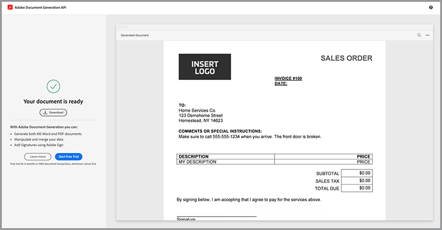

# Versnel je verkoopproces


Van whitepapers tot contracten en overeenkomsten, tijdens het aankooptraject zijn veel documenten nodig. Leer in deze zelfstudie hoe u [[!DNL Adobe Acrobat Services]](https://developer.adobe.com/document-services/) kan documentervaringen tijdens dit traject integreren om de verkoop te versnellen.

## Overeenkomsten en verkooporders genereren op basis van gegevens

Verkoopovereenkomsten, contracten en andere documenten kunnen sterk variëren op basis van specifieke criteria. Een verkoopovereenkomst kan bijvoorbeeld alleen bepaalde voorwaarden bevatten die op een uniek criterium zijn gebaseerd, zoals in een bepaald land of een bepaalde staat, of bepaalde producten als onderdeel van de overeenkomst opnemen. Door deze documenten handmatig te maken of veel verschillende sjabloonvariaties te behouden, kunnen de juridische kosten voor het handmatig controleren van wijzigingen aanzienlijk toenemen.

[Adobe-API voor documentgeneratie](https://developer.adobe.com/document-services/apis/doc-generation/) kunt u gegevens van uw CRM of ander gegevenssysteem gebruiken om verkoopdocumenten dynamisch te genereren op basis van die gegevens.

## Referenties ophalen

Registreer eerst voor gratis Adobe PDF Services-gebruikersgegevens:

1. Navigeren [hier](https://documentcloud.adobe.com/dc-integration-creation-app-cdn/main.html) om uw referenties te registreren.
1. Meld u aan met uw Adobe ID.
1. Stel uw aanmeldingsnaam in (bijv. Verkoopovereenkomsten demo).

   

1. Kies een taal om uw voorbeeldcode te downloaden (bijvoorbeeld Node.js).
1. Schakel in om akkoord te gaan met **[!UICONTROL ontwikkelingstermijnen]**.
1. Selecteren **[!UICONTROL Referenties maken]**.
Er wordt een bestand naar uw computer gedownload met een ZIP-bestand met de voorbeeldbestanden pdfservices-api-credentials.json en private.key voor verificatie.

   

1. Selecteren **[!UICONTROL Microsoft Word-invoegtoepassing ophalen]** of ga naar [AppSource](https://appsource.microsoft.com/en-cy/product/office/WA200002654) installeren.

   >[!NOTE]
   >
   >Voor de installatie van de invoegtoepassing Word moet u toestemming hebben om invoegtoepassingen te installeren in Microsoft 365. Neem contact op met uw Microsoft 365-beheerder als u geen toestemming hebt.

## Uw gegevens

Als u gegevens uit een specifiek gegevenssysteem haalt, moet u die gegevens uitvoeren als JSON-gegevens of uw eigen schema genereren. In dit scenario wordt de volgende vooraf gemaakte set met voorbeeldgegevens gebruikt:

```
{
    "salesOrder": {
        "comment": "Make sure to call 555-555-1234 when you arrive. The front door is broken."
    },
    "company": {
        "name":"Home Services Co.",
        "address": {
            "city": "Homestead",
            "state": "NY",
            "zip": "14623",
            "streetAddress": "123 Demohome Street"
        }
    },
    "customer": {
        "address": {
            "city": "Seattle",
            "state": "WA",
            "zip": "98052",
            "streetAddress": "20341 Whitworth Institute 405 N. Whitworth"
        },
        "email": "mailto:jane-doe@xyz.edu",
        "jobTitle": "Professor",
        "name": "Jane Doe",
        "telephone": "(425) 123-4567",
        "url": "http://www.janedoe.com"
    },
    "tax": {
        "state":"WA",
        "rate": 0.08
    },
    "referencesOrder": [
        {
            "description": "Carpet Cleaning Service - 3BR 2BA",
            "totalPaymentDue": {
                "price": 359.54
            },
            "orderedItem": {
                "description": "Carpet Cleaning Service"
            }
        },
        {
            "description": "Home Cleaning Service - 3BR 2BA",
            "totalPaymentDue": {
                "price": 299.99
            },
            "orderedItem": {
                "description": "House Cleaning Service"
            }
        }
    ]
}
```

## Basiscodes toevoegen aan uw document

Dit scenario gebruikt een document van de Orde van de Verkoop, dat kan downloaden [hier](https://github.com/benvanderberg/adobe-document-generation-samples/blob/main/SalesOrder/Exercise/SalesOrder_Base.docx?raw=true).


1. Open de *SalesOrder.docx* voorbeelddocument in Microsoft Word.
1. Als de plug-in Documentgeneratie is geïnstalleerd, selecteert u **[!UICONTROL Documenten genereren]** in het lint. Als u het genereren van documenten niet ziet in uw lint, volgt u deze instructies.
1. Selecteren **[!UICONTROL Aan de slag]**.
1. Kopieer de JSON-voorbeeldgegevens die hierboven zijn geschreven naar de *JSON-gegevens* veld.

   

Navigeer vervolgens naar het deelvenster Tags voor het genereren van documenten om codes in het document te plaatsen.

1. Selecteer de tekst die u wilt vervangen (bijvoorbeeld *NAAM VAN BEDRIJF*).
1. In het dialoogvenster *Tagger voor documentgeneratie* , zoekt u naar &quot;naam&quot;.
1. Selecteer een naam onder Bedrijf in de lijst met tags.
1. Selecteren **[!UICONTROL Tekst invoegen]**.

   

   Dit proces plaatst een tag genaamd {{company.name}} omdat de tag zich onder het pad in de JSON bevindt.

   ```
   {
   …
   "company": {
       "name":"Home Services Co.",
       …
   },
   …
   }
   ```

Herhaal deze handelingen voor enkele extra tags in het document, zoals STREET ADDRESS, CITY, STATE, ZIP enzovoort.

## Een voorvertoning van het gegenereerde document bekijken

Direct in Microsoft Word kunt u een voorvertoning van het gegenereerde document weergeven op basis van de JSON-voorbeeldgegevens.

1. In het dialoogvenster *Tagger voor documentgeneratie* deelvenster selecteert u **[!UICONTROL Document genereren]**. De eerste keer dat u wordt gevraagd u aan te melden bij uw Adobe ID. Selecteren **[!UICONTROL Aanmelden]** en vult de aanmeldingsgegevens in.

   

1. Selecteren **[!UICONTROL Document weergeven]**.

   

1. Er wordt een browservenster geopend waarin u een voorvertoning van de documentresultaten kunt bekijken.

   

U kunt de labels in het document zien die zijn vervangen door de gegevens uit de oorspronkelijke voorbeeldgegevens.


## Een tabel toevoegen aan een sjabloon

In dit volgende scenario voegt u een lijst met producten toe aan een tabel in het document.

1. Plaats de cursor op de plaats waar de tabel moet worden geplaatst.
1. In het dialoogvenster *Tagger voor documentgeneratie* deelvenster selecteert u **[!UICONTROL Gedeeld]**.
1. Uitbreiden **[!UICONTROL Tabellen en lijsten]**.
1. In het dialoogvenster *Tabelrecords* veld, selecteren *referencesOrder*, dat is een array die alle productitems opsomt.
1. Typ in het veld Kolomrecords selecteren de tekst die u wilt opnemen *beschrijving* en *totalPaymentDue.price* veld.
1. Selecteren **[!UICONTROL Tabel invoegen]**.

   

Bewerk de tabel om deze aan te passen aan stijlen, grootten en andere parameters, net als elke andere tabel in Microsoft Word.

## Numerieke berekening toevoegen

Met numerieke berekeningen kunt u sommen en andere berekeningen berekenen op basis van een verzameling gegevens, zoals een array. In dit scenario voegt u een veld toe om het subtotaal te berekenen.

1. Selecteer de *$ 0,00* naast de subtitel.
1. In het dialoogvenster *[!UICONTROL Tagger voor documentgeneratie]* deelvenster, uitvouwen **[!UICONTROL Numerieke berekeningen]**.
1. Onder *[!UICONTROL Type berekening selecteren]* kiest u **[!UICONTROL Samenvoeging]**.
1. Onder *[!UICONTROL Tekst selecteren]* kiest u **[!UICONTROL Som]**.
1. Onder *[!UICONTROL Records selecteren]* kiest u **[!UICONTROL ReferencesOrder]**.
1. Onder *[!UICONTROL Item selecteren om samenvoeging uit te voeren]&#x200B;**, kies &#x200B;** [!UICONTROL totalPaymentsDue.price]**.
1. Selecteren **[!UICONTROL Berekening invoegen]**.

Hierbij wordt een berekeningscode ingevoegd die de som van waarden bevat. U kunt geavanceerdere berekeningen maken met behulp van JSONata-berekeningen. Bijvoorbeeld:

* Subtotaal: `${{expr($sum(referencesOrder.totalPaymentDue.price))}}`
Berekent de som van referencesOrder.totalPaymentDue.price.

* BTW: `${{expr($sum(referencesOrder.totalPaymentDue.price)*0.08)}}`
Berekent de prijs en vermenigvuldigt met 8% om de belasting te berekenen.

* Totaal eind: `${{expr($sum(referencesOrder.totalPaymentDue.price)*1.08)}}`
Berekent de prijs en vermenigvuldigt met 1,08 om het subtotaal plus belasting te berekenen.

## Voorwaardelijke voorwaarden toevoegen

Met voorwaardelijke secties kunt u alleen een zin of alinea opnemen als aan een bepaalde voorwaarde is voldaan. In dit scenario wordt alleen een sectie opgenomen als deze overeenkomt met een bepaalde status.

1. Zoek in het document naar de sectie met de naam *CALIFORNIA PRIVACY-INSTRUCTIES*.
1. Selecteer de sectie met de cursor.

   

1. In het dialoogvenster *[!UICONTROL Tagger voor documentgeneratie]* selecteert u **[!UICONTROL Gedeeld]**.
1. Uitbreiden **[!UICONTROL Voorwaardelijke inhoud]**.
1. In het dialoogvenster *[!UICONTROL Records selecteren]* veld, zoeken en selecteren **[!UICONTROL customer.address.state]**.
1. In het dialoogvenster *[!UICONTROL Operator selecteren]* veld, selecteren **=**.
1. In het dialoogvenster *[!UICONTROL Waardeveld]*, type *CA*.
1. Selecteren **[!UICONTROL Voorwaarde invoegen]**.

De sectie California wordt alleen weergegeven in het gegenereerde document als customer.address.state = CA.

Selecteer vervolgens de sectie voor WASHINGTON PRIVACY-INSTRUCTIES en herhaal de bovenstaande stappen en vervang de waarde CA door WA.

## Een dynamische afbeelding toevoegen

Met de API voor het genereren van documenten kunt u afbeeldingen dynamisch invoegen op basis van gegevens. Dit is handig wanneer u verschillende submerken hebt en logo&#39;s, portretafbeeldingen of afbeeldingen wilt wijzigen om ze relevanter te maken voor een bepaalde branche.

Afbeeldingen kunnen via een URL worden doorgegeven in de gegevens- of base64-inhoud. In dit voorbeeld wordt een URL gebruikt.

1. Plaats de cursor op de plaats waar u een afbeelding wilt invoegen.
1. In het dialoogvenster *[!UICONTROL Tagger voor documentgeneratie]* deelvenster selecteert u **[!UICONTROL Gedeeld]**.
1. Uitbreiden **[!UICONTROL Afbeeldingen]**.
1. In het dialoogvenster *[!UICONTROL Labels selecteren]* veld, kiest u **[!UICONTROL logo]**.
1. In het dialoogvenster *[!UICONTROL Optionele alternatieve tekst]* veld, een beschrijving geven (bijvoorbeeld logo). Hierbij wordt een tijdelijke aanduiding voor afbeeldingen ingevoegd die er als volgt uitziet:

   

U wilt de afbeelding echter dynamisch instellen voor een afbeelding die zich al in de lay-out bevindt. Dat kunt u als volgt doen:

1. Klik met de rechtermuisknop op de ingevoegde voorlopige afbeelding.

   

1. Selecteren **[!UICONTROL Alt-tekst bewerken]**.
1. Kopieer in het deelvenster de tekst die er als volgt uitziet:
   `{ "location-path": "logo", "image-props": { "alt-text": "Logo" }}`
1. Selecteer een andere afbeelding in het document dat u dynamisch wilt maken.

   

1. Klik met de rechtermuisknop op de afbeelding en selecteer **[!UICONTROL Alt-tekst bewerken]**.
1. Plak de waarde in het deelvenster.

Bij dit proces wordt de afbeelding vervangen door een afbeelding in de logovariabele in de gegevens.

## Tags toevoegen voor Acrobat Sign

Met Adobe Acrobat Sign kunt u elektronische handtekeningen vastleggen op uw documenten. Acrobat Sign biedt een eenvoudige manier om velden binnen de webinterface te slepen en neer te zetten, maar u kunt ook de plaatsing van handtekeningen en andere velden regelen met een tekstcode. Met Adobe Document Generation Tagger kunt u deze tekstlabelvelden eenvoudig plaatsen.

1. Navigeer naar de plaats waar een handtekening is vereist in het voorbeelddocument.
1. Plaats de cursor op de plaats waar de handtekening nodig is.
1. In het dialoogvenster *[!UICONTROL Tagger voor het genereren van Adobe-documenten]* deelvenster selecteert u **[!UICONTROL Adobe Sign]**.
1. In het dialoogvenster *[!UICONTROL Geef het aantal ontvangers op]* -veld, stelt u het aantal ontvangers in (in dit voorbeeld is het er één).
1. In het dialoogvenster *[!UICONTROL Ontvangers]* veld, selecteren **[!UICONTROL Afzender-1]**.
1. In het dialoogvenster *[!UICONTROL Veld]* tekst, selecteren **[!UICONTROL Handtekening]**.
1. Selecteren **[!UICONTROL Adobe Sign-teksttag invoegen]**.

Er wordt een label in het document ingevoegd.


Acrobat Sign biedt verschillende andere typen velden die u kunt plaatsen, zoals datumvelden.
1. In het dialoogvenster *Veld* tekst, selecteren **[!UICONTROL Datum]**.
1. Plaats de cursor boven de datumlocatie in het document.
1. Selecteren **[!UICONTROL Adobe Sign-teksttag invoegen]**.


## Uw overeenkomst genereren

U hebt uw document nu gelabeld en bent klaar om te gaan. In deze volgende sectie wordt besproken hoe u een document kunt genereren aan de hand van de API-voorbeelden voor het genereren van documenten voor Node.js, maar deze werken in alle talen.

Open de pdfservices-node-sdk-samples-master die is gedownload toen u uw referenties registreerde. De bestanden pdfservices-api-credentials.json en private.key moeten in deze bestanden worden opgenomen.

1. Open een Terminal om gebiedsdelen te installeren gebruikend npm installeert.
1. Kopieer de sample data.json naar de map resources.
1. Kopieer de Word-sjabloon naar de bronnenmap.
1. Maak een nieuw bestand in de hoofdmap van de map samples met de naam generate-salesOrder.js.

```
const PDFServicesSdk = require('@adobe/pdfservices-node-sdk');
const fs = require('fs');
const path = require('path');

var dataFileName = path.join('resources', '<INSERT JSON FILE');
var outputFileName = path.join('output', 'salesOrder_'+Date.now()+".pdf");
var inputFileName = path.join('resources', '<INSERT DOCX>');

//Loads credentials from the file that you created.
const credentials =  PDFServicesSdk.Credentials
    .serviceAccountCredentialsBuilder()
    .fromFile("pdfservices-api-credentials.json")
    .build();

// Setup input data for the document merge process
const jsonString = fs.readFileSync(dataFileName),
jsonDataForMerge = JSON.parse(jsonString);

// Create an ExecutionContext using credentials
const executionContext = PDFServicesSdk.ExecutionContext.create(credentials);

// Create a new DocumentMerge options instance
const documentMerge = PDFServicesSdk.DocumentMerge,
documentMergeOptions = documentMerge.options,
options = new documentMergeOptions.DocumentMergeOptions(jsonDataForMerge, documentMergeOptions.OutputFormat.PDF);

// Create a new operation instance using the options instance
const documentMergeOperation = documentMerge.Operation.createNew(options)

// Set operation input document template from a source file.
const input = PDFServicesSdk.FileRef.createFromLocalFile(inputFileName);
documentMergeOperation.setInput(input);

// Execute the operation and Save the result to the specified location.
documentMergeOperation.execute(executionContext)
.then(result => result.saveAsFile(outputFileName))
.catch(err => {
    if(err instanceof PDFServicesSdk.Error.ServiceApiError
        || err instanceof PDFServicesSdk.Error.ServiceUsageError) {
        console.log('Exception encountered while executing operation', err);
    } else {
        console.log('Exception encountered while executing operation', err);
    }
});
```

1. Vervangen `<INSERT JSON FILE>` met de naam van het JSON-bestand in /resources.
1. Vervangen `<INSERT DOCX>` met de naam van het DOCX-bestand.
1. Om te lopen, gebruik Terminal om knoop uit te voeren generate-salesOrder.js.

Het uitvoerbestand moet zich in de /uitvoermap bevinden en het document moet correct zijn gegenereerd.

## Meer opties

Nadat het document is gegenereerd, kunt u aanvullende acties uitvoeren, zoals:

* Document beveiligen met een wachtwoord
* PDF comprimeren als er grote afbeeldingen zijn
* Elektronische handtekeningen vastleggen op het document

Als u meer wilt weten over enkele andere beschikbare handelingen, bekijkt u de scripts in de map /src in de voorbeeldbestanden. U kunt ook meer leren door de documentatie van de verschillende handelingen te bekijken.

## Aanvullende gebruiksscenario’s

[!DNL Adobe Acrobat Services] kan helpen bij het stroomlijnen van een groot aantal onderdelen van een verkoopcyclus met workflows voor digitale documenten:

* Gebruik Adobe PDF Embed API om whitepapers en andere inhoud in te sluiten op websites en om analyses te meten en te verzamelen over viewers
* Gebruik Acrobat Sign om elektronische handtekeningen vast te leggen op uw gegenereerde overeenkomsten
* Overeenkomstgegevens uit uw PDF-documenten extraheren met Adobe PDF Extract API

## Verder leren

Wil je meer leren? Bekijk enkele aanvullende manieren om te gebruiken [!DNL Adobe Acrobat Services]:

* Meer informatie van [documentatie](https://developer.adobe.com/document-services/docs/overview/)
* Meer zelfstudies op Adobe Experience League bekijken
* Gebruik de voorbeeldscripts in de map /src om te zien hoe u PDF kunt gebruiken
* Volg [Adobe Tech Blog](https://medium.com/adobetech/tagged/adobe-document-cloud) voor de nieuwste tips en trucs
* Abonneren op [Papierclips (de maandelijkse live stream)](https://www.youtube.com/playlist?list=PLcVEYUqU7VRe4sT-Bf8flvRz1XXUyGmtF) voor meer informatie over automatiseren met [!DNL Adobe Acrobat Services]. ======
* Meer informatie van [documentatie](https://developer.adobe.com/document-services/docs/overview/)
* Meer zelfstudies op Adobe Experience League bekijken
* Gebruik de voorbeeldscripts in de map /src om te zien hoe u PDF kunt gebruiken
* Volg [Adobe Tech Blog](https://medium.com/adobetech/tagged/adobe-document-cloud) voor de nieuwste tips en trucs
* Abonneren op [Papierclips (de maandelijkse live stream)](https://www.youtube.com/playlist?list=PLcVEYUqU7VRe4sT-Bf8flvRz1XXUyGmtF) voor meer informatie over automatiseren met [!DNL Adobe Acrobat Services]
