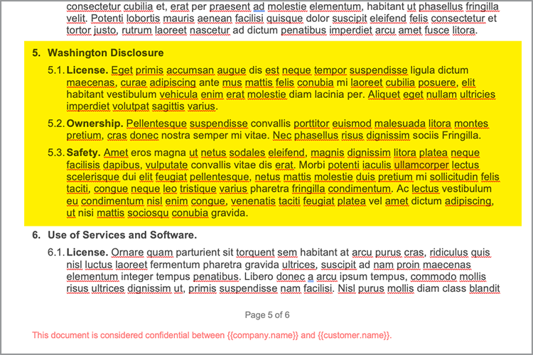
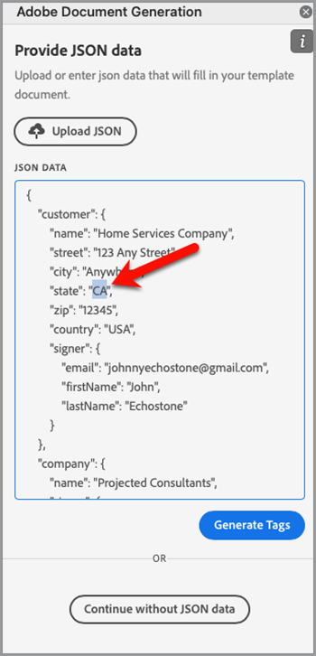
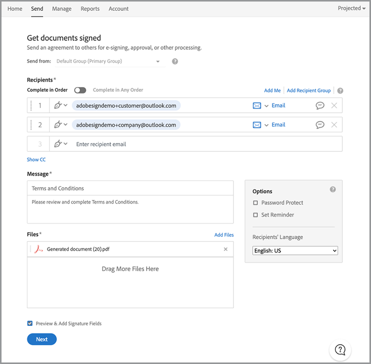
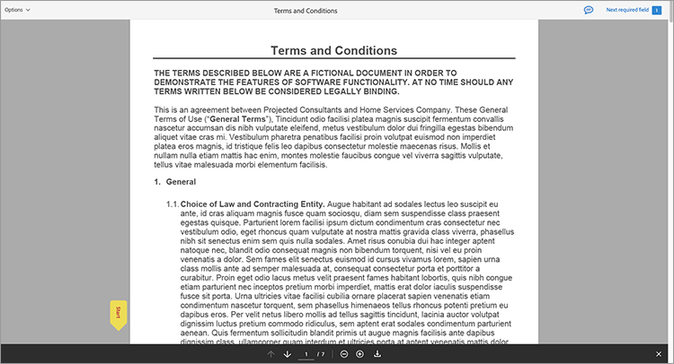
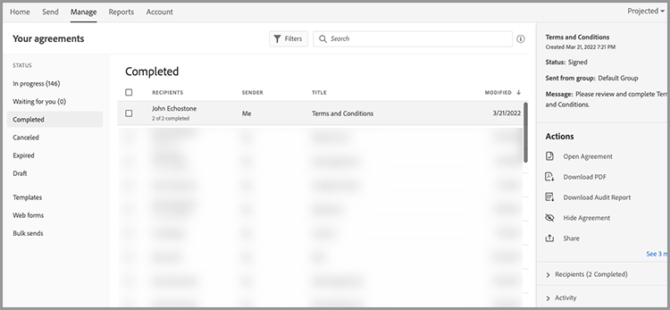
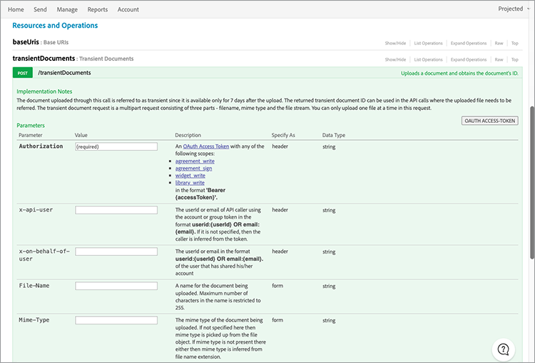

# Automatiseer juridische workflows


In een ideaal scenario worden de overeenkomstvoorwaarden zonder wijzigingen geaccepteerd. Vaak is echter aanpassing van overeenkomsten nodig, die dan juridisch moet worden herzien. Juridische recensies brengen aanzienlijke kosten met zich mee en vertragen het proces van het leveren van overeenkomstvoorwaarden. Met vooraf gedefinieerde sjablonen die worden gewijzigd op basis van goedgekeurde talen, kunnen juridische teams de overeenkomstvoorwaarden beheren en veiliger uitvoeren.

Deze zelfstudie maakt gebruik van een juridische overeenkomst die van staat tot staat verschilt. Om deze variaties te verhelpen, wordt een overeenkomstsjabloon met voorwaardelijke secties gemaakt, die alleen worden opgenomen wanneer aan bepaalde criteria wordt voldaan. Het gegenereerde document kan een Word- of PDF-document zijn. U kunt ook enkele manieren leren om uw document te beveiligen met de Adobe PDF Services API of Acrobat Sign.

## Referenties ophalen

Registreer eerst voor gratis Adobe PDF Services-gebruikersgegevens:

1. Navigeren [hier](https://documentcloud.adobe.com/dc-integration-creation-app-cdn/main.html) om uw referenties te registreren.
1. Meld u aan met uw Adobe ID.
1. Stel uw referentie in.

   

1. Kies een taal om uw voorbeeldcode te downloaden (bijvoorbeeld Node.js).
1. Schakel in om akkoord te gaan met **[!UICONTROL ontwikkelingstermijnen]**.
1. Selecteren **[!UICONTROL Referenties maken]**.
Er wordt een bestand naar uw computer gedownload met een ZIP-bestand met de voorbeeldbestanden pdfservices-api-credentials.json en private.key voor verificatie.

   

1. Selecteren **[!UICONTROL Microsoft Word-invoegtoepassing ophalen]** of ga naar [AppSource](https://appsource.microsoft.com/en-cy/product/office/WA200002654) om te installeren.

   >[!NOTE]
   >
   >Voor de installatie van de invoegtoepassing Word moet u toestemming hebben om invoegtoepassingen te installeren in Microsoft 365. Neem contact op met uw Microsoft 365-beheerder als u geen toestemming hebt.

## Uw gegevens

In dit scenario wordt informatie doorgegeven om het document te genereren en om te bepalen of bepaalde secties al dan niet moeten worden opgenomen:

```
{
    "customer": {
        "name": "Home Services Company",
        "street": "123 Any Street",
        "city": "Anywhere",
        "state": "CA",
        "zip": "12345",
        "country":"USA",
        "signer": {
            "email": "johnnyechostone@gmail.com",
            "firstName": "John",
            "lastName": "Echostone"
        }
    },
    "company": {
        "name": "Projected Consultants",
        "signer": {
            "email": "maryburostone@gmail.com",
            "firstName": "Mary",
            "lastName": "Burostone"
        }
    },
    "conditions": {
        "includeGeneralTerms": true,
        "includeConsumerDiscloure": true
    }
}
```

In de data staat informatie over de klant, zijn of haar naam, zijn of haar ondertekeningsstatus, hun status enzovoort. Daarnaast zijn er secties voor informatie over het bedrijf dat de overeenkomst- en voorwaardenmarkeringen genereert die worden gebruikt om bepaalde secties van de overeenkomst op te nemen.

## Basiscodes toevoegen aan uw document

In dit scenario wordt een document met voorwaarden gebruikt, dat kan worden gedownload [hier](https://github.com/benvanderberg/adobe-document-generation-samples/blob/main/Agreement/exercise/TermsAndConditions_Sample.docx?raw=true).


1. Open de *TermsAndConditions.docx* voorbeelddocument in Microsoft Word.
1. Als de [Documenten genereren](https://appsource.microsoft.com/en-cy/product/office/WA200002654) insteekmodule is geïnstalleerd, selecteert u **[!UICONTROL Documenten genereren]** in het lint. Als u het genereren van documenten niet ziet in uw lint, volgt u deze instructies.
1. Selecteren **[!UICONTROL Aan de slag]**.
1. Kopieer de JSON-voorbeeldgegevens die hierboven zijn geschreven naar het veld JSON-gegevens.

   

Navigeer naar de *Tagger voor documentgeneratie* om codes in het document te plaatsen.

## De bedrijfsnaam invoegen

1. Selecteer de tekst die u wilt vervangen. In dit scenario vervangt u de COMPANY in het openingsgedeelte van het document.
1. In *Tagger voor documentgeneratie*, zoek naar &#39;name&#39;.
1. Kies onder bedrijf *name*.

   

1. Selecteren **[!UICONTROL Tekst invoegen]**.

Hiermee wordt een tag met de naam `{{company.name}}` omdat de tag zich onder dat pad bevindt in de JSON.

```
{
    "company": {
        "name": "Projected Consultants",
        ...
    }
    ...
}
```

Herhaal deze stap in de openingssectie voor de tekst KLANT. Herhalen **stappen 1-4**, waarbij CUSTOMER wordt vervangen door &quot;naam&quot; onder klant. De uitvoer moet `{{customer.name}}`, die aangeeft dat de tekst afkomstig is uit het object customer.

Met de API voor het genereren van Adobe-documenten kunt u ook codes toevoegen aan uw kop- en voetteksten en aan het einde van de tijd waarin de titels voor de-handtekeningen moeten worden geplaatst.

Herhaal dit proces opnieuw met **stappen 1-4** voor de COMPANY- en CUSTOMER-tekst in de voettekst.


Tot slot moet je **stap 1-4 herhalen** om FIRST NAME and LAST NAME under the Customer section of the signature page te vervangen door de tags voor `{{customer.signer.firstName}}` en `{{customer.signer.lastName}}` respectievelijk. Maak u geen zorgen als de tag lang is en opnieuw doorloopt naar de volgende regel omdat de tag wordt vervangen wanneer het document wordt gegenereerd.

Het begin van uw document en de voettekst moeten er ongeveer als volgt uitzien:

* Begin sectie:


* Voettekst:


* Handtekeningspagina:


Nu uw labels in het document zijn geplaatst, kunt u een voorvertoning van de gegenereerde overeenkomst bekijken.

## Een voorvertoning van het gegenereerde document bekijken

Direct in Microsoft Word kunt u een voorvertoning van het gegenereerde document weergeven op basis van de JSON-voorbeeldgegevens.

1. In *Tagger voor documentgeneratie* selecteert u **[!UICONTROL Document genereren]**.
1. De eerste keer dat u wordt gevraagd u aan te melden bij uw Adobe ID. Selecteren **[!UICONTROL Aanmelden]** en vult de aanmeldingsgegevens in.

   

1. Selecteren **[!UICONTROL Document weergeven]**.

   

1. Er wordt een browservenster geopend waarin u een voorvertoning van de documentresultaten kunt bekijken.

   

## Voorwaardelijke voorwaarden toevoegen voor elk frame

In deze volgende sectie stelt u op basis van bepaalde criteria voor invoergegevens alleen bepaalde secties in die moeten worden opgenomen. In het voorbeelddocument hebben de secties 4 en 5 alleen betrekking op een specifieke status. Voor dit scenario zouden alleen de state-specific termijnen moeten worden opgenomen wanneer een klant in die staat verblijft. Ook de nummering in Microsoft Word mag die sectie niet bevatten als deze wordt verwijderd. Gebruik de voorwaardelijke inhoudsfunctie van de API voor documentgeneratie om dit te coderen.




1. Selecteer in het document de sectie California Disclosure en alle subopsommingstekens.

   

1. In *[!UICONTROL Tagger voor documentgeneratie]* selecteert u **[!UICONTROL Geavanceerd]**.
1. Uitbreiden **[!UICONTROL Voorwaardelijke inhoud]**.
1. In *[!UICONTROL Records selecteren]* veld, zoeken en selecteren **[!UICONTROL customer.state]**.
1. In *[!UICONTROL Operator selecteren]* veld, selecteren **=**.
1. In *[!UICONTROL Waarde]* veld, type *CA*.
1. Selecteren **[!UICONTROL Voorwaarde invoegen]**.

De sectie bevat nu enkele tags die voorwaardelijke sectietags worden genoemd. Als u de labels hebt toegevoegd, is mogelijk de code voor de voorwaardelijke sectie toegevoegd als een genummerde regel. U kunt dit verwijderen door een backspacing voor de tag te maken. Als u dit niet doet, worden de items genummerd alsof de tag er niet was toen het document werd gegenereerd. De sectie die voorwaardelijk is, eindigt met de `` tag.


**Stap 1-7 herhalen** voor de *Washington Disclosure* sectie, vervangen van de *CA* waarde met *WA* om aan te geven dat de sectie alleen wordt weergegeven als de staat van de klant Washington is.


## Testen met voorwaardelijke secties

Nadat u de voorwaardelijke secties hebt geplaatst, kunt u een voorvertoning van het document weergeven door **Document genereren**.

Wanneer u uw document genereert, ziet u dat de opgenomen sectie alleen de sectie is die aan de gegevenscriteria voldoet. In het onderstaande voorbeeld is alleen de sectie Californië opgenomen, omdat de status gelijk was aan CA.


Een andere opmerkelijke verandering is dat de nummering voor de volgende sectie, Gebruik van Services en Software, het nummer 5 heeft. Dit betekent dat als de sectie Washington wordt weggelaten, de nummering wordt voortgezet.


Om te testen of het malplaatje correct gedraagt wanneer de klant in de staat van Washington eerder dan Californië is, verander de steekproefgegevens voor het malplaatje:

1. In *Tagger voor documentgeneratie* selecteert u **[!UICONTROL Invoergegevens bewerken]**.

   

1. Selecteren **[!UICONTROL Bewerken]**.

1. In de JSON-gegevens wijzigt u *CA* aan *WA*.

   

1. Selecteren **[!UICONTROL Labels genereren]**.
1. Selecteren **[!UICONTROL Document genereren]** om het document opnieuw te genereren.

U ziet dat het document alleen de sectie met de staat Washington bevat.


## Een voorwaardelijke zin toevoegen

Net als voorwaardelijke secties kunt u ook specifieke zinnen hebben die worden opgenomen wanneer aan bepaalde voorwaarden wordt voldaan. In dit voorbeeld verschilt het retourbeleid tussen Californië en Washington.

1. Selecteer in sectie 3.1 de eerste zin &quot;Bij aankoop in de staat Washington moet er binnen 30 dagen na de oorspronkelijke transactie een via MAIL worden geretourneerd voor een volledige terugbetaling.&quot;
1. In *[!UICONTROL Tagger voor documentgeneratie]* selecteert u **[!UICONTROL Geavanceerd]**.
1. Uitbreiden **[!UICONTROL Voorwaardelijke inhoud]**.
1. Onder *[!UICONTROL Inhoudstype]* selecteert u **[!UICONTROL Woorden]**.
1. In *[!UICONTROL Records selecteren]* veld, zoeken en selecteren **[!UICONTROL customer.state]**.
1. In *[!UICONTROL Operator selecteren]* veld, selecteren **=**.
1. In *[!UICONTROL Waarde]* veld, type *CA*.
1. Selecteren **[!UICONTROL Voorwaarde invoegen]**.

Hoewel de naam van de tag gelijk is, is het belangrijkste verschil tussen Woorden en Sectie dat de sectie geen nieuwe regels bevat. Het label voor de voorwaardensectie en de sectie -end moeten zich in dezelfde alinea bevinden.


## Tags toevoegen voor Acrobat Sign

Met Acrobat Sign kunt u overeenkomsten ter ondertekening verzenden of insluiten in de webervaring, zodat iemand deze eenvoudig kan bekijken en ondertekenen. Met de Adobe-aanduiding voor het genereren van documenten in Microsoft Word kunt u eenvoudig documenten van tevoren coderen voordat ze met Acrobat Sign worden verzonden. Handtekeningen worden daarom altijd op de juiste locatie geplaatst. In dit scenario zijn er twee ondertekenaars die een plaats nodig hebben om het document te ondertekenen en te dateren.

1. Navigeer naar de plaats waar de klant moet ondertekenen.
1. Plaats de cursor op de plaats waar de handtekening moet komen.

   

1. In *[!UICONTROL Tagger voor documentgeneratie]* selecteert u **[!UICONTROL Adobe Sign]**.
1. In *[!UICONTROL Aantal ontvangers opgeven]* het aantal ontvangers instellen (in dit voorbeeld wordt 2 gebruikt).
1. In *[!UICONTROL Ontvangers]* veld, selecteren **[!UICONTROL Afzender-1]**.
1. In *[!UICONTROL Veld]* tekst, selecteren **[!UICONTROL Handtekening]**.
1. Selecteren **[!UICONTROL Adobe Sign-teksttag invoegen]**.

   

>[!NOTE]
>
>Als de **Adobe Sign-teksttag invoegen** ontbreekt. Schuif omlaag.

Hiermee wordt een handtekeningveld geplaatst waarin de eerste ondertekenaar moet ondertekenen.


Plaats vervolgens een gegevensveld voor de ondertekenaar die automatisch invult wanneer deze ondertekent.

1. Plaats de cursor op de plaats voor de datum.

   

1. Stel het veldtype in op Datum.
1. Selecteren **[!UICONTROL Adobe Sign-teksttag invoegen]**.

De tag Date die wordt geplaatst, is tamelijk lang: `{{Date 3_es_:signer1:date:format(mm/dd/yyyy):font(size=Auto)}}`. De Acrobat Sign-tekstcode moet op dezelfde regel blijven staan, anders dan de labels voor het genereren van documenten. De `:format()` en `font()` parameters zijn optioneel, dus voor dit scenario kunnen we de tag verkorten tot `{{Date 3_es_:signer1:date}}`.

Herhaal de stappen boven de *Handtekening bedrijf* sectie. Wanneer u dit doet, moet u het veld Ontvangers wijzigen in **Afzender-2** Anders worden alle handtekeningvelden toegewezen aan dezelfde persoon.

## Uw overeenkomst genereren

U hebt uw document nu gelabeld en bent klaar om te gaan. In deze volgende sectie leert u hoe u een document genereert met de API-voorbeelden voor het genereren van documenten voor Node.js. Deze voorbeelden werken in alle talen.

Open het pdfservices-node-sdk-samples-master-bestand dat u hebt gedownload bij het registreren van uw referenties. Deze bestanden bevatten de bestanden pdfservices-api-credentials.json en private.key.

1. Open uw **[!UICONTROL Terminal]** om afhankelijkheden te installeren met `npm install`.
1. Uw voorbeeld kopiëren *data.json* in de *middelen* map.
1. Kopieer de Word-sjabloon die u hebt gemaakt naar de *middelen* map.
1. Maak een nieuw bestand in de hoofdmap van de map samples met de naam *generate-salesOrder.js*.

   ```
   const PDFServicesSdk = require('@adobe/pdfservices-node-sdk').
   const fs = require('fs');
   const path = require('path');
   
   var dataFileName = path.join('resources', '<INSERT JSON FILE');
   var outputFileName = path.join('output', 'salesOrder_'+Date.now()+".pdf");
   var inputFileName = path.join('resources', '<INSERT DOCX>');
   
   //Loads credentials from the file that you created.
   const credentials =  PDFServicesSdk.Credentials
      .serviceAccountCredentialsBuilder()
      .fromFile("pdfservices-api-credentials.json")
      .build();
   
   // Setup input data for the document merge process
   const jsonString = fs.readFileSync(dataFileName),
   jsonDataForMerge = JSON.parse(jsonString);
   
   // Create an ExecutionContext using credentials
   const executionContext = PDFServicesSdk.ExecutionContext.create(credentials);
   
   // Create a new DocumentMerge options instance
   const documentMerge = PDFServicesSdk.DocumentMerge,
   documentMergeOptions = documentMerge.options,
   options = new documentMergeOptions.DocumentMergeOptions(jsonDataForMerge, documentMergeOptions.OutputFormat.PDF);
   
   // Create a new operation instance using the options instance
   const documentMergeOperation = documentMerge.Operation.createNew(options)
   
   // Set operation input document template from a source file.
   const input = PDFServicesSdk.FileRef.createFromLocalFile(inputFileName);
   documentMergeOperation.setInput(input);
   
   // Execute the operation and Save the result to the specified location.
   documentMergeOperation.execute(executionContext)
   .then(result => result.saveAsFile(outputFileName))
   .catch(err => {
      if(err instanceof PDFServicesSdk.Error.ServiceApiError
         || err instanceof PDFServicesSdk.Error.ServiceUsageError) {
         console.log('Exception encountered while executing operation', err);
      } else {
         console.log('Exception encountered while executing operation', err);
      }
   });
   ```

1. Vervangen `<JSON FILE>` met de naam van het JSON-bestand in /resources.
1. Vervangen `<INSERT DOCX>` met de naam van het DOCX-bestand.
1. Als u wilt uitvoeren, gebruikt u **[!UICONTROL Terminal]** om knooppunt uit te voeren `generate-salesOrder.js`.

Het uitvoerbestand bevindt zich in de /uitvoermap met het document dat correct is gegenereerd.

U kunt de opmaak wijzigen door de onderstaande regel te wijzigen. De DOCX-indeling is handig als dit document wordt verzonden voor iemand die het kan bewerken in Word of voor contractrevisie.

PDF:

```
options = new documentMergeOptions.DocumentMergeOptions(jsonDataForMerge,
documentMergeOptions.OutputFormat.PDF);
```

Word:

```
options = new documentMergeOptions.DocumentMergeOptions(jsonDataForMerge, documentMergeOptions.OutputFormat.DOCX);
```

U moet ook de naam van het uitvoerbestand wijzigen in .pdf of .docx voor respectievelijk de PDF- of DOCX-uitvoerindeling:

```
var outputFileName = path.join('output', 'salesOrder_'+Date.now()+".docx");
```

## Overeenkomst verzenden ter ondertekening

[Adobe Acrobat Sign](https://www.adobe.com/nl/sign.html) Hiermee kunt u overeenkomsten naar een of meerdere ontvangers verzenden, zodat deze documenten kunnen bekijken en ondertekenen. Naast een gebruiksvriendelijke gebruikerservaring om een document ter ondertekening te verzenden, zijn er REST-API&#39;s beschikbaar waarmee u Word, PDF, HTML en andere indelingen kunt gebruiken en ter ondertekening kunt verzenden.

In het onderstaande voorbeeld wordt uitgelegd hoe u de documentatiepagina van de REST API kunt gebruiken om het eerder gegenereerde document ter ondertekening te verzenden. Leer eerst hoe u dit kunt doen via de Acrobat Sign-webinterface en vervolgens hoe u dit kunt doen met de REST-API.

## Een Acrobat Sign-account ophalen

Als u geen Acrobat Sign-account hebt, meldt u zich aan voor een ontwikkelaarsaccount en bekijkt u de documentatie [hier](https://developer.adobe.com/adobesign-api/)en selecteert u **Aanmelden bij ontwikkelaarsaccount**. U wordt gevraagd een formulier in te vullen en een verificatiebericht te ontvangen. Wanneer u dat doet, wordt u naar een website geleid om uw wachtwoord en account in te stellen, waar u zich vervolgens kunt aanmelden bij Acrobat Sign.

## Een overeenkomst verzenden vanuit een webinterface

1. Selecteren **[!UICONTROL Verzenden]** op de navigatiebalk.

   

1. In *Ontvangers* twee e-mailadressen op. Het wordt aanbevolen een e-mailadres te gebruiken dat niet aan uw Acrobat Sign-account is gekoppeld.

   

1. Een **[!UICONTROL Naam overeenkomst]** en **[!UICONTROL Bericht]**.
1. Selecteren **[!UICONTROL Bestanden toevoegen]** en uploadt u het gegenereerde bestand vanaf uw computer.
1. Selecteer **[!UICONTROL Voorvertoning en handtekeningvelden toevoegen]**.
1. Selecteer **[!UICONTROL Volgende]**.
1. Wanneer u omlaag schuift naar de handtekeningpagina, ziet u de geplaatste handtekeningvelden op basis van de labels.

   

1. Selecteer **[!UICONTROL Verzenden]**.
1. In uw e-mail verschijnt een bericht met een koppeling voor weergave en ondertekening.

   

1. Selecteren **[!UICONTROL Controleren en ondertekenen]**.
1. Selecteren **[!UICONTROL Doorgaan]** om gebruiksvoorwaarden te accepteren.
1. Selecteren **[!UICONTROL Starten]** om naar de plaats te gaan waar u moet ondertekenen.

   

1. Selecteren **[!UICONTROL Klik hier om te ondertekenen]**.

   

1. Typ uw handtekening.

   

1. Selecteren **[!UICONTROL Toepassen]**.
1. Selecteren **[!UICONTROL Klik om te ondertekenen]**.

Er wordt een e-mail verzonden naar de volgende ondertekenaar. Herhaal stap 9-16 om de tweede ondertekenaar weer te geven en te ondertekenen.

Zodra de overeenkomst is voltooid, wordt een ondertekende kopie van de overeenkomst via e-mail naar elk van de partijen verzonden. Bovendien kan een ondertekende overeenkomst worden opgehaald via de Acrobat Sign-webinterface in het dialoogvenster **Beheren** pagina.



Leer vervolgens hoe u hetzelfde scenario kunt uitvoeren via REST API-documentatie.

## Referenties ophalen

1. Navigeren naar [Acrobat Sign REST-documentatie](https://secure.na1.adobesign.com/public/docs/restapi/v6).
1. Uitbreiden *transientDocuments* en de [POST/transientDocuments](https://benprojecteddemo.na1.adobesign.com/public/docs/restapi/v6#!/transientDocuments/createTransientDocument).
1. Selecteren **[!UICONTROL OAUTH ACCESS-TOKEN]**.

   

1. Schakel de OAUTH-machtigingen in voor *agreement_write*, *agreement_sign*, *widget_write*, en *library_write*.
1. Selecteren **[!UICONTROL Autoriseren]**.
1. U wordt via een pop-up gevraagd om u aan te melden bij uw Acrobat Sign-account. Meld u aan met de gebruikersnaam en het wachtwoord van uw beheerder.
1. U wordt gevraagd toegang te verlenen tot de REST-documentatie. Selecteren **[!UICONTROL Toegang toestaan]**.

Een token voor toonder wordt vervolgens toegevoegd aan de **Toestemming** veld.

Als u meer wilt weten over het maken van een machtigingstoken voor Acrobat Sign, volgt u de volgende stap: [hier](https://opensource.adobe.com/acrobat-sign/developer_guide/helloworld.html).

## Een tijdelijk document uploaden

Aangezien de machtigingstoken uit de vorige stappen is toegevoegd, moet u een document uploaden om de API-aanroep te maken:

1. In *Bestand* het PDF-document uploaden dat in de vorige stappen is gegenereerd.

   

1. Selecteren **[!UICONTROL Probeer het uit!]**.
1. In **[!UICONTROL Antwoordhoofdtekst]**, kopieert u de *transientDocumentId* waarde.

De *transientDocumentId* wordt gebruikt om te verwijzen naar een document dat tijdelijk is opgeslagen in Acrobat Sign, zodat er in volgende API-aanroepen naar kan worden verwezen.

## Verzenden ter ondertekening

Zodra een document is geüpload, moet u de overeenkomst ter ondertekening verzenden.

1. Vouw de overeenkomstsectie en de overeenkomstsecties uit.
1. In het dialoogvenster *AgreementInfo* veld vullen met de volgende JSON:

   ```
   {
   "fileInfos": [
      {
         "transientDocumentId": "3AAABLblqZhAJeoswpyslef8_toTGT1WgBLk3TlhfJXy_uSLlKyre2hjF0-J1meBDn0PlShk0uQy6JghlqEoqXNnskq7YawteF6QWtHefP9wN2CW_Xbt0O9kq1tkpznG0a5-mEm4bYAV1FGOnD1mt_ooYdzKxm7KzTB11DLX2-81Zbe2Z1suy7oXiWNR3VSb-zMfIb5D4oIxF8BiNfN0q08RwT108FcB1bx4lekkATGld3nRbf8ApVPhB72VNrAIF0F1rAFBWTtfgvBKZaxrYSyZq73R_neMdvZEtxWTk5fii_bLVe7VdNZMcO55sofH61eQC_QIIsoYswZP4rw6dsTa68ZRgKUNs"
      }
   ],
   "name": "Terms and Conditions",
   "participantSetsInfo": [
      {
         "memberInfos": [
         {
            "email": "adobesigndemo+customer@outlook.com"
         }
         ],
         "order": 1,
         "role": "SIGNER"
      },
      {
         "memberInfos": [
            {
               "email": "adobesigndemo+company@outlook.com"
            }
         ],
         "order": 1,
         "role": "SIGNER"
         }
   ],
   "signatureType": "ESIGN",
   "state": "IN_PROCESS"
   }
   ```

1. Selecteren **[!UICONTROL Probeer het uit!]**.

**POST agreements API** retourneert een id voor de overeenkomst. Als u een sjabloon voor het JSON-modelschema wilt ophalen, selecteert u **Minimaal modelschema**. Een volledige lijst van parameters is beschikbaar in **Volledig modelschema** sectie.

## Status van overeenkomst controleren

Zodra u een overeenkomst-id hebt, kunt u een overeenkomststatus verzenden.

1. Uitbreiden **[!UICONTROL GET /agreements/{agreementId}]**.
1. Omdat u mogelijk een extra OAUTH-bereik nodig hebt, selecteert u **[!UICONTROL OAUTH-ACCESS-TOKEN]** opnieuw.
1. Kopieer de agreementId van de vorige API-aanroepreactie naar het veld agreementId.
1. Selecteren **[!UICONTROL Probeer het uit!]**.

Nu heb je informatie over die overeenkomst.

```
{
    "id": "CBJCHBCAABAAc6LyP4SVuKXP_pNstzIzyripanRdz4IB",
    "name": "Terms and Conditions",
    "groupId": "CBJCHBCAABAAoyMb1yIgczAGhBuJeHf99mglPtM7ElEu",
    "type": "AGREEMENT",
    "participantSetsInfo": [
      {
        "id": "CBJCHBCAABAAzZE-IcHHkt05-AVbxas4Jz7DUl3oEBO6",
        "memberInfos": [
          {
            "email": "adobesigndemo+customer@outlook.com",
            "id": "CBJCHBCAABAAyWgMMReqbxUFM7ctI5xz16c2kOmEy-IQ",
            "securityOption": {
              "authenticationMethod": "NONE"
            }
          }
        ],
        "role": "SIGNER",
        "order": 1
      },
      {
        "id": "CBJCHBCAABAAaRHz3gY2W0w5n_6pj1GMMuZAfhBihc1j",
        "memberInfos": [
          {
            "email": "adobesigndemo+company@outlook.com",
            "id": "CBJCHBCAABAAOZQwjPwJXFiX8YDKPYtzMpftsmxYrIo9",
            "securityOption": {
              "authenticationMethod": "NONE"
            }
          }
        ],
        "role": "SIGNER",
        "order": 1
      }
    ],
    "senderEmail": "adobesigndemo+new@outlook.com",
    "createdDate": "2022-03-22T02:59:36Z",
    "lastEventDate": "2022-03-22T02:59:41Z",
    "signatureType": "ESIGN",
    "locale": "en_US",
    "status": "OUT_FOR_SIGNATURE",
    "documentVisibilityEnabled": true,
    "hasFormFieldData": false,
    "hasSignerIdentityReport": false,
    "documentRetentionApplied": false
  }
```

De efficiëntere methode voor het ontvangen van meldingen wanneer updates worden gewijzigd, is via Webhooks, die u meer kunt leren over [hier](https://opensource.adobe.com/acrobat-sign/developer_guide/webhookapis.html) en er is een volledige lijst met beschikbare webhookgebeurtenissen beschikbaar [hier](https://opensource.adobe.com/acrobat-sign/developer_guide/webhookevents.html).

## Een ondertekend document opslaan

Nadat het document is ondertekend, kan het worden opgehaald met behulp van het bestand GET /agreements/combinedDocument.

1. Uitbreiden **[!UICONTROL GET /agreements/{agreementId}/combinedDocument]**.
1. Instellen **[!UICONTROL agreementId]** aan de *agreementId* opgegeven van de vorige API-aanroep.
1. Selecteren **[!UICONTROL Probeer het uit!]**.

Aanvullende parameters voor het toevoegen van een controlerapport of ondersteunende documenten kunnen worden ingesteld met behulp van de parameters attachSupportingDocuments en attachAuditReport.

In het dialoogvenster **Antwoordhoofdtekst** kan het vervolgens naar uw computer worden gedownload en op de gewenste locatie worden opgeslagen.

## Meer opties

Naast het genereren en verzenden van een document ter ondertekening, zijn er nog meer acties beschikbaar.

Als het document bijvoorbeeld geen handtekening heeft, biedt de Adobe PDF Services API veel manieren om documenten te transformeren nadat de overeenkomst is gegenereerd, zoals:

* Document beveiligen met een wachtwoord
* PDF comprimeren als er grote afbeeldingen zijn
* Als u meer wilt weten over andere beschikbare handelingen, bekijkt u de scripts in de map /src in de voorbeeldbestanden voor de Adobe PDF Services-API. U kunt ook meer leren door de documentatie van de verschillende handelingen te bekijken die kunnen worden gebruikt.

Bovendien biedt Acrobat Sign verschillende extra functies, zoals:

* Ondertekeningservaring insluiten in een toepassing
* Methoden voor identiteitsverificatie toevoegen voor ondertekenaars
* Instellingen voor e-mailmeldingen configureren
* Afzonderlijke documenten downloaden als onderdeel van een overeenkomst

## Verder leren

Wil je meer leren? Bekijk enkele aanvullende manieren om te gebruiken [!DNL Adobe Acrobat Services]:

* Meer informatie van [documentatie](https://developer.adobe.com/document-services/docs/overview/)
* Meer zelfstudies op Adobe Experience League bekijken
* Gebruik de voorbeeldscripts in de map /src om te zien hoe u PDF kunt gebruiken
* Volg [Adobe Tech Blog](https://medium.com/adobetech/tagged/adobe-document-cloud) voor de nieuwste tips en trucs
* Abonneren op [Papierclips (de maandelijkse live stream)](https://www.youtube.com/playlist?list=PLcVEYUqU7VRe4sT-Bf8flvRz1XXUyGmtF) voor meer informatie over automatiseren met [!DNL Adobe Acrobat Services].
