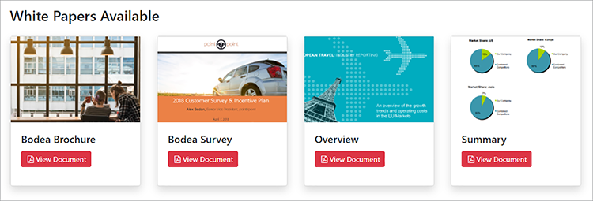
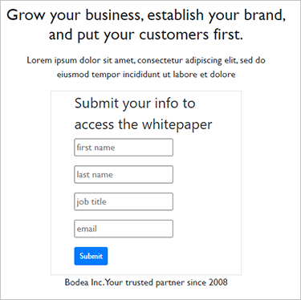

# Digitale publicatie van documenten


Elektronische documenten zijn overal — er zijn waarschijnlijk [biljoenen PDF](https://itextpdf.com/en/blog/technical-notes/do-you-know-how-many-pdf-documents-exist-world) wereldwijd, en dat aantal stijgt elke dag. Door een PDF-viewer in uw webpagina&#39;s in te sluiten, kunnen gebruikers documenten weergeven zonder uw HTML en CSS opnieuw te ontwerpen of de toegang tot uw website te belemmeren.

Laten we een populair scenario onderzoeken. Een bedrijfspost [whitepapers op hun website](https://www.adobe.io/apis/documentcloud/dcsdk/digital-content-publishing.html)
om context te bieden voor hun apps en services. De marketeer van de website wil beter begrijpen hoe gebruikers omgaan met hun op PDF gebaseerde content en deze integreren met hun webpagina en merk. Ze hebben besloten de whitepapers te publiceren als [gekleurde inhoud](https://whatis.techtarget.com/definition/gated-content-ungated-content#:~:text=Gated%20content%20is%20online%20materials,about%20their%20jobs%20and%20organizations.), bepaalt wie ze kan downloaden.

## Wat je kunt leren

Leer in deze praktische zelfstudie hoe u ingesloten PDF-documenten op webpagina&#39;s kunt weergeven met [Adobe PDF Embed-API](https://www.adobe.io/apis/documentcloud/dcsdk/pdf-embed.html), die gratis en gebruiksvriendelijk is. Deze voorbeelden maken gebruik van JavaScript, Node.js, Express.js, HTML en CSS. U kunt de volledige projectcode bekijken op [GitHub](https://www.google.com/url?q=https://github.com/marcelooliveira/EmbedPDF/tree/main/pdf-app&amp;sa=D&amp;source=editors&amp;ust=1617129543031000&amp;usg=AOvVaw2rzSwYuJ_JI7biVIgbNMw1).

## Relevante API&#39;s en bronnen

* [PDF Embed-API](https://www.adobe.com/devnet-docs/dcsdk_io/viewSDK/index.html)

* [PDF Services API](https://opensource.adobe.com/pdftools-sdk-docs/release/latest/index.html)

* [Projectcode](https://www.google.com/url?q=https://github.com/marcelooliveira/EmbedPDF/tree/main/pdf-app&amp;sa=D&amp;source=editors&amp;ust=1617129543031000&amp;usg=AOvVaw2rzSwYuJ_JI7biVIgbNMw1)

## Een Node Web-app maken

Laten we beginnen met het maken van een site met Node.js en Express die een mooi uitziende sjabloon gebruikt en verschillende PDF voor downloaden biedt.

Eerste, [Node.js downloaden en installeren](https://nodejs.org/en/download/).

Om een project Node.js met een minimale structuur van de Webtoepassing gemakkelijk te creëren, installeer het hulpmiddel van de toepassingsgenerator `` `express-generator` ``.

```
npm install express-generator -g
```

Maak vervolgens de nieuwe Express-app met de naam pdf-app en kies als weergave-engine.

```
express pdf-app --view=ejs
```

Ga nu naar de map \\pdf-app en installeer alle projectafhankelijkheden.

```
cd pdf-app
npm install
```

Start vervolgens de lokale webserver en voer de toepassing uit.

```
npm start
```

Ten slotte opent u de website op <http://localhost:3000>.


U hebt nu een basiswebsite.

## Whitepaper-gegevens renderen

Als u een whitepaper op de website wilt plaatsen, worden de gegevens van het whitepaper gedefinieerd en voorbereid op de website om deze documenten weer te geven. Maak eerst een nieuwe \\data-map in de hoofdmap van het project. De informatie over de beschikbare whitepapers is afkomstig uit een nieuw bestand met de naam [data.json](https://github.com/marcelooliveira/EmbedPDF/blob/main/pdf-app/data/data.json), die in de gegevensmap wordt geplaatst.

Installeer de [Bootstrap](https://getbootstrap.com/) en [Font Awesome](https://fontawesome.com/) front-end bibliotheken.

```
npm install bootstrap
npm install font-awesome
```

Open het bestand app.js en neem deze directory&#39;s op als bronnen voor statische bestanden, waarna ze na de bestaande `` `express.static` `` lijn.

```
app.use(express.static(path.join(__dirname, '/node_modules/bootstrap/dist')));
app.use(express.static(path.join(__dirname, '/node_modules/font-awesome')));
```

Als u de PDF-documenten wilt opnemen, maakt u een map met de naam \\pdfs onder de openbare map \\nvan het project. In plaats van de PDF en de miniaturen zelf te maken, kunt u ze vanuit deze [GitHub-opslagmap](https://github.com/marcelooliveira/EmbedPDF/tree/main/pdf-app/public) naar de mappen \\pdfs en \\image.

De map \\public\\pdfs bevat nu de PDF-documenten:


De map \\public\\images moet de miniaturen bevatten voor elk van de PDF-documenten:


Open nu het bestand \\routes\\index.js dat de logica voor het routeren van de startpagina bevat. Als u de whitepaper-gegevens uit het bestand data.json wilt gebruiken, moet u de module Node.js laden die verantwoordelijk is voor de toegang tot en interactie met het bestandssysteem. Vervolgens declareert u de `fs` constante in de eerste regel van het bestand \\routes\\index.js, als volgt:

```
const fs = require('fs');
```

Lees vervolgens het bestand data.json, parseer het en sla deze op in de papiervariabele:

```
let rawdata = fs.readFileSync('data/data.json');
let papers = JSON.parse(rawdata);
```

Pas nu de regel aan om de rendermethode voor de indexweergave aan te roepen, waarbij de papierverzameling wordt doorgegeven als het model voor de indexweergave.

```
res.render('index', { title: 'Embedding PDF', papers: papers });
```

Als u de verzameling whitepapers op de startpagina wilt renderen, opent u het bestand \\views\\index.ejs en vervangt u de bestaande code door de code van het project [indexbestand](https://github.com/marcelooliveira/EmbedPDF/blob/main/pdf-app/views/index.ejs).

Start en open npm opnieuw <http://localhost:3000> om uw verzameling beschikbare whitepapers te bekijken.


In de volgende secties wordt de website verbeterd en wordt [PDF Embed-API](https://www.adobe.io/apis/documentcloud/dcsdk/pdf-embed.html) om de PDF-documenten op de webpagina weer te geven. PDF Embed API is gratis te gebruiken — je hoeft alleen maar een API-referentie te verkrijgen.

## Een PDF Embed API-referentie ophalen

Ga voor een gratis PDF Embed API-referentie naar het [Aan de slag](https://www.adobe.io/apis/documentcloud/dcsdk/gettingstarted.html) pagina na aanmelding voor een nieuwe account of aanmelden bij uw bestaande account.

Klikken **Nieuwe referenties maken** en dan **Aan de slag:**


U wordt nu gevraagd u in te schrijven voor een gratis account als u er geen hebt.

Selecteren **PDF Embed-API** en typ vervolgens uw aanmeldingsnaam en toepassingsdomein. Gebruik de **localhost** domein omdat de webtoepassing lokaal is getest.


Klik op de knop **Referenties maken** om uw aanmeldingsgegevens voor de PDF te openen en de client-id (API KEY) op te halen.


Maak in uw Node.js-project een bestand met de naam .ENV in de hoofdmap van de toepassing en declareer de omgevingsvariabele voor uw PDF Embed Client ID met de waarde van de API KEY-referentie uit de vorige stap.

```
PDF_EMBED_CLIENT_ID=**********************************************
```

Later gebruikt u deze client-id voor toegang tot de PDF Embed-API. Installeer het dotenv-pakket voor toegang tot deze omgevingsvariabele met behulp van Node.js-code.

```
npm install dotenv
```

Open nu het bestand app.js en voeg de volgende regel toe boven aan het bestand, zodat Node.js de module dotenv kan laden:

```
require('dotenv').config();
```

## PDF weergeven in de webapp

Gebruik nu PDF Embed API om PDF op de site weer te geven. Live openen [Demo van PDF Embed-API](https://documentcloud.adobe.com/view-sdk-demo/index.html#/view/FULL_WINDOW/Bodea%20Brochure.pdf).


In het linkerdeelvenster kunt u de insluitmodus kiezen die het best aansluit bij de behoeften van uw website:

* **Volledig venster**: de PDF bestrijkt alle webpaginaruimte

* **Container in grootte**: de PDF wordt weergegeven binnen de webpagina, één pagina tegelijk, in een div met beperkte grootte

* **In-line**: de volledige PDF wordt weergegeven in een div-element binnen de webpagina

* **Lichtbak**: de PDF wordt weergegeven als een laag boven op uw webpagina

Het wordt aanbevolen de insluitmodus in de regel te gebruiken voor witboeken en de codegenerator later om een PDF in de toepassing in te sluiten.

## Een inline insluitmoduspagina maken

Als u een PDF-viewer wilt insluiten in uw webpagina en alle pagina&#39;s tegelijk wilt weergeven, maakt u een nieuwe pagina met de insluitmodus in de regel.

Maak een nieuwe weergave in het bestand \\views\\in-line.ejs met de EJS-weergave-engine.

```
<! html DOCTYPE >
<html>
<head>
<title>
<%= title %>
</title>
<link rel='stylesheet' href='/stylesheets/style.css' />
<link rel='stylesheet' href='/css/bootstrap.min.css'/>
<link rel='stylesheet' href='/css/font-awesome.min.css' />
<style type="text/css">
p {
font-family: 'Gill Sans', 'Gill Sans MT', Calibri, 'Trebuchet MS', sans-serif
}
</style>
</head>
<body class="m-0">
<div>
<main>
<div class="row">
<div class="col-sm-3"></div>
<div class="col-sm-6">
<h3>
<p class="text-center">Grow your business, establish your brand,<br
/>
```

En zet je klanten op de eerste plaats.

```
</p>
</h3>
<div>
<p class="text-center">Lorem ipsum dolor sit amet, consectetur adipiscing elit, sed do<br />
eiusmod tempor incididunt ut labore et dolore</p>
</div>
</div>
</main>
<footer>
<div class="row">
<div class="col-sm-3"></div>
<div class="col-sm-6">
<p class="text-center">Bodea Inc. Your trusted partner since 2008</p>
</div>
</div>
</footer>
</div>
</div>
</body>
</html>
```

Wijzig vervolgens \\views\\index.ejs om een knop te maken waarmee de inline weergave wordt geopend.

```
<div class="card-body">
<h5 class="card-title">
<span>
<%= paper.title %>
</span>
</h5>
<p>
<a class="btn btn-sm btn btn-danger" href="/in-line/<%=
paper.id %>">
<span type="button"></span>
<span class="fa fa-file-pdf-o"></span>&nbsp;View Document</button>
</a>
</p>
</div>
```

Open het app.js- dossier en verklaar een nieuwe router na de verklaring indexRouter:

```
var indexRouter = require('./routes/index');
var inLineRouter = require('./routes/in-line');
```

Dan voeg deze code na app.use (&#39;/&#39;, indexRouter) toe; om de in-lijn in te bedden wijze mening met zijn router te associëren:

```
app.use('/', indexRouter);
app.use('/in-line', inLineRouter);
```

Nu, creeer een nieuw in-line.js- dossier onder \ \ routes om nieuwe routerlogica tot stand te brengen. Include Express, een Node-module waarmee een back-end van een webtoepassing wordt ingeschakeld.

```
var express = require('express');
const fs = require('fs');
var router = express.Router();
```

Daarna, creeer een eindpunt dat de verzoeken van de GET om een specifieke whitepaper identiteitskaart behandelt en de in-line.ejs mening teruggeeft.

```
router.all('/:id', function(req, res, next) {
let rawdata = fs.readFileSync('data/data.json');
let papers = JSON.parse(rawdata);
let paper = papers.filter(p => p.id == parseInt(req.params.id))[0];
res.render('in-line', { title: paper.title, paper: paper });
});
module.exports = router;
```

Kijk opnieuw naar de [live demo](https://documentcloud.adobe.com/view-sdk-demo/index.html#/view/FULL_WINDOW/Bodea%20Brochure.pdf) om PDF Embed-API-code automatisch te genereren. Klikken **In-line** in het linkerdeelvenster:


Klikken **Code genereren** om de HTML-code te zien die is vereist voor het weergeven van een viewer voor de PDF van een container in grootte.


Klikken **Code kopiëren** en plak de code in het bestand in line.ejs.

```
<div>
<p class="text-center">Lorem ipsum dolor sit amet, consectetur adipiscing elit, sed do<br />
eiusmod tempor incididunt ut labore et dolore</p>
</div>
<div class="row align-items-center border border-primary">
<div id="adobe-dc-view" style="width: 800px;"></div>
<script src="https://documentcloud.adobe.com/view-sdk/main.js"></script>
<script type="text/javascript">
document.addEventListener("adobe_dc_view_sdk.ready", function(){
var adobeDCView = new AdobeDC.View({clientId: "<YOUR_CLIENT_ID>", divId: "adobe-dc-view"});
adobeDCView.previewFile({
content:{location: {url: "https://documentcloud.adobe.com/view-sdk-demo/PDFs/Bodea Brochure.pdf"}},
metaData:{fileName: "Bodea Brochure.pdf"}
}, {embedMode: "IN_LINE"});
});
</script>
</div>
```

De documentparameters zijn echter nog wel gecodeerd. Laten we deze vervangen door de syntaxis met EJS-haken (\&lt;%= someValue %\>) om de pagina weer te geven volgens de gegevens van het whitepaper-model.

```
<div id="adobe-dc-view" style="width: 800px;"></div>
<script src="https://documentcloud.adobe.com/view-sdk/main.js"></script>
<script type="text/javascript">
document.addEventListener("adobe_dc_view_sdk.ready", function () {
var adobeDCView = new AdobeDC.View({ clientId: "<%=process.env.PDF_EMBED_CLIENT_ID %>", divId: "adobe-dc-view" });
adobeDCView.previewFile({
content: { location: { url: "<%= paper.pdf %>" } },
metaData: { fileName: "<%= paper.fileName %>" }
}, {
embedMode: "IN_LINE"
});
});
</script>
```

Voer de toepassing nu uit met de opdracht voor het starten van de npm en open de website op <http://localhost:3000>.



Tot slot kiest u één witboek en klikt u op **Document weergeven** om een nieuwe pagina te openen met de inline ingesloten PDF:


Houd er rekening mee dat de opties Download PDF en Print PDF nu beschikbaar zijn.


Je wilt deze vlaggen aan de achterkant controleren. Later kunt u vergunningscontroles uitvoeren die op gebruikersidentiteit worden gebaseerd en toegang beperken volgens uw bedrijfsregels. Die complexiteit is hier niet nodig. Laten we \\routes\\in-line.js aanpassen om de geverifieerde eigenschappen en machtigingseigenschappen op te nemen in het modelobject.

```
let authenticated = false;
res.render('in-line', {
title: paper.title,
paper: paper,
authenticated: authenticated,
permissions: {
showDownloadPDF: true,
showPrintPDF: true,
showFullScreen: true
}
});
```

Pas vervolgens \\views\\in-line.ejs aan, zodat uw webpagina de vlagwaarden kan renderen die afkomstig zijn van de back-end.

```
embedMode: "IN_LINE",
showDownloadPDF: <%= permissions.showDownloadPDF %>,
showPrintPDF: <%= permissions.showPrintPDF %>,
showFullScreen: <%= permissions.showFullScreen %>
Now, open the in-line.js route file and modify it to disallow the printing, downloading, and full-screen controls.
permissions: {
showDownloadPDF: false,
showPrintPDF: false,
showFullScreen: false
}
```

Voer vervolgens de toepassing opnieuw uit om te zien hoe deze wijziging wordt weergegeven in de PDF Viewer.


## Gated-inhoud maken

Volgens het eindgebruikersscenario wil de marketeer voor de website van het bedrijf beter begrijpen hoe gebruikers met hun op PDF gebaseerde inhoud omgaan en de inhoud opnemen met de rest van hun webpagina en merk.

Onze focus ligt op insluiten van PDF, dus u maakt geen gebruikersverificatiefunctie. Implementeer in plaats daarvan gewoon een eenvoudige, neppaywall met behulp van een webformulier waarin bepaalde gebruikersgegevens worden geaccepteerd. Vervolgens wordt het PDF-document weergegeven zodra de gebruiker het formulier verzendt.

Vervang het bestand \\routes\\in-line.js met de onderstaande inhoud om het weergavemodel te voorzien van gebruikersinformatie:

```
var express = require('express');
const fs = require('fs');
var router = express.Router();
router.all('/:id', function(req, res, next) {
let rawdata = fs.readFileSync('data/data.json');
let papers = JSON.parse(rawdata);
let paper = papers.filter(p => p.id == parseInt(req.params.id))[0];
let authenticated = false;
let user = {};
if (req.body.firstName) {
user = {
firstName: req.body.firstName,
lastName: req.body.lastName,
jobTitle: req.body.jobTitle,
email: req.body.email,
};
authenticated = true;
}
res.render('in-line', {
title: paper.title,
paper: paper,
user: user,
authenticated: authenticated,
permissions: {
showDownloadPDF: false,
showPrintPDF: false,
showFullScreen: false
}
});
});
module.exports = router;
```

Vervang vervolgens de inhoud \\views\\in-line.ejs door de onderstaande code. Het formulier met gebruikersgegevens of de PDF-viewer wordt weergegeven, afhankelijk van het feit of het een geverifieerde gebruiker is.

```
<!DOCTYPE html>
<html>
<head>
<title>
<%= title %>
</title>
<link rel='stylesheet' href='/css/bootstrap.min.css'/>
<link rel='stylesheet' href='/css/font-awesome.min.css' />
<style type="text/css">
p {
font-family: 'Gill Sans', 'Gill Sans MT', Calibri, 'Trebuchet MS', sans-serif
}
</style>
</head>
<body class="m-0">
<% if (authenticated) { %>
<header class="bg-dark text-white">
<div class="text-right mr-4">Hello, <%= user.firstName %> <%= user.lastName%></div>
</header>
<% } %>
<div>
<main>
<div class="row">
<div class="col-sm-3"></div>
<div class="col-sm-6">
<h3>
<p class="text-center">Grow your business, establish your brand,<br
/>
```

En zet je klanten op de eerste plaats.

```
</p>
</h3>
<div>
<p class="text-center">Lorem ipsum dolor sit amet, consectetur adipiscing elit, sed do<br />
eiusmod tempor incididunt ut labore et dolore</p>
</div>
<% if (!authenticated) { %>
<div class="row">
<form method="POST" class="center-panel text offset-md-3 col-md-6 border">
<fieldset class="offset-md-1">
<legend>Submit your info to<br/>access the whitepaper</legend>
<p><input name="firstName" placeholder="first name"/></p>
<p><input name="lastName" placeholder="last name"/></p>
<p><input name="jobTitle" placeholder="job title"/></p>
<p><input name="email" placeholder="email"/></p>
<p><button type="submit" class="btn btn-sm btn btn-primary">Submit</button></p>
</fieldset>
</form>
</div>
<% } %>
<% if (authenticated) { %>
<div class="row align-items-center border border-primary">
<div id="adobe-dc-view" style="width: 800px;"></div>
<script src="https://documentcloud.adobe.com/view-sdk/main.js"></script>
<script type="text/javascript">
document.addEventListener("adobe_dc_view_sdk.ready", function () {
var adobeDCView = new AdobeDC.View({ clientId: "<%=process.env.PDF_EMBED_CLIENT_ID %>", divId: "adobe-dc-view" });
adobeDCView.previewFile({
content: { location: { url: "<%= paper.pdf %>" } },
metaData: { fileName: "<%= paper.fileName %>" }
}, {
embedMode: "IN_LINE",
showDownloadPDF: <%= permissions.showDownloadPDF %>,
showPrintPDF: <%= permissions.showPrintPDF %>,
showFullScreen: <%= permissions.showFullScreen %>
});
});
</script>
<% } %>
</div>
</div>
</main>
<footer>
<div class="row">
<div class="col-sm-3"></div>
<div class="col-sm-6">
<p class="text-center">Bodea Inc. Your trusted partner since 2008</p>
</div>
</div>
</footer>
</div>
</div>
</body>
</html>
```



Site-bezoekers hebben nu alleen toegang tot PDF nadat ze hun gegevens hebben verzonden:


## Gebeurtenissen inschakelen

Laten we kijken hoe u PDF-viewergebeurtenissen eenvoudig kunt integreren met uw toepassing om analysegegevens voor de marketeer te verzamelen. Als u de viewer wilt uitbreiden met PDF EmbedAPI, voegt u de volgende coderegels toe na het declareren van de variabele adobeDCView en voordat u de methode previewFile aanroept:

```
var adobeDCView = new AdobeDC.View({ clientId: "<%=process.env.PDF_EMBED_CLIENT_ID %>", divId: "adobe-dc-view" });
adobeDCView.registerCallback(
AdobeDC.View.Enum.CallbackType.EVENT_LISTENER,
function(event) {
console.log(event);
},
{ enablePDFAnalytics: true }
);
```

Voer nu de toepassing opnieuw uit en open de ontwikkelprogramma&#39;s van uw webbrowser om de gebeurtenisgegevens te zien.


U kunt deze gegevens verzenden naar [Adobe Analytics](https://www.adobe.io/apis/documentcloud/dcsdk/docs.html?view=view) of andere analytics-tools.

## Volgende stappen

[!DNL Acrobat Services] API’s helpen ontwikkelaars om eenvoudig digitale-publicatieproblemen op te lossen met behulp van een op PDF gerichte workflow. U hebt gezien hoe u een voorbeeldNode-webapp kunt maken om een verzameling whitepapers weer te geven. Vervolgens verwerft u een [gratis API-referentie](https://www.adobe.io/apis/documentcloud/dcsdk/gettingstarted.html) en de ingebouwde beperkte toegang tot de whitepapers, die in één van vier kan worden getoond [insluitmodi](https://documentcloud.adobe.com/view-sdk-demo/index.html#/view/FULL_WINDOW/Bodea%20Brochure.pdf).

Als u deze workflow samenbrengt, helpt het [hypothetische marketeer](https://www.adobe.io/apis/documentcloud/dcsdk/digital-content-publishing.html) contactgegevens voor leads verzamelen in ruil voor downloads voor artikelen en statistieken bekijken over wie met de PDF communiceert. U kunt deze functies in uw website opnemen om de betrokkenheid van gebruikers te stimuleren en te controleren.

Als je een Angular of React ontwikkelaar bent, kun je je best doen [extra monsters](https://github.com/adobe/pdf-embed-api-samples) PDF Embed API integreren met React- en Angular-projecten.

Met Adobe kun je je complete klantervaring opbouwen met innovatieve oplossingen. Uitchecken [Adobe PDF Embed-API](https://www.adobe.io/apis/documentcloud/viesdk) gratis. Om te ontdekken wat je nog meer kunt doen, probeer je de Adobe PDF Services API met [pay-as-you-gopr](https://www.adobe.io/apis/documentcloud/dcsdk/pdf-pricing.html)[ijsvorming](https://www.adobe.io/apis/documentcloud/dcsdk/pdf-pricing.html).

[Aan de slag](https://www.adobe.io/apis/documentcloud/dcsdk/gettingstarted.html) met [!DNL Adobe Acrobat Services] API&#39;s van vandaag.
