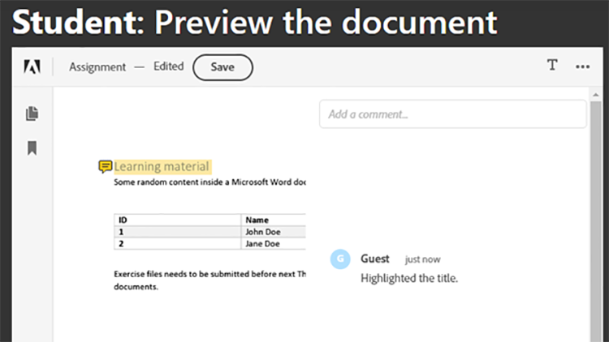

# Samenwerking tussen studenten en docenten


Onderwijsinstellingen gebruiken PDF-documenten om leermateriaal met studenten te delen. PDF biedt docenten een uitwisselbaar documentformaat.

Het integreren van [ Adobe PDF Services API ](https://developer.adobe.com/document-services/apis/pdf-services) en [ Adobe PDF bedt API ](https://developer.adobe.com/document-services/apis/pdf-embed) in een app verstrekt leraren en studenten één enkel platform waarop te onderwijzen en te leren. Uw app kan studenten bijvoorbeeld de mogelijkheid bieden vragen te stellen over hun opdrachten en rapportkaarten en samen te werken aan groepstoewijzingen.

Er is een officiële SDK voor Node.js-toepassingen voor toegang tot de PDF Services-API. Zo kunt u documenten zoals Microsoft Word of Microsoft Excel converteren naar
PDF. Bovendien kunt u meer geavanceerde bewerkingen uitvoeren, zoals het combineren van meerdere rapporten, het opnieuw rangschikken van pagina&#39;s en het beschermen van PDF. Voor meer details, herzie [ productdocumentatie ](https://developer.adobe.com/document-services/homepage/).

## Wat je kunt leren

In dit hands-on leerprogramma, leer om een online het leren platform te creëren dat [ leraren en studenten toelaat om middelen ](https://developer.adobe.com/document-services/use-cases/collaboration/student-teacher-collaboration) in PDF gemakkelijk te delen. Dit leerprogramma gebruikt a [ het leren portaal ](https://github.com/afzaal-ahmad-zeeshan/adobe-pdf-tools-for-teachers) gecreeerd gebruikend runtime Node.js JavaScript (Node.js) en de Diensten van PDF.

Het leerportaal heeft de volgende functies:

* Hiermee kunnen docenten bronnen uploaden

* Laat studenten toe om veelvoudige documenten te selecteren om in PDF om te zetten

* Schakelt de conversie van documenten naar PDF in

* Verstrekt een voorproef van de PDF voor studenten in Webbrowser en laat hen toe om de documenten zonder extra software aan te tekeningen te maken

* Laat studenten toe om commentaren te verlaten en hen te downloaden aan hun computers

Leer hoe [!DNL Adobe Acrobat Services] uw studenten een rijke ervaring van PDF voorziet. API&#39;s van [!DNL Acrobat Services] integreren naadloos in uw bestaande toepassingen, zodat studenten bestanden kunnen uploaden, converteren en weergeven, vervolgens opmerkingen kunnen maken en opslaan — alles binnen uw huidige installatie.

## Relevante API&#39;s en bronnen

* [ PDF bedt API ](https://www.adobe.com/devnet-docs/dcsdk_io/viewSDK/index.html) in

* [ de Diensten API van de PDF ](https://opensource.adobe.com/pdftools-sdk-docs/release/latest/index.html)

* [ code van het Project ](https://github.com/afzaal-ahmad-zeeshan/adobe-pdf-tools-for-teachers)

## Bronnen uploaden naar de leerportal

In de sectie van de leerkrachten van het leerportaal kunnen leerkrachten documenten uploaden zoals opdrachten en tests. De documenten kunnen elke indeling hebben, zoals Microsoft Word, Microsoft Excel, HTML, verschillende afbeeldingsindelingen, enzovoort.


Geüploade documenten worden opgeslagen en aan de studenten getoond wanneer zij hun webpagina openen.

Leren hoe de toepassing de dossiers uploadt, te zien gelieve de [ projectcode ](https://github.com/afzaal-ahmad-zeeshan/adobe-pdf-tools-for-teachers).

## Documenten omzetten in PDF

Studenten kunnen een of meer documenten van elk type omzetten in PDF, zoals Microsoft Word, Excel en PowerPoint, en in andere veelgebruikte tekst- en afbeeldingsbestandstypen. Het leerportaal gebruikt PDF Services om bestanden om te zetten in PDF.

Als u uw eigen leerportal wilt maken, moet u eerst uw eigen referenties maken. [ Teken omhoog ](https://www.adobe.io/apis/documentcloud/dcsdk/gettingstarted.html) aan
gebruik de PDF Services API gratis voor zes maanden en tot 1.000 documenttransacties. Na dat, [ betaal-als-u-gaat ](https://developer.adobe.com/document-services/pricing/main) bij enkel \$0.05 per documenttransactie aangezien de klasse omhoog hun taken ramt.

Wanneer een student een document van het dashboard selecteert, zien zij het volgende:


De student selecteert eenvoudig de documenten voor omzetting en klikt **krijgt rapport**.

De leerportal zet de documenten om in PDF en geeft een rapportpagina weer, samen met een voorvertoning van het PDF-bestand.

Hier volgt de voorbeeldcode voor deze stap:

```
async function createPdf(rawFile, outputPdf) {
    try {
            // configurations
            const credentials =  adobe.Credentials
            .serviceAccountCredentialsBuilder()
            .fromFile("./src/pdftools-api-credentials.json")
            .build();
 
            // Capture the credential from app and show create the context
            const executionContext = adobe.ExecutionContext.create(credentials),
            operation = adobe.CreatePDF.Operation.createNew();
 
            // Pass the content as input (stream)
            const input = adobe.FileRef.createFromLocalFile(rawFile);
            operation.setInput(input);
 
            // Async create the PDF
            let result = await operation.execute(executionContext);
            await result.saveAsFile(outputPdf);
    } catch (err) {
            console.log('Exception encountered while executing operation', err);
    }
}
```

De voorbeeldcode roept de `createPdf` -methode binnen de Express-routehandler op om de PDF te genereren.

Leren hoe deze methode wordt geroepen, zie [ de projectcode ](https://github.com/afzaal-ahmad-zeeshan/adobe-pdf-tools-for-teachers/blob/master/src/helpers/pdf.js).

## Een voorvertoning weergeven van de leermiddelen

De gebruikersinterface gebruikt PDF Embed API om PDF in een webbrowser te renderen. Deze API kan gratis worden gebruikt.

PDF Embed API gebruikt een verschillende referentie dan de Diensten API van de PDF, zodat moet u [ een referentie ](https://www.adobe.io/apis/documentcloud/dcsdk/gettingstarted.html) creëren
voordat u het kunt gebruiken. Vervolgens kunt u PDF insluiten volledig gratis gebruiken.

Zorg ervoor dat u de juiste URL van de website in het token invoert. Anders kunt u de PDF mogelijk niet met het token renderen.

Het gebruikersinterface gebruikt de [ de sjabloontaal van Handgrepen ](https://handlebarsjs.com/). De PDF wordt in een webbrowser weergegeven.

Hier volgt de code voor deze stap:

```
<div id="adobe-dc-view" style="height: 750px; width: 700px;"></div>
<script src="https://documentcloud.adobe.com/view-sdk/main.js"></script>
<script type="text/javascript">
    document.addEventListener("adobe_dc_view_sdk.ready", function () {
        var adobeDCView = new AdobeDC.View({ clientId: "<your-credentials-here>", divId: "adobe-dc-view" });
        adobeDCView.previewFile(
            {
                content: {
                    location: { url: "<file-url>" }
                },
                    metaData: { fileName: "<file-name>" }
            },
           );
    });
</script>
 
<p>Material has been generated, <a href="/students/download/{{filename}}" target="_blank">click here</a> to download it.
</p>
```

Deze code geeft de uitvoer van de PDF en de koppeling voor het downloaden van het PDF-rapport weer, zoals in de onderstaande schermvastlegging wordt getoond:


De studenten zouden het rapport moeten kunnen downloaden of aan het materiaal hier werken.

## PDF-documenten annoteren

Een leerplatform moet basisannotaties, opmerkingen en discussies in PDF ondersteunen. PDF Embed API biedt al deze functies. Hiermee wordt ondersteuning voor annotaties geactiveerd met `showAnnotationTools` , zodat docenten en studenten opmerkingen over de documenten kunnen plaatsen en opmerkingen kunnen archiveren als onderdeel van de PDF.

Als u annotaties in PDF-documenten wilt inschakelen, hoeft u alleen het argument `showAnnotationTools` : true aan de methode `previewFile` door te geven. Hiermee wordt het gereedschap Annotaties weergegeven in de voorvertoning van de PDF. Gebruik dit gereedschap in het menu met de drie puntjes rechtsboven in de voorvertoning.


In de documenten die door docenten zijn geüpload, kunnen studenten tekst markeren, opmerkingen toevoegen enzovoort.



In de bovenstaande schermvastlegging is de gebruiker gelabeld &quot;Gast&quot;, maar u kunt profielen voor gebruikers configureren, zoals studenten en docenten.

Wanneer een student een aantekening toepast, bedt PDF API vertoningen a **sparen** knoop langs de hoogste banner in. Bij opslaan worden de annotaties aan het bestand toegevoegd. Probeer klikkend **sparen** om te zien hoe het dossier met de annotatie opslaat ingebed in het rapport.

Studenten kunnen annotaties gebruiken om vragen te stellen of hun opmerkingen over het leermateriaal te delen.

## Het gebruik van bijgehouden documenten

Het is belangrijk voor leraren en scholen om te zien hoe studenten gebruik maken van onlineplatforms. Dit helpt leraren hun studenten met middelen steunen die hen helpen beter op hun taken presteren. De API voor insluiten van PDF is geïntegreerd met analytics die u kunt gebruiken om alle gebeurtenissen te meten die plaatsvinden, zoals wanneer gebruikers documenten openen, lezen en sluiten. Met de PDF Services-API kunnen docenten ook afdrukken, downloaden en bestandswijzigingen uitschakelen om de academische integriteit te behouden.

Als u een [ Adobe Analytics ](https://developer.adobe.com/analytics-apis/docs/2.0/) vergunning hebt, kunt u zijn [ uit-van-de-doosintegratie ](https://experienceleague.adobe.com/nl/docs/acrobat-services-learn/tutorials/pdfembed/controlpdfexperience#adobe-analytics) gebruiken. Anders, gebruik callbacks om uw Diensten van de PDF met andere analyseleveranciers, zoals [ Google ](https://experienceleague.adobe.com/nl/docs/acrobat-services-learn/tutorials/pdfembed/controlpdfexperience#google-analytics) te integreren.

Als u het meten van documentgebeurtenissen wilt inschakelen, koppelt u de gebeurtenishandlers met behulp van de methode `registerCallback` met de Adobe DC View-instantie. U kunt basisgegevens, zoals het openen van een document of het lezen van een pagina, weergeven op de console. U kunt de metrics ook opslaan in een logbestand of publiceren in andere analytics-winkels.

Hier volgt een voorbeeldcode voor het koppelen van de gebeurtenishandlers:

```
adobeDCView.registerCallback(
    AdobeDC.View.Enum.CallbackType.EVENT_LISTENER,
    function(event) {
           console.log(event);
    },
    {
           enablePDFAnalytics: true
    }
);
```

Leerkrachten kunnen zien hoeveel studenten de opdracht hebben gezien, hoeveel leerlingen alle pagina&#39;s van hun notities hebben bezocht en andere waardevolle details.

Hier volgt een schermvastlegging van webbrowserconsole:


Deze schermopname toont dat de student het toewijzingsbestand heeft geopend, de eerste pagina heeft gelezen — ze hebben niet naar extra pagina&#39;s geschoven of het document heeft maar één pagina — en vervolgens heeft het bestand gedownload. Je kunt deze metrics verzamelen om analyses uit te voeren en het gedrag van je studenten te bestuderen.

Ook, [ Adobe Analytics ](https://business.adobe.com/products/adobe-analytics.html) is geïntegreerd met PDF Embed API, zodat als u een abonnement op de suite van Adobe Analytics hebt, kunt u uw metriek in uw abonnement publiceren. Als u de metrics in Adobe Analytics wilt publiceren, hoeft u uw suite-id alleen door te geven aan de PDF Embed API-constructor. (Let op: u moet uw PDF Embed API-referenties gebruiken, niet uw PDF Services API-referenties).

Hier volgt een voorbeeldcode die laat zien hoe u de suite-id doorgeeft aan de PDF Embed API-constructor:

```
var adobeDCView = new AdobeDC.View({
    clientId: "<your-adobe-dc-credential>",
    divId: "<#element>"
    reportSuiteId: <your-id-here>,
}); 
```

## Volgende stappen

Dit hands-on leerprogramma herzag hoe te om PDF Services API en PDF te gebruiken Embed API om een het leren portaal te creëren, die efficiënte [ samenwerking tussen studenten en leerkrachten ](https://developer.adobe.com/document-services/use-cases/collaboration/student-teacher-collaboration) vergemakkelijkt. Met behulp van dit portaal kunnen docenten leermateriaal in elke indeling uploaden en dit converteren naar PDF met behulp van de PDF Services API. Studenten kunnen deze PDF vervolgens voorvertonen met de PDF Embed-API.

Nu u weet hoe u rapporten van de PDF kunt annoteren, de annotaties kunt archiveren, en het gebruik van PDF-rapporten kunt volgen, kunt u beginnen deze oplossingen in uw eigen projecten uit te voeren.

U kunt [!DNL Adobe Acrobat Services] API&#39;s gebruiken om gebruikersvriendelijke, interactieve PDF-ervaringen op uw website te maken. Geniet van het gratis gebruiken van de Diensten API van Adobe PDF voor zes maanden toen enkel [ betaal-als-u-gaat ](https://developer.adobe.com/document-services/pricing/main) (door AWS of een directe overeenkomst) voor slechts \$0.05 per documenttransactie. Gebruik Adobe PDF Embed free zonder tijdlimiet. Creeer een vrije rekening aan [ begin ](https://www.adobe.com/go/dcsdks_credentials) vandaag.
