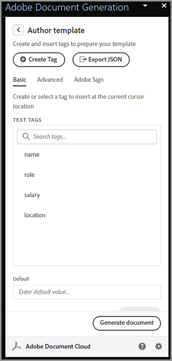
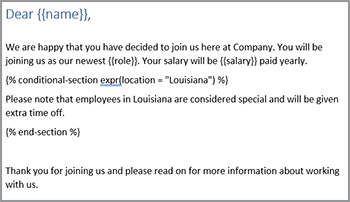

# Modernisering van onboarding van werknemers


In een grote organisatie kan onboarding van werknemers een groot en traag proces zijn. Gewoonlijk is er een combinatie van aangepaste documentatie samen met bouwsteenmateriaal die moet worden gepresenteerd en ondertekend door een nieuwe medewerker. Deze combinatie van aangepast en bouwsteenmateriaal vereist meerdere stappen: kostbare tijd wegnemen van de mensen die bij het proces betrokken zijn. [!DNL Adobe Acrobat Services] en Acrobat Sign kan deze benadering moderniseren en automatiseren, waardoor uw HR persoonlijk wordt vrijgemaakt voor belangrijker taken. Laten we eens kijken hoe dit wordt bereikt.

## Wat is [!DNL Adobe Acrobat Services]?

[[!DNL Adobe Acrobat Services]](https://developer.adobe.com/document-services/homepage) Dit zijn een set API&#39;s die betrekking hebben op het werken met documenten (en niet alleen op PDF). Over het algemeen valt dit pakket services in drie hoofdcategorieën:

* De eerste is de [PDF Services](https://developer.adobe.com/document-services/apis/pdf-services/) set gereedschappen. Dit zijn hulpmethoden voor het werken met PDF en andere documenten. De services omvatten onder andere het omzetten in en van PDF, het uitvoeren van OCR en optimalisatie, het samenvoegen en splitsen van PDF, enzovoort. Het is de gereedschapset met documentverwerkingsfuncties.
* [PDF Extract-API](https://developer.adobe.com/document-services/apis/pdf-extract/) maakt gebruik van krachtige AI/ML-technieken om een PDF te analyseren en een ongelooflijke hoeveelheid details over de inhoud te retourneren. Dit omvat de tekst, opmaak en positionele informatie, en kan ook tabelgegevens in CSV/XLS-indeling retourneren en afbeeldingen ophalen.
* Tot slot: [API voor documentgeneratie](https://developer.adobe.com/document-services/apis/doc-generation/) Hiermee kunnen ontwikkelaars Microsoft Word gebruiken als een &quot;sjabloon&quot;, combineren met hun gegevens (uit elke bron) en dynamische, gepersonaliseerde documenten genereren (PDF en Word).

Ontwikkelaars kunnen [inschrijven](https://documentcloud.adobe.com/dc-integration-creation-app-cdn/main.html) en probeer al deze services met een gratis proefversie. De [!DNL Acrobat Services] Het platform gebruikt een REST-gebaseerde API maar ondersteunt ook SDK&#39;s voor Node, Java, .NET en Python (alleen op dit moment extraheren).

Hoewel ze geen API zijn, kunnen ontwikkelaars ook de gratis [PDF Embed-API](https://developer.adobe.com/document-services/apis/pdf-embed/)en biedt een consistente en flexibele weergave van documenten met uw webpagina&#39;s.

## Wat is Acrobat Sign?

[Acrobat Sign](https://www.adobe.com/nl/sign.html) is wereldleider op het gebied van elektronische ondertekeningsdiensten . U kunt documenten ter ondertekening verzenden met behulp van verschillende workflows, waaronder meerdere handtekeningen. Acrobat Sign ondersteunt ook workflows waarvoor handtekeningen en aanvullende informatie vereist zijn. Al deze mogelijkheden worden ondersteund door een krachtig dashboard met een flexibel ontwerpsysteem.

Als met [!DNL Acrobat Services], Acrobat Sign heeft een [gratis proefversie](https://www.adobe.com/sign.html#sign_free_trial) waarmee ontwikkelaars het ondertekeningsproces kunnen testen via het dashboard en met een eenvoudig te gebruiken REST-API.

## Een onboardingscenario

Laten we eens kijken naar een scenario dat laat zien hoe Adobe kunnen helpen. Wanneer een nieuwe werknemer zich bij een bedrijf aansluit, hebben zij aangepaste informatie nodig die aan hun rol wordt aangepast. Bovendien hebben zij ook bedrijfsbreed materiaal nodig. Tot slot moeten ze de acceptatie van het bedrijfsbeleid aantonen door de documenten te ondertekenen. Laten we dit onderverdelen in concrete stappen:

* Ten eerste is een aangepaste begeleidende brief nodig die de nieuwe werknemer op naam begroet. De brief zou informatie over de naam van de werknemer, de rol, het salaris, en de plaats moeten bevatten.
* De aangepaste brief moet worden gecombineerd met een PDF die basis, bedrijfsbrede informatie bevat (denk aan diverse het beleid van u, voordelen, enz.)
* Er moet een definitief document worden opgenomen waarin wordt gevraagd om de handtekening en de datum van de werknemer.
* Al het bovenstaande moet worden gepresenteerd als één document dat ter ondertekening naar de medewerker wordt gestuurd.

Laten we nader ingaan op hoe we dit kunnen doen.

## Dynamische documenten genereren

Adobe [Documenten genereren](https://developer.adobe.com/document-services/apis/doc-generation/) Met API kunnen ontwikkelaars dynamische documenten maken door Microsoft Word en een eenvoudige sjabloontaal te gebruiken als basis voor het genereren van PDF- en Word-documenten. Hier is een voorbeeld van hoe dit werkt.

Laten we beginnen met een Word-document met hard-gecodeerde waarden. Het document kan op elke gewenste manier worden opgemaakt, zoals afbeeldingen, tabellen, enzovoort. Hier is het eerste document.


Het genereren van documenten werkt door tokens toe te voegen aan een Word-document die worden vervangen door uw gegevens. Hoewel deze tokens handmatig kunnen worden ingevoerd, is er een [Microsoft Word-invoegtoepassing](https://developer.adobe.com/document-services/docs/overview/document-generation-api/wordaddin/) dat maakt het makkelijker . Als u deze functie opent, kunnen auteurs codes of gegevenssets definiëren die in uw document kunnen worden gebruikt.


U kunt JSON-informatie uit een lokaal bestand uploaden, kopiëren in JSON-tekst of selecteren om door te gaan met de initiële gegevens. Zo kunt u uw tags ad hoc definiëren op basis van uw specifieke behoeften. In dit voorbeeld is alleen een tag voor naam, rol, salaris en locatie nodig. Dit doet u door de opdracht **Tag maken** knop:


Nadat u de eerste tag hebt gedefinieerd, kunt u zo veel definiëren als u nodig hebt:



Als u de labels hebt gedefinieerd, selecteert u de tekst in het document en vervangt u deze waar nodig door de codes. In dit voorbeeld worden tags toegevoegd voor naam, rol en salaris.


Het genereren van documenten ondersteunt niet alleen eenvoudige tags, maar ook logische expressies. De tweede alinea van het document bevat tekst die alleen van toepassing is op mensen in Louisiana. U kunt een voorwaardelijke expressie toevoegen door naar het tabblad Geavanceerd van de documentmarkering te gaan en een voorwaarde te definiëren. Hieronder wordt beschreven hoe u een eenvoudige voorwaarde voor gelijkheid definieert, maar u ziet dat numerieke vergelijkingen en andere vergelijkingstypen ook worden ondersteund.


Deze kan vervolgens worden ingevoegd en rond de alinea worden geplaatst:



Als u wilt testen hoe dit werkt, selecteert u **Document genereren**. De eerste keer dat u dit doet, moet u zich aanmelden met een Adobe ID. Na het aanmelden wordt standaard-JSON weergegeven die handmatig kan worden bewerkt.


Er wordt een PDF gegenereerd die vervolgens kan worden weergegeven of gedownload.


Met de Document Tagger kunt u snel ontwerpen en testen, nadat u klaar bent en in productie, maar u kunt een van de SDK&#39;s gebruiken om dit proces te automatiseren. Terwijl de daadwerkelijke code gebaseerd op specifieke behoeften verschilt, is hier een voorbeeld van hoe deze code in Node.js kijkt:

```js
 const PDFServicesSdk = require('@adobe/pdfservices-node-sdk');

const credentials =  PDFServicesSdk.Credentials
    .serviceAccountCredentialsBuilder()
    .fromFile("pdfservices-api-credentials.json")
    .build();

// Data would be dynamic...
let data = {
    "name":"Raymond Camden",
    "role":"Lead Developer",
    "salary":9000,
    "location":"Louisiana"
}

// Create an ExecutionContext using credentials.
const executionContext = PDFServicesSdk.ExecutionContext.create(credentials);

// Create a new DocumentMerge options instance.
const documentMerge = PDFServicesSdk.DocumentMerge,
    documentMergeOptions = documentMerge.options,
    options = new documentMergeOptions.DocumentMergeOptions(jsonDataForMerge, documentMergeOptions.OutputFormat.PDF);

// Create a new operation instance using the options instance.
const documentMergeOperation = documentMerge.Operation.createNew(options);

// Set operation input document template from a source file.
const input = PDFServicesSdk.FileRef.createFromLocalFile('documentMergeTemplate.docx');
documentMergeOperation.setInput(input);

// Execute the operation and Save the result to the specified location.
documentMergeOperation.execute(executionContext)
    .then(result => result.saveAsFile('documentOutput.pdf'))
    .catch(err => {
        if(err instanceof PDFServicesSdk.Error.ServiceApiError
            || err instanceof PDFServicesSdk.Error.ServiceUsageError) {
            console.log('Exception encountered while executing operation', err);
        } else {
            console.log('Exception encountered while executing operation', err);
        }
    });
```

Kortom, de code stelt referenties in, maakt een bewerkingsobject, stelt de invoer en opties in en roept de bewerking aan. Tot slot wordt het resultaat als een PDF opgeslagen. (De resultaten kunnen ook worden uitgevoerd als Word.)

Het genereren van documenten ondersteunt veel complexere gebruiksscenario&#39;s, zoals de mogelijkheid om volledig dynamische tabellen en afbeeldingen te hebben. Zie de [documentatie](https://developer.adobe.com/document-services/docs/overview/document-generation-api/) voor meer informatie.

## PDF-bewerkingen uitvoeren

De [PDF Services API](https://developer.adobe.com/document-services/apis/pdf-services/) biedt een groot aantal hulpprogramma&#39;s voor het werken met PDF. Deze bewerkingen omvatten:

* PDF maken van Office-documenten
* PDF naar Office-documenten exporteren
* PDF combineren en splitsen
* OCR toepassen op PDF
* Beveiliging instellen, verwijderen en wijzigen voor PDF
* Pagina&#39;s verwijderen, invoegen, opnieuw ordenen en roteren
* PDF optimaliseren via compressie of linearisatie
* PDF-eigenschappen ophalen

Voor dit scenario, moet het resultaat van de vraag van de Generatie van het Document met een standaard PDF worden samengevoegd. Deze bewerking is vrij eenvoudig met de SDK&#39;s. Hier is een voorbeeld van Node.js:

```js
const PDFServicesSdk = require('@adobe/pdfservices-node-sdk');
 
// Initial setup, create credentials instance.
const credentials = PDFServicesSdk.Credentials
    .serviceAccountCredentialsBuilder()
    .fromFile("pdfservices-api-credentials.json")
    .build();
 
// Create an ExecutionContext using credentials and create a new operation instance.
const executionContext = PDFServicesSdk.ExecutionContext.create(credentials),
    combineFilesOperation = PDFServicesSdk.CombineFiles.Operation.createNew();
 
// Set operation input from a source file.
const combineSource1 = PDFServicesSdk.FileRef.createFromLocalFile('documentOutput.pdf'),
      combineSource2 = PDFServicesSdk.FileRef.createFromLocalFile('standardCorporate.pdf');

combineFilesOperation.addInput(combineSource1);
combineFilesOperation.addInput(combineSource2);
 
// Execute the operation and Save the result to the specified location.
combineFilesOperation.execute(executionContext)
    .then(result => result.saveAsFile('combineFilesOutput.pdf'))
    .catch(err => {
        if (err instanceof PDFServicesSdk.Error.ServiceApiError
            || err instanceof PDFServicesSdk.Error.ServiceUsageError) {
            console.log('Exception encountered while executing operation', err);
        } else {
            console.log('Exception encountered while executing operation', err);
        }
    });
```

Deze code neemt de twee PDF, voegt deze samen en slaat het resultaat op in een nieuwe PDF. Eenvoudig en gemakkelijk! Zie de [docs](https://developer.adobe.com/document-services/docs/overview/pdf-services-api/) voorbeelden van wat er gedaan kan worden .

## Het ondertekeningsproces

In de laatste fase van het onboardingproces moet de werknemer een overeenkomst ondertekenen waarin staat dat hij/zij alle beleidsregels heeft gelezen en ermee akkoord gaat die binnen deze overeenkomst zijn gedefinieerd. [Acrobat Sign](https://www.adobe.com/nl/sign.html) ondersteunt vele verschillende workflows en integraties, waaronder een geautomatiseerde workflow via een [API](https://opensource.adobe.com/acrobat-sign/developer_guide/index.html). In grote lijnen kan het laatste gedeelte van het scenario als volgt worden voltooid:

Ontwerp eerst het document dat het formulier bevat dat moet worden ondertekend. Er zijn verschillende manieren om dit te doen, inclusief een visueel ontwerp in het Adobe Sign-gebruikersdashboard. U kunt ook de invoegtoepassing Word voor het genereren van documenten gebruiken om de labels voor u in te voegen. In dit voorbeeld worden een handtekening en een datum gevraagd.


Dit document kan worden opgeslagen als een PDF en op dezelfde manier als hierboven is beschreven. Het document kan worden samengevoegd met alle documenten. Met dit proces maakt u één samenhangend pakket met een gepersonaliseerde begroeting, standaardbedrijfsdocumentatie en een uiteindelijke pagina die geschikt is voor ondertekening.

De sjabloon kan naar het Acrobat Sign-dashboard worden geüpload en vervolgens voor nieuwe overeenkomsten worden gebruikt. Door de REST-API te gebruiken, kan dit document vervolgens naar de potentiële werknemer worden verzonden om zijn of haar handtekening aan te vragen.


## Ervaar het zelf

Alles wat in dit artikel wordt beschreven, kan nu worden getest. De [!DNL Adobe Acrobat Services] API [gratis proefversie](https://documentcloud.adobe.com/dc-integration-creation-app-cdn/main.html) geeft je momenteel 1.000 gratis verzoeken over een periode van zes maanden. Acrobat Sign [gratis proefversie](https://www.adobe.com/sign.html#sign_free_trial) Hiermee kunt u overeenkomsten met watermerken verzenden voor testdoeleinden.

Hebt u vragen? De [ondersteuningsforum](https://community.adobe.com/t5/document-services-apis/ct-p/ct-Document-Cloud-SDK) wordt elke dag gecontroleerd door Adobe-ontwikkelaars en ondersteuningsmedewerkers. Vergeet niet om voor meer inspiratie de volgende stap te zetten [Papierclips](https://www.youtube.com/playlist?list=PLcVEYUqU7VRe4sT-Bf8flvRz1XXUyGmtF) episode. Er zijn regelmatig live vergaderingen met nieuws, demonstraties en gesprekken met klanten.
