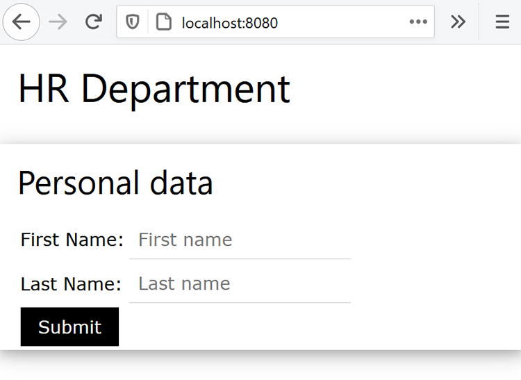

# HR-documentworkflows in Java


Vele ondernemingen vereisen documentatie rond een nieuwe huur, zoals werkplekovereenkomsten voor werk-van-huis werknemers. Traditioneel beheerden bedrijven deze documenten fysiek in formulieren die moeilijk te beheren en op te slaan zijn. Bij het overschakelen op elektronische documenten zijn PDF-bestanden een ideale keuze, omdat ze veiliger en minder aanpasbaar zijn dan andere bestandstypen. Bovendien ondersteunen ze digitale handtekeningen.

## Wat je kunt leren

In deze praktische zelfstudie leert u hoe u een webgebaseerd HR-formulier implementeert waarmee u een werkpleurovereenkomst opslaat voor PDF met aanmelding in een eenvoudige Java Spring MVC-toepassing.

## Relevante API&#39;s en bronnen

* [ de Diensten API van de PDF ](https://opensource.adobe.com/pdftools-sdk-docs/release/latest/index.html)

* [ Adobe Sign API ](https://www.adobe.io/apis/documentcloud/sign.html)

* [ code van het Project ](https://github.com/dawidborycki/adobe-sign)

## API-referenties genereren

Meld u aan voor de gratis proefversie van de Adobe PDF Services API. Ga naar de [ website van de Adobe ](https://www.adobe.io/apis/documentcloud/dcsdk/gettingstarted.html?ref=getStartedWithServicesSDK) [ ](https://www.adobe.io/apis/documentcloud/dcsdk/gettingstarted.html?ref=getStartedWithServicesSDK) en klik *krijgen Begonnen* knoop onder *creëren Nieuwe Geloofsbrieven*. De gratis proefversie biedt 1.000 Document Transactions die kunnen worden gebruikt gedurende zes maanden. Kies op de volgende pagina (zie hieronder) de service (PDF Services API), stel de aanmeldingsnaam in (bijvoorbeeld HRDocumentWFCredentials) en voer een beschrijving in.

Selecteer de taal (Java voor dit voorbeeld) en controle *creeer gepersonaliseerde codesteekproeven*. De laatste stap zorgt ervoor dat codevoorbeelden al het vooraf ingevulde bestand pdftools-api-credentials.json bevatten dat u gebruikt, samen met de persoonlijke sleutel voor het verifiëren van uw app binnen de API.

Tot slot klik *creeer Referenties* knoop. Hiermee worden de referenties gegenereerd en wordt automatisch begonnen met het downloaden van de samples.


Open de gedownloade samples om er zeker van te zijn dat de referenties werken. Hier gebruik je IntelliJ IDEA. Wanneer u de broncode opent, vraagt de geïntegreerde ontwikkelomgeving (winde) om de bouwstijlmotor. Maven wordt gebruikt in dit voorbeeld, maar u kunt ook werken met Gradle, afhankelijk van uw voorkeuren.

Vervolgens voert u het doel `mvn clean install` Maven uit om de potbestanden samen te stellen.

Voer tot slot het voorbeeld CombinePDF uit, zoals hieronder weergegeven. De code genereert de PDF in de uitvoermap.

 in werking te stellen

## De Spring MVC-toepassing maken

Op basis van de referenties maakt u de toepassing. In dit voorbeeld wordt Spring Initializr gebruikt.

Configureer eerst de projectinstellingen om de Java 8-taal en het Jar-pakket te gebruiken (zie onderstaande schermafbeelding).


Ten tweede voegt u Veer Web (van web) en Thymeleaf (van Sjabloonmotoren) toe:

 toe te voegen

Nadat u het project hebt gemaakt, gaat u naar het bestand pom.xml en vult u de sectie Afhankelijkheden aan met pdftools-sdk en log4j-slf4j-impl:

```
<dependencies>
    <dependency>
        <groupId>org.springframework.boot</groupId>
        <artifactId>spring-boot-starter-thymeleaf</artifactId>
    </dependency>
    <dependency>
        <groupId>org.springframework.boot</groupId>
        <artifactId>spring-boot-starter-web</artifactId>
    </dependency>

    <dependency>
        <groupId>org.springframework.boot</groupId>
        <artifactId>spring-boot-starter-test</artifactId>
        <scope>test</scope>
    </dependency>

</dependencies>
```

Vul vervolgens de hoofdmap van uw project in met twee bestanden die u hebt gedownload met de voorbeeldcode:

* pdftools-api-credentials.json

* private.key

## Een webformulier renderen

Als u het webformulier wilt genereren, wijzigt u de toepassing met de controller die het formulier voor persoonlijke gegevens weergeeft en het posten van het formulier verwerkt. Wijzig eerst de toepassing dus met de PersonForm-modelklasse:

```
package com.hr.docsigning;
import javax.validation.constraints.NotNull;
import javax.validation.constraints.Size;

public class PersonForm {
    @NotNull
    @Size(min=2, max=30)
    private String firstName;

    @NotNull
    @Size(min=2, max=30)
    private String lastName;

    public String getFirstName() {
            return this.firstName;
    }


    public void setFirstName(String firstName) {
            this.firstName = firstName;
    }

    public String getLastName() {
           return this.lastName;
    }

    public void setLastName(String lastName) {
            this.lastName = lastName;
    }

    public String GetFullName() {
           return this.firstName + " " + this.lastName;
    }
}
```

Deze klasse bevat twee eigenschappen: `firstName` en `lastName` . Gebruik deze eenvoudige validatie ook om te controleren of deze twee tot dertig tekens lang zijn.

Op basis van de modelklasse kunt u de controller maken (zie PersonController.java van de bijbehorende code):

```
package com.hr.docsigning;
import org.springframework.stereotype.Controller;
import org.springframework.validation.BindingResult;
import org.springframework.web.bind.annotation.GetMapping;
import org.springframework.web.bind.annotation.PostMapping;
import javax.validation.Valid;


@Controller
public class PersonController {
    @GetMapping("/")
    public String showForm(PersonForm personForm) {
        return "form";
    }
}
```

De controller heeft slechts één methode: showForm. Het is verantwoordelijk voor het weergeven van het formulier met de HTML-sjabloon in resources/templates/form.html:

```
<html>
<head>
    <link rel="stylesheet" href="https://www.w3schools.com/w3css/4/w3.css">
</head>
 
<body>
<div class="w3-container">
    <h1>HR Department</h1>
</div>
 
<form class="w3-panel w3-card-4" action="#" th:action="@{/}"
        th:object="${personForm}" method="post">
    <h2>Personal data</h2>
    <table>
        <tr>
            <td>First Name:</td>
            <td><input type="text" class="w3-input"
                placeholder="First name" th:field="*{firstName}" /></td>
            <td class="w3-text-red" th:if="${#fields.hasErrors('firstName')}"
                th:errors="*{firstName}"></td>
        </tr>
        <tr>
            <td>Last Name:</td>
            <td><input type="text" class="w3-input"
                placeholder="Last name" th:field="*{lastName}" /></td>
            <td class="w3-text-red" th:if="${#fields.hasErrors('lastName')}"
                th:errors="*{lastName}"></td>
        </tr>
        <tr>
            <td><button class="w3-button w3-black" type="submit">Submit</button></td>
        </tr>
    </table>
</form>
</body>
</html>
```

Voor het renderen van dynamische inhoud wordt de Thymeleaf-engine voor sjabloonrendering gebruikt. Nadat u de toepassing hebt uitgevoerd, ziet u het volgende:



## De PDF genereren met dynamische inhoud

Genereer nu het PDF-document met het virtuele contract door geselecteerde velden dynamisch in te vullen na het weergeven van het formulier met persoonlijke gegevens. In het bijzonder moet u de persoonsgegevens in het vooraf gemaakte contract invullen.

Voor het gemak hebt u hier alleen een koptekst, een subkoptekst en een tekenreeksconstante die leest: &quot;Dit contract is voorbereid voor \&lt;volledige naam van de persoon\>&quot;.

Om dit doel te bereiken, begin met Adobe [ creeer een PDF van Dynamische HTML ](https://opensource.adobe.com/pdftools-sdk-docs/release/latest/howtos.html#create-a-pdf-from-dynamic-html) voorbeeld. Door die voorbeeldcode te analyseren, zie je dat het proces van dynamische veldpopulatie van HTML als volgt werkt.

Eerst moet u de pagina HTML voorbereiden, die statische en dynamische inhoud bevat. Het dynamische deel wordt bijgewerkt met behulp van JavaScript. Met de PDF Services-API wordt het JSON-object in uw HTML ingebracht.

Vervolgens haalt u de JSON-eigenschappen op met behulp van de JavaScript-functie die wordt aangeroepen wanneer het HTML-document wordt geladen. Deze JavaScript-functie werkt de geselecteerde DOM-elementen bij. Hier is het voorbeeld dat het span-element vult en de gegevens van de persoon bevat (zie src\\main\\resources\\contract\\index.html van de bijbehorende code):

```
<html>
<head>
    <link rel="stylesheet" href="https://www.w3schools.com/w3css/4/w3.css">
</head>
 
<body onload="updateFullName()">
    <script src="./json.js"></script>
    <script type="text/javascript">
        function updateFullName()
        {
            var document = window.document;
            document.getElementById("personFullName").innerHTML = String(
                window.json.personFullName);
        }
    </script>
 
    <div class="w3-container ">
        <h1>HR Department</h1>
 
        <h2>Contract details</h2>
 
        <p>This contract was prepared for:
            <strong><span id="personFullName"></span></strong>
        </p>
    </div>
</body>
</html>
```

Vervolgens moet u de HTML met alle afhankelijke JavaScript- en CSS-bestanden comprimeren. De PDF Services-API accepteert geen HTML-bestanden. In plaats daarvan is een ZIP-bestand vereist als invoer. In dit geval slaat u het gecomprimeerde bestand op in src\\main\\resources\\contract\\index.zip.

Daarna kunt u `PersonController` aanvullen met een andere methode die verzoeken van POSTEN verwerkt:

```
@PostMapping("/")
public String checkPersonInfo(@Valid PersonForm personForm,
    BindingResult bindingResult) {
    if (bindingResult.hasErrors()) {
        return "form";
    }
 
    CreateContract(personForm);
 
    return "contract-actions";
}
```

Met de bovenstaande methode wordt een PDF-contract gemaakt op basis van de verstrekte persoonsgegevens en wordt de weergave van de contractacties weergegeven. Deze laatste bevat koppelingen naar de gegenereerde PDF en voor het ondertekenen van de PDF.

Laten we nu kijken hoe de methode `CreateContract` werkt (de volledige lijst verderop). De methode is gebaseerd op twee velden:

* `LOGGER` , van log4j, om informatie over om het even welke uitzonderingen te zuiveren

* `contractFilePath`, met daarin het bestandspad naar de gegenereerde PDF

De methode `CreateContract` stelt de referenties in en maakt de PDF van HTML. Als u de gegevens van de persoon in het contract wilt doorgeven en invullen, gebruikt u de `setCustomOptionsAndPersonData` Help. Met deze methode haalt u de gegevens van de persoon op uit het formulier en verzendt u deze vervolgens naar de gegenereerde PDF via het JSON-object dat hierboven wordt uitgelegd.

Bovendien toont `setCustomOptionsAndPersonData` hoe u de weergave van de PDF kunt bepalen door de kop- en voettekst uit te schakelen. Als deze stappen zijn voltooid, slaat u het PDF-bestand op in output/contract.pdf en verwijdert u uiteindelijk het eerder gegenereerde bestand.

```
private static final Logger LOGGER = LoggerFactory.getLogger(PersonController.class);
private String contractFilePath = "output/contract.pdf"; 
private void CreateContract(PersonForm personForm) {
    try {
        // Initial setup, create credentials instance.
        Credentials credentials = Credentials.serviceAccountCredentialsBuilder()
                .fromFile("pdftools-api-credentials.json")
                .build();

        //Create an ExecutionContext using credentials 
       //and create a new operation instance.
        ExecutionContext executionContext = ExecutionContext.create(credentials);
        CreatePDFOperation htmlToPDFOperation = CreatePDFOperation.createNew();

        // Set operation input from a source file.
        FileRef source = FileRef.createFromLocalFile(
           "src/main/resources/contract/index.zip");
       htmlToPDFOperation.setInput(source);

        // Provide any custom configuration options for the operation
        // You pass person data here to dynamically fill out the HTML
        setCustomOptionsAndPersonData(htmlToPDFOperation, personForm);

        // Execute the operation.
        FileRef result = htmlToPDFOperation.execute(executionContext);

        // Save the result to the specified location. Delete previous file if exists
        File file = new File(contractFilePath);
        Files.deleteIfExists(file.toPath());

        result.saveAs(file.getPath());

    } catch (ServiceApiException | IOException | 
             SdkException | ServiceUsageException ex) {
        LOGGER.error("Exception encountered while executing operation", ex);
    }
}
 
private static void setCustomOptionsAndPersonData(
    CreatePDFOperation htmlToPDFOperation, PersonForm personForm) {
    //Set the dataToMerge field that needs to be populated 
    //in the HTML before its conversion
    JSONObject dataToMerge = new JSONObject();
    dataToMerge.put("personFullName", personForm.GetFullName());
 
    // Set the desired HTML-to-PDF conversion options.
    CreatePDFOptions htmlToPdfOptions = CreatePDFOptions.htmlOptionsBuilder()
        .includeHeaderFooter(false)
        .withDataToMerge(dataToMerge)
        .build();
    htmlToPDFOperation.setOptions(htmlToPdfOptions);
}
```

Wanneer u het contract genereert, kunt u ook de dynamische, persoonspecifieke gegevens samenvoegen met vaste contractvoorwaarden. Om dit te doen, volg [ creeer een PDF van statische HTML ](https://opensource.adobe.com/pdftools-sdk-docs/release/latest/howtos.html#create-a-pdf-from-dynamic-html) voorbeeld. Alternatief, kunt u [ twee PDF ](https://opensource.adobe.com/pdftools-sdk-docs/release/latest/howtos.html#create-a-pdf-from-static-html) samenvoegen.

## Het PDF-bestand voor downloaden presenteren

U kunt nu de koppeling naar de gegenereerde PDF weergeven zodat de gebruiker deze kan downloaden. Hiertoe maakt u eerst het bestand contract-actions.html (zie resources/templates contract-actions.html van de bijbehorende code):

```
<html>
<head>
    <link rel="stylesheet" href="https://www.w3schools.com/w3css/4/w3.css">
</head>
 
<div class="w3-container ">
    <h1>HR Department</h1>
 
    <h2>Contract file</h2>
 
    <p>Click <a href="/pdf">here</a> to download your contract</p>
</div>
</body>
</html>
```

Vervolgens implementeert u de methode `downloadContract` binnen de klasse `PersonController` als volgt:

```
@RequestMapping("/pdf")
public void downloadContract(HttpServletResponse response)
{
    Path file = Paths.get(contractFilePath);
 
    response.setContentType("application/pdf");
    response.addHeader(
        "Content-Disposition", "attachment; filename=contract.pdf");

    try
    {
        Files.copy(file, response.getOutputStream());
        response.getOutputStream().flush();
    }
    catch (IOException ex) 
    {
        ex.printStackTrace();
    }
}
```

Nadat u de app hebt uitgevoerd, krijgt u de volgende flow. Het eerste scherm toont het formulier voor persoonlijke gegevens. Vul de tekst met waarden tussen twee en 30 tekens om deze te testen:


Na het klikken van *verzend* knoop, bevestigt de vorm en de PDF produceert gebaseerd op de HTML (resources/contract/index.html). De toepassing geeft een andere weergave (contractdetails) weer, waarin u de PDF kunt downloaden:


De PDF ziet er na rendering in de webbrowser als volgt uit. De ingevoerde persoonsgegevens worden doorgegeven aan de PDF:

 wordt teruggegeven

## Handtekeningen en beveiliging inschakelen

Als de overeenkomst klaar is, kan Adobe Sign digitale handtekeningen toevoegen die de goedkeuring vertegenwoordigen. Adobe Sign-verificatie werkt iets anders dan OAuth. Laten we nu kijken hoe u de toepassing kunt integreren met Adobe Sign. Hiervoor moet u het toegangstoken voor uw toepassing voorbereiden. Vervolgens schrijft u de clientcode met de Adobe Sign Java SDK.

Als u een verificatietoken wilt verkrijgen, moet u verschillende stappen uitvoeren:

Eerst, registreer a [ ontwikkelaarrekening ](https://acrobat.adobe.com/nl/nl/sign/developer-form.html).

Creeer de toepassing van de CLIENT in het [ portaal van Adobe Sign ](https://www.adobe.io/apis/documentcloud/sign/docs.html#!adobedocs/adobe-sign/master/gstarted/create_app.md).

Vorm OAuth voor de toepassing zoals beschreven [ hier ](https://www.adobe.io/apis/documentcloud/sign/docs.html#!adobedocs/adobe-sign/master/gstarted/configure_oauth.md) en [ hier ](https://secure.eu1.adobesign.com/public/static/oauthDoc.jsp). Noteer de client-ID en het clientgeheim. Vervolgens kunt u `https://www.google.com` gebruiken als de Redirect URI en de volgende bereiken:

* user_login: self

* agreement_read: account

* agreement_write: account

* agreement_send: account

Bereid een URL als volgt voor met uw client-id in plaats van \&lt;CLIENT_ID\>:

```
https://secure.eu1.adobesign.com/public/oauth?redirect_uri=https://www.google.com
&response_type=code
&client_id=<CLIENT_ID>
&scope=user_login:self+agreement_read:account+agreement_write:account+agreement_send:account
```

Typ de bovenstaande URL in uw webbrowser. U wordt omgeleid naar google.com en de code wordt in de adresbalk weergegeven als code=\&lt;UW_CODE\>, voor
voorbeeld:

```
https://www.google.com/?code=<YOUR_CODE>&api_access_point=https://api.eu1.adobesign.com/&web_access_point=https://secure.eu1.adobesign.com%2F
```

Let op de waarden die worden gegeven voor \&lt;UW_CODE\> en api_access_point.

Als u een HTTP-POST-aanvraag wilt verzenden die u het toegangstoken verschaft, gebruikt u de client-id, de waarden \&lt;UW_CODE\> en api_access_point. U kunt [ Postman ](https://helpx.adobe.com/sign/kb/how-to-create-access-token-using-postman-adobe-sign.html) of cURL gebruiken:

```
curl --location --request POST "https://**api.eu1.adobesign.com**/oauth/token"
\\

\--data-urlencode "client_secret=**\<CLIENT_SECRET\>**" \\

\--data-urlencode "client_id=**\<CLIENT_ID\>**" \\

\--data-urlencode "code=**\<YOUR_CODE\>**" \\

\--data-urlencode "redirect_uri=**https://www.google.com**" \\

\--data-urlencode "grant_type=authorization_code"
```

De voorbeeldreactie ziet er als volgt uit:

```
{
    "access_token":"3AAABLblqZhByhLuqlb-…",
    "refresh_token":"3AAABLblqZhC_nJCT7n…",
    "token_type":"Bearer",
    "expires_in":3600
}
```

Noteer je access_token. U hebt deze nodig om uw clientcode te autoriseren.

## De Adobe Sign Java SDK gebruiken

Zodra u het toegangstoken hebt, kunt u REST API-aanroepen naar Adobe Sign verzenden. Gebruik de Adobe Sign Java SDK om dit proces te vereenvoudigen. De broncode is beschikbaar bij de [ bewaarplaats GitHub van de Adobe ](https://github.com/adobe-sign/AdobeSignJavaSdk).

Als u dit pakket wilt integreren met uw toepassing, moet u de code klonen. Maak vervolgens het Maven-pakket (mvn-pakket) en installeer de volgende bestanden in het project (u vindt ze in de bijbehorende code in de map adobe-sign-sdk):

* target/swagger-java-client-1.0.0.jar

* target/lib/gson-2.8.1.jar

* target/lib/gson-fire-1.8.0.jar

* target/lib/hamcrest-core-1.3.jar

* target/lib/junit-4.12.jar

* target/lib/logging-interceptor-2.7.5.jar

* target/lib/okhttp-2.7.5.jar

* target/lib/okio-1.6.0.jar

* target/lib/swagger-annotations-1.5.15.jar

In IntelliJ IDEA, kunt u die dossiers als gebiedsdelen toevoegen gebruikend *de Structuur van het Project* (Dossier/de Structuur van het Project).

## De PDF ter ondertekening verzenden

U kunt de overeenkomst nu ter ondertekening verzenden. Hiertoe vult u eerst het contract-details.html aan met een andere hyperlink naar de verzendaanvraag:

```
<html>
<head>
    <link rel="stylesheet" href="https://www.w3schools.com/w3css/4/w3.css">
</head>
 
<div class="w3-container ">
    <h1>HR Department</h1>
 
    <h2>Contract file</h2>
 
    <p>Click <a href="/pdf"> here</a> to download your contract</p>
 
    
</div>
</body>
</html>
```

Vervolgens voegt u nog een controller, `AdobeSignController` , toe waarin u `sendContractMethod` implementeert (zie de bijbehorende code). De methode werkt als volgt:

Eerst wordt `ApiClient` gebruikt om het API-eindpunt te verkrijgen.

```
ApiClient apiClient = new ApiClient();

//Default baseUrl to make GET /baseUris API call.
String baseUrl = "https://api.echosign.com/";
String endpointUrl = "/api/rest/v6";
apiClient.setBasePath(baseUrl + endpointUrl);

// Provide an OAuth Access Token as "Bearer access token" in authorization
String authorization = "Bearer ";

// Get the baseUris for the user and set it in apiClient.
BaseUrisApi baseUrisApi = new BaseUrisApi(apiClient);
BaseUriInfo baseUriInfo = baseUrisApi.getBaseUris(authorization);
apiClient.setBasePath(baseUriInfo.getApiAccessPoint() + endpointUrl);
```

Vervolgens gebruikt de methode het bestand contract.pdf om het overgangsdocument te maken:

```
// Get PDF file
String filePath = "output/";
String fileName = "contract.pdf";
File file = new File(filePath + fileName);
String mimeType = "application/pdf";
 
//Get the id of the transient document.
TransientDocumentsApi transientDocumentsApi =
    new TransientDocumentsApi(apiClient);
TransientDocumentResponse response = transientDocumentsApi.createTransientDocument(authorization,
    file, null, null, fileName, mimeType);
String transientDocumentId = response.getTransientDocumentId();
```

Vervolgens moet u een overeenkomst maken. Gebruik hiervoor het bestand contract.pdf en stel de overeenkomststatus in op IN_PROCESS om het bestand onmiddellijk te verzenden. U kunt ook de elektronische handtekening kiezen:

```
// Create AgreementCreationInfo
AgreementCreationInfo agreementCreationInfo = new AgreementCreationInfo();
 
// Add file
FileInfo fileInfo = new FileInfo();
fileInfo.setTransientDocumentId(transientDocumentId);
agreementCreationInfo.addFileInfosItem(fileInfo);
 
// Set state to IN_PROCESS, so the agreement is be sent immediately
agreementCreationInfo.setState(AgreementCreationInfo.StateEnum.IN_PROCESS);
agreementCreationInfo.setName("Contract");
agreementCreationInfo.setSignatureType(AgreementCreationInfo.SignatureTypeEnum.ESIGN);
```

Vervolgens voegt u de ontvangers van de overeenkomst als volgt toe. Hier voegt u twee ontvangers toe (zie de secties Medewerker en Manager):

```
// Provide emails of recipients to whom agreement is be sent
// Employee
ParticipantSetInfo participantSetInfo = new ParticipantSetInfo();
ParticipantSetMemberInfo participantSetMemberInfo = new ParticipantSetMemberInfo();
participantSetMemberInfo.setEmail("");
participantSetInfo.addMemberInfosItem(participantSetMemberInfo);
participantSetInfo.setOrder(1);
participantSetInfo.setRole(ParticipantSetInfo.RoleEnum.SIGNER);
agreementCreationInfo.addParticipantSetsInfoItem(participantSetInfo);
 
// Manager
participantSetInfo = new ParticipantSetInfo();
participantSetMemberInfo = new ParticipantSetMemberInfo();
participantSetMemberInfo.setEmail("");
participantSetInfo.addMemberInfosItem(participantSetMemberInfo);
participantSetInfo.setOrder(2);
participantSetInfo.setRole(ParticipantSetInfo.RoleEnum.SIGNER);
agreementCreationInfo.addParticipantSetsInfoItem(participantSetInfo);
```

Tot slot verzendt u de overeenkomst via de methode `createAgreement` van de Adobe Sign Java SDK:

```
// Create agreement using the transient document.
AgreementsApi agreementsApi = new AgreementsApi(apiClient);
AgreementCreationResponse agreementCreationResponse = agreementsApi.createAgreement(
    authorization, agreementCreationInfo, null, null);
 
System.out.println("Agreement sent, ID: " + agreementCreationResponse.getId());
```

Nadat u deze code hebt uitgevoerd, ontvangt u een e-mail (naar het adres dat in de code is opgegeven als `<email_address>)` met de aanvraag voor de ondertekening van de overeenkomst. De e-mail bevat de hyperlink, waarmee ontvangers naar de Adobe Sign-portal worden gestuurd om het ondertekenen uit te voeren. U ziet het document in uw Portaal van de Ontwikkelaar van Adobe Sign (zie hieronder figuur) en u kunt het handtekeningproces programmatically ook volgen gebruikend de [ getAgreementInfo ](https://github.com/adobe-sign/AdobeSignJavaSdk/blob/master/docs/AgreementsApi.md#getAgreementInfo) methode.

Tot slot kunt u uw PDF ook wachtwoord-beschermen gebruikend de Diensten API van de PDF zoals aangetoond in deze [ voorbeelden ](https://github.com/adobe/pdfservices-java-sdk-samples/tree/master/src/main/java/com/adobe/pdfservices/operation/samples/protectpdf).


## Volgende stappen

Zoals u kunt zien, kunt u met de snelstartfunctie een eenvoudig webformulier implementeren om een goedgekeurde PDF in Java te maken met de Adobe PDF Services-API. Adobe PDF API&#39;s integreren naadloos in je bestaande clienttoepassingen.

In het volgende voorbeeld kunt u ontvangers van formulieren maken die op afstand en veilig kunnen ondertekenen. Als je meerdere handtekeningen nodig hebt, kun je zelfs automatisch formulieren doorsturen naar een reeks personen in een workflow. Je werknemersonboarding is verbeterd en je HR-afdeling zal van je houden.

Bekijk [[!DNL Adobe Acrobat Services] ](https://www.adobe.io/apis/documentcloud/dcsdk/) om een groot aantal PDF-mogelijkheden aan uw toepassingen toe te voegen.
