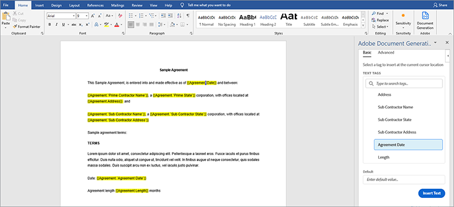
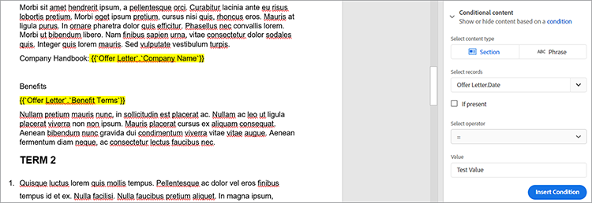

# Juridische contracten beheren


Met digitalisering komen er uitdagingen. Vandaag, hebben de meeste organisaties vele soorten [&#x200B; wettelijke contracten &#x200B;](https://developer.adobe.com/document-services/use-cases/agreements-and-contracts/legal-contracts) die zij moeten creëren, uitgeven, goedkeuren, en door verschillende partijen hebben ondertekend. Deze juridische contracten vereisen vaak unieke aanpassingen en branding. Organisaties moeten ze mogelijk ook opslaan in een beveiligde indeling nadat ze zijn ondertekend om ze veilig te houden. Om al deze dingen te doen, hebben ze een krachtige oplossing voor het genereren en beheren van documenten nodig.

Veel oplossingen bieden de mogelijkheid om documenten te genereren, maar kunnen geen gegevensinvoer en voorwaardelijke logica aanpassen, zoals clausules die alleen van toepassing zijn op specifieke scenario&#39;s. Het handmatig bijwerken van de juridische sjablonen van een bedrijf is lastig en vatbaar voor fouten omdat deze documenten steeds uitgebreider worden. De noodzaak om deze processen te automatiseren is aanzienlijk.

## Wat je kunt leren

In dit hands-on leerprogramma, onderzoek de eigenschappen van [[!DNL Adobe Acrobat Services]  APIs &#x200B;](https://developer.adobe.com/document-services/apis/doc-generation) in de generatie van de gebieden van de douaneinput in documenten. Ga ook na hoe u deze gegenereerde documenten eenvoudig kunt converteren naar een beveiligde, draagbare documentindeling (PDF) om gegevensmanipulatie te voorkomen.

Deze zelfstudie omvat een beetje programmeren bij het verkennen van de conversie van contracten naar PDF. Om langs effectief te volgen, [&#x200B; Word van Microsoft &#x200B;](https://www.microsoft.com/en-us/download/office.aspx) en [&#x200B; Node.js &#x200B;](https://nodejs.org/) zou op uw PC moeten worden geïnstalleerd. Een basisbegrip van Node.js en [&#x200B; ES6 syntaxis &#x200B;](https://www.w3schools.com/js/js_es6.asp) wordt ook geadviseerd.

## Relevante API&#39;s en bronnen

* [&#x200B; de Generatie API van het Document van de Adobe &#x200B;](https://developer.adobe.com/document-services/apis/doc-generation)

* [&#x200B; PDF bedt API &#x200B;](https://www.adobe.com/devnet-docs/dcsdk_io/viewSDK/index.html) in

* [&#x200B; Adobe Sign API &#x200B;](https://developer.adobe.com/adobesign-api/)

* [&#x200B; code van het Project &#x200B;](https://github.com/agavitalis/adobe_legal_contracts.git)

## Een sjabloondocument maken

U kunt wettelijke documenten tot stand brengen gebruikend de toepassing van Microsoft Word of door de malplaatjes van Word van de Adobe [&#x200B; te downloaden &#x200B;](https://developer.adobe.com/document-services/apis/doc-generation#sample-blade). Nog, is het niet gemakkelijk om input aan te passen en deze documenten digitaal te ondertekenen zonder sommige helperhulpmiddelen zoals [&#128279;](https://developer.adobe.com/document-services/docs/overview/document-generation-api/wordaddin) toe:voegen-binnen de Tagger van de Generatie van het Document van de Adobe  voor Microsoft Word te gebruiken.

Tagger voor het genereren van documenten is een Microsoft Word-invoegtoepassing waarmee u documenten naadloos kunt aanpassen met behulp van codes. Hiermee kunt u dynamische velden in documentsjablonen maken die dynamisch worden gevuld met JSON-gegevens.


Als u het gebruik van Document Generation Tagger wilt illustreren, installeert u deze invoegtoepassing en maakt u vervolgens een JSON-gegevensmodel dat wordt gebruikt voor het coderen van een eenvoudig juridisch contractdocument.

Installeer Tagger van de Generatie van het Document in Word door het **Tussenvoegsel** lusje, dan in de toe:voegen-ins groep, klik **Mijn toe:voegen-ins**. Voor het menu van toe:voegen-ins van het Bureau, onderzoek naar &quot;de Generatie van het Document van de Adobe&quot;en klik dan **voeg** toe en volg het proces. U kunt deze stappen zien in de bovenstaande schermvastlegging.

Nadat u de invoegtoepassing Document Generation Tagger voor Word hebt geïnstalleerd, maakt u een eenvoudig JSON-gegevensmodel om het juridische document te coderen.

Als u verder wilt gaan, opent u een gewenste editor, maakt u een bestand met de naam Agreement.json en plakt u het codefragment hieronder in het JSON-bestand dat u hebt gemaakt.

```
{
"Agreement": {
"Date": "1/24/2021",
"Prime Contractor Name": "Ogbonna Vitalis Corp",
"Prime State": "Lagos",
"Address": "Maryland Ave, Lagos State, Ng",
"Sub Contractor Name": "Vivvaa Soln",
"Sub Contractor State": "California",
"Sub Contractor Address": "Molusi Avenue, Dallas Texas, CA",
"Agreement Date": "1/24/2021",
"Length": 5
}
}
```

Nadat u dit JSON-document hebt opgeslagen, importeert u het in de invoegtoepassing Tagger voor documentgeneratie. Importeer het document door **de Generatie van het Document** in de groep van de Adobe op de hogere juiste kant van het scherm van Word te klikken, zoals aangetoond in het hieronder gevangen scherm.


Hiermee wordt een video weergegeven om u te begeleiden. U kunt op het letten of rechtstreeks naar het etiketterende gebied gaan door **te klikken krijg Begonnen**. Na het klikken **krijg Begonnen**, verschijnt een upload vorm. Klik **upload JSON dossier** en selecteer het JSON dossier u enkel creeerde. Wanneer de invoer volledig is, produceer de klik **Markering** om de markeringen te produceren.

Nadat u tags hebt geïmporteerd en gegenereerd, kunt u deze tags aan uw document toevoegen. Plaats de cursor op de plaats waar u de tag wilt invoegen om de tags toe te voegen. Dan selecteer een markering van de Generatie API van het Document en klik **Tekst van het Tussenvoegsel**. Deze procedure wordt beschreven in de onderstaande schermvastlegging.



Naast de basiscodes die zijn gemaakt met behulp van het geïmporteerde JSON-gegevensmodel, kunt u ook geavanceerde functies gebruiken voor meer opties zoals afbeeldingen, voorwaardelijke logica, berekeningen, herhalende elementen en voorwaardelijke woordgroepen. U kunt tot deze eigenschappen toegang hebben door **Geavanceerd** in het paneel van de Tagger van de Generatie van het Document te klikken. U kunt dit zien in de schermvastlegging hieronder.


Deze geavanceerde functies verschillen niet van de basiscodes. Als u voorwaardelijke logica wilt opnemen, selecteert u het deel van het document dat u wilt invullen. Configureer vervolgens de regel die de invoeging van de tag bepaalt.

Ter illustratie, bijvoorbeeld in de overeenkomst, is er een sectie die u wilt opnemen, alleen voorwaardelijk. Selecteer **Sectie in het veld Inhoudstype selecteren.** Selecteer in het veld Records selecteren de optie die bepaalt of de voorwaardelijke sectie wordt weergegeven. Selecteer de gewenste voorwaardelijke operator en stel de waarde in waarop u wilt testen in het veld Waarde. Dan klik **Voorwaarde van het Tussenvoegsel.** De schermvastlegging hieronder illustreert dit proces.



Selecteer voor berekeningen de optie Rekenkundig of Aggregatie en neem vervolgens de relevante eerste record, operator en de tweede record op op op basis van de beschikbare sjabloontags. Dan klik **Berekening van het Tussenvoegsel**.

Ook juridische contracten vereisen vaak handtekeningen van de betrokken partijen. U kunt een e-handtekening invoegen met behulp van Adobe Sign-tekstcodes die zich direct onder de sectie Numerieke berekeningen bevinden. Om de e-handtekening te omvatten, moet u het aantal ontvangers specificeren, **Ondertekenaar** selecteren, en het gebiedstype van de drop-down lijsten, dienovereenkomstig. Zodra gedaan, klik **markering van de Tekst van Adobe Sign** opnemen om het proces te voltooien.

Sla juridische documenten op in een beveiligde indeling om de gegevensintegriteit te waarborgen. Met [!DNL Acrobat Services] API&#39;s kun je snel documenten omzetten in PDF-indeling. U kunt een eenvoudige express Node.js-toepassing maken, hierin de API voor het genereren van documenten integreren en met deze eenvoudige toepassing uw gecodeerde document converteren van Word naar PDF-indeling.

## Projectinstelling

Eerst stelt u de mapstructuur in voor de toepassing Node.js. In dit voorbeeld roept u deze eenvoudige toepassing AdobeLegalContractAPI aan. U kunt de broncode [&#x200B; hier terugwinnen &#x200B;](https://github.com/agavitalis/adobe_legal_contracts.git).

### Directorystructuur

Maak een map met de naam AdobeLegalContractAPI en open deze in een editor naar keuze. Maak een basistoepassing Node.js met de opdracht ```npm init``` aan de hand van de onderstaande mapstructuur:

```
###Directory Structure
AdobeLegalContractAPI
-----config
----------default.json
-----controllers
----------createPDFController.js
----------previewController.js
-----models
----------document.js
-----routes
----------web.js
-----services
-----------upload.js
-----uploads
-----views
-----index.js
```

Hierboven vindt u een eenvoudige Node.js-toepassingsstructuur voor uw toepassing. Ga nu verder met de installatie van de benodigde npm-pakketten.

### Pakketinstallatie

Installeer de vereiste pakketten met de npm-installatieopdracht, zoals weergegeven in het codefragment hieronder:

```
npm install express body-parser morgan multer hbs path config mongoose
```

Nadat u de pakketten hebt geïnstalleerd, controleert u of de inhoud van het bestand package.json overeenkomt met het codefragment hieronder:

```
###package.json
{
"name": "adobelegalcontractapi",
"version": "1.0.0",
"description": "",
"main": "index.js",
"directories": {
"test": "test"
},
"dependencies": {
"body-parser": "^1.19.0",
"config": "^3.3.6",
"express": "^4.17.1",
"hbs": "^4.1.1",
"mongoose": "^5.12.1",
"morgan": "^1.10.0",
"multer": "^1.4.2",
"path": "^0.12.7"
},
"devDependencies": {},
"scripts": {
"start": "node index.js"
},
"repository": {
"type": "git",
"url": "https://github.com/agavitalis/adobe_legal_contracts.git"
},
"author": "Ogbonna Vitalis",
"license": "ISC",
"bugs": {
"url": "https://github.com/agavitalis/adobe_legal_contracts/issues"
},
"homepage": "https://github.com/agavitalis/adobe_legal_contracts#readme"
}
```

In deze codefragmenten, installeerde u de toepassingsgebiedsdelen, met inbegrip van de de sjabloonmotor van Handlebars voor de mening.

De primaire nadruk in dit leerprogramma is op het gebruiken van [[!DNL Acrobat Services]  APIs &#x200B;](https://developer.adobe.com/document-services/homepage/) om documenten in PDF om te zetten. Er is dus geen stapsgewijs proces voor het bouwen van deze Node.js-toepassing. Nochtans, kunt u de volledige werkende Node.js toepassingscode op [&#x200B; GitHub &#x200B;](https://github.com/agavitalis/adobe_legal_contracts.git) terugwinnen.

## [!DNL Adobe Acrobat Services] API&#39;s integreren in een Node.js-toepassing

[!DNL Adobe Acrobat Services] API&#39;s zijn cloudgebaseerde, betrouwbare services die zijn ontworpen voor de naadloze bewerking van documenten. Het biedt drie API&#39;s:

* Adobe PDF Services API

* Adobe PDF Embed-API

* Adobe-API voor documentgeneratie

U hebt referenties nodig om [!DNL Acrobat Services] API&#39;s te gebruiken (anders dan uw PDF Embed API-referenties). Als u geen geldige geloofsbrieven hebt, [&#x200B; register &#x200B;](https://www.adobe.com/go/dcsdks_credentials?ref=getStartedWithServicesSDK) en voltooi het werkschema zoals geïllustreerd in het scherm vangen hieronder. Geniet van een a [&#x200B; vrije proefperiode van zes maanden dan betaal-als-u-gaat &#x200B;](https://developer.adobe.com/document-services/pricing/main), enkel $0.05 per documenttransactie.


Als het aanmeldingsproces is voltooid, wordt er automatisch een codevoorbeeld gedownload naar uw pc om u te helpen met starten. U kunt dit codevoorbeeld extraheren en er mee volgen. Vergeet niet de bestanden pdftools-api-credentials.json en private.key uit het geëxtraheerde codevoorbeeld te kopiëren naar de hoofdmap van het project Node.js. De referenties zijn vereist voordat u toegang krijgt tot de API-eindpunten van [!DNL Acrobat Services] . U kunt ook SDK-voorbeelden downloaden met uw persoonlijke gegevens, zodat u de sleutel in de voorbeeldcode niet hoeft bij te werken.

Installeer nu de SDK van Adobe PDF Services Node door de opdracht ```npm install \--save @adobe/documentservices-pdftools-node-sdk``` uit te voeren met behulp van de terminal in de hoofdmap van uw toepassing. Als de installatie is gelukt, kunt u [!DNL Acrobat Services] API&#39;s gebruiken om documenten in uw toepassing te bewerken.

## Een PDF-document maken

[!DNL Acrobat Services] APIs steunt de verwezenlijking van PDF van de documenten van Microsoft Office (Word, Excel, en PowerPoint) en andere [&#x200B; gesteunde dossierformaten &#x200B;](https://opensource.adobe.com/pdftools-sdk-docs/release/latest/howtos.html#create-a-pdf) zoals .txt, .rtf, .bmp, .jpeg, gif, .tiff, en .png. Je kunt eenvoudig juridische contracten van elke andere bestandsindeling converteren naar PDF met behulp van Acrobat Service API’s.

Met de API voor het genereren van Adoben kunt u converteren naar een Word-bestand of -PDF. U kunt bijvoorbeeld een Word-sjabloon gebruiken om een contract te genereren, waaronder een redliner om bewerkte tekst te markeren. Converteer het document vervolgens naar een PDF en gebruik de PDF Services-API om het document te beveiligen met een wachtwoord, het ter ondertekening te verzenden, en meer.

Als u het maken van PDF-documenten wilt implementeren op basis van de beschikbare ondersteunde bestandsindelingen, moet u een formulier uploaden om het te transformeren met [!DNL Acrobat Services] .

Ontworpen upload vorm verschijnt in het scherm hieronder vangen, en u kunt tot de HTML en CSS dossiers op [&#x200B; GitHub &#x200B;](https://github.com/agavitalis/adobe_legal_contracts.git) toegang hebben.


Voeg nu de volgende codefragmenten toe aan het bestand controllers /createPDFController.js. Met deze code wordt het geüploade document opgehaald en omgezet in PDF. [!DNL Acrobat Services] slaat het oorspronkelijke geüploade bestand en het getransformeerde bestand in verschillende mappen op.

```
###controllers/createPDFController.js
const PDFToolsSdk = require('@adobe/documentservices-pdftools-node-sdk');
const Document = require('../models/document');
/*
* GET / route to show the createPDF form.
*/
function createPDF(req, res) {
//catch any response on the url
let response = req.query.response
res.render('index', { response })
}
/*
* POST /createPDF to create a new PDF File.
*/
function createPDFPost(req, res) {
let filePath = req.file.path;
let fileName = req.file.filename;
try {
// Initial setup, create credentials instance.
const credentials = PDFToolsSdk.Credentials
.serviceAccountCredentialsBuilder()
.fromFile("pdftools-api-credentials.json")
.build();
// Create an ExecutionContext using credentials and create a new operation instance.
const executionContext = PDFToolsSdk.ExecutionContext.create(credentials),
createPdfOperation = PDFToolsSdk.CreatePDF.Operation.createNew();
// Set operation input from a source file.
const input = PDFToolsSdk.FileRef.createFromLocalFile(filePath);
createPdfOperation.setInput(input);
// Execute the operation and Save the result to the specified location.
createPdfOperation.execute(executionContext)
.then(async(result) => {
let newFileName = `createPDFFromDOCX-${Math.random() * 171}.pdf`
let newFilePath = require('path').resolve('./') + `\\output\\${newFileName}`
await result.saveAsFile(`views/output/${newFileName}`)
//Creates a new document
let newDocument = new Document({
documentName: newFileName,
url: newFilePath
});
//Save it into the DB.
newDocument.save((err, docs) => {
if (err) {
res.send(err);
}
else {
res.redirect('/?response=PDF Successfully created')
}
});
})
.catch(err => {
if (err instanceof PDFToolsSdk.Error.ServiceApiError
|| err instanceof PDFToolsSdk.Error.ServiceUsageError) {
console.log('Exception encountered while executing operation', err);
} else {
console.log('Exception encountered while executing operation', err);
}
});
} catch (err) {
console.log('Exception encountered while executing operation', err);
}
}
//export all the functions
module.exports = { createPDF, createPDFPost };
```

Voor het bovenstaande codefragment waren het documentmodel en de [!DNL Acrobat Services] Node SDK vereist die u eerder hebt geïnstalleerd. Er zijn twee functies:

* createPDF geeft het geüploade documentformulier weer.

* createPDFPost transformeert het geüploade document in een PDF.

De functies slaan de getransformeerde PDF-documenten op in de map views/output, waar u ze kunt downloaden naar uw pc.

U kunt ook een voorvertoning van het getransformeerde PDF-bestand weergeven met de gratis PDF Embed-API. Gebruikend PDF bedt API, kunt u Adobe geloofsbrieven [&#x200B; hier &#x200B;](https://www.adobe.com/go/dcsdks_credentials) (verschillend van uw [!DNL Acrobat Services] geloofsbrieven) produceren en toegelaten domeinen registreren om tot API toegang te hebben. Volg het proces en genereer PDF Embed API-referenties voor uw toepassing. U kunt de demonstratie [&#x200B; hier &#x200B;](https://documentcloud.adobe.com/view-sdk-demo/index.html#/view/FULL_WINDOW/Bodea%20Brochure.pdf) ook controleren, waarvan u gemakkelijk codes kunt produceren om u snel begonnen te krijgen.

Maak list.hbs- en preview.hbs-bestanden in de weergavemap van uw toepassing en plak het codefragment hieronder in respectievelijk de bestanden list.hbs en preview.hbs.

```
###views/list.hbs
<!DOCTYPE html>
<html lang="en">
<head>
<title>Adobe Legal Contract</title>
<!-- Meta tags -->
<meta charset="UTF-8">
<meta name="viewport" content="width=device-width,
initial-scale=1.0">
<meta http-equiv="X-UA-Compatible" content="ie=edge">
<!-- //Meta tags -->
<link
href=".min.css" rel="stylesheet" integrity="sha384-eOJMYsd53ii+scO/
bJGFsiCZc+5NDVN2yr8+0RDqr0Ql0h+rP48ckxlpbzKgwra6" crossorigin="anonymous">
<link rel="stylesheet" href="css/style.css" type="text/css"
media="all" /><!-- Style-CSS -->
<link href="css/font-awesome.css" rel="stylesheet" /><!--
font-awesome-icons -->
</head>
<body>
<section>
<div class="form-36-mian section-gap">
<div class="wrapper">
<div class="container">
<div class="row">
{{#each documents}}
<div class="col-md-4 mb-2">
<div class="card" style="width:
18rem;">

<div class="card-body">
<h5
class="card-title">{{documentName}}</h5>
<a
href="/downloadPDF/{{_id}}" class="btn btn-primary"><i class="fa
fa-download" aria-hidden="true"></i> Download</a>
<a
href="/previewPDF/{{_id}}" class="btn btn-info"><i class="fa fa-eye"
aria-hidden="true"></i> Preview</a>
</div>
</div>
</div>
{{/each}}
</div>
</div>
<!-- copyright -->
<div class="copy-right">
<p>(c) 2021 Vitalis</p>
</div>
<!-- //copyright -->
</div>
</div>
</section>
</body>
</html>
###views/preview.hbs
<!DOCTYPE html>
<html lang="en">
<head>
<title>[!DNL Adobe Acrobat Services] PDF Embed API</title>
<meta charset="utf-8" />
<meta http-equiv="X-UA-Compatible" content="IE=edge,chrome=1" />
<meta id="viewport" name="viewport" content="width=device-width,
initial-scale=1" />
</head>
<body style="margin: 0px">
<input type="hidden" id="pdfDocumentName"
value={{document.documentName}} />
<input type="hidden" id="pdfDocumentUrl" value={{document.url}} />
<div id="adobe-dc-view"></div>
<script
src="https://documentcloud.adobe.com/view-sdk/main.js"></script>
<script type="text/javascript">
let pdfDocumentName =
document.getElementById("pdfDocumentName").value;
let pdfDocumentUrl =
document.getElementById("pdfDocumentUrl").value;
document.addEventListener("adobe_dc_view_sdk.ready", function
() {
var adobeDCView = new AdobeDC.View({ clientId:
"XXXXXXXXXXXXXXXX", divId: "adobe-dc-view" });
adobeDCView.previewFile({
content: { location: { url:
`http://localhost:5000/output/${pdfDocumentName}` } },
metaData: { fileName: pdfDocumentName }
}, {});
});
</script>
</body>
</html>
```

Maak ook een controller/previewController.js-bestand en plak de onderstaande codefragmenten in het bestand.

```
const Document = require('../models/document');
/*
* GET /listFiles route to show PDF file lists.
*/
async function listFiles(req, res) {
let documents = await Document.find({});
res.render('lists', { documents })
}
/*
* GET /previewPDF route to show PDF file in AdobeEmbedAPI.
*/
async function previewPDF(req, res) {
//catch any response on the url
let documentId = req.params.documentId
let document = await Document.findOne({_id:documentId});
res.render('preview', { document })
}
/*
* GET /downloadPDF To Download PDF Documents.
*/
async function downloadPDF(req, res) {
let documentId = req.params.documentId
let document = await Document.findOne({_id:documentId});
res.download(document.url);
}
//export all the functions
module.exports = {listFiles, previewPDF, downloadPDF };
```

Het controllerbestand hierboven bevat drie functies: listFiles, previewPDF en downloadPDF. De listFiles-functie geeft een overzicht van alle PDF-bestanden die tot nu toe zijn gegenereerd met [!DNL Acrobat Services] API&#39;s. Met de functie previewPDF kunt u PDF-bestanden voorvertonen met de PDF Embed-API, terwijl u met de functie downloadPDF het gegenereerde PDF-bestand naar uw pc kunt downloaden. Hieronder ziet u een voorbeeld van de PDF-voorvertoning met de PDF Embed-API.


## Samenvatting

In deze praktische zelfstudie hebt u een document gelabeld met gebruik van de invoegtoepassing Microsoft Word Tagger voor documentgeneratie. Vervolgens integreerde u [!DNL Acrobat Services] API&#39;s in een Node.js-toepassing en
een gelabeld document is omgezet in een downloadbare PDF-indeling, hoewel u het juridische contract ook rechtstreeks naar PDF had kunnen maken. Tot slot hebt u de Adobe PDF Embed API gebruikt om een voorvertoning van de gegenereerde PDF te bekijken voor verificatie en ondertekening.

De voltooide toepassing maakt het veel gemakkelijker om [&#x200B; wettelijke contractmalplaatjes &#x200B;](https://developer.adobe.com/document-services/use-cases/agreements-and-contracts/legal-contracts) met dynamische gebieden te etiketteren, hen om te zetten in PDF, hen voor te vertonen, en hen te ondertekenen gebruikend [!DNL Acrobat Services] APIs. In plaats van tijd te besteden aan het creëren van een uniek contract, kan je team automatisch het juiste contract naar elke klant sturen en dan meer tijd besteden aan het kweken van je bedrijf.

Organisaties gebruiken [!DNL Adobe Acrobat Services] API&#39;s voor hun volledigheid en gebruiksgemak. Het beste van allen, kunt u van a [&#x200B; zes maanden vrije proef genieten dan betaal-als-u-gaat &#x200B;](https://developer.adobe.com/document-services/pricing/main). Je betaalt alleen voor wat je gebruikt. Bovendien is de API voor insluiten van PDF altijd gratis.

Wilt u de productiviteit verhogen door uw documentstroom te verbeteren? [&#x200B; begin &#x200B;](https://www.adobe.io/apis/documentcloud/dcsdk/gettingstarted.html) vandaag.
