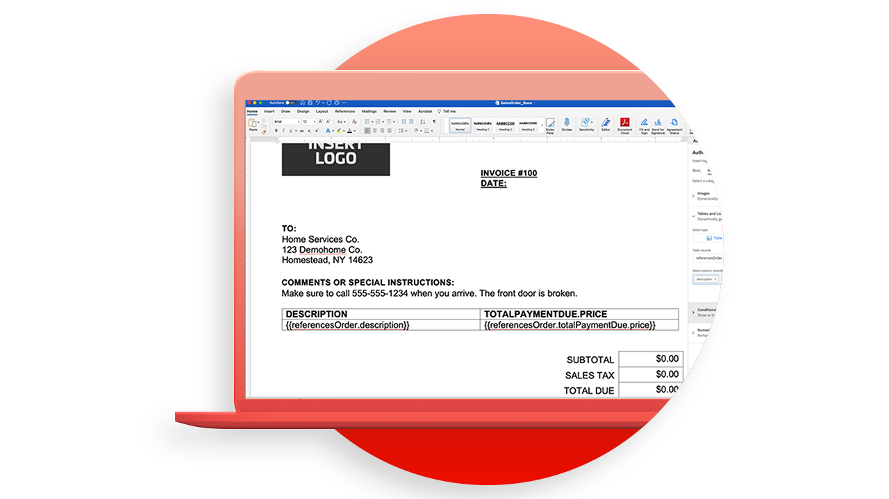

# [!DNL Adobe Acrobat Services] API-gebruiksscenario&#39;s

## Wat kunnen de [!DNL Adobe Acrobat Services] API&#39;s voor mij doen?

Leer hoe de [!DNL Adobe Acrobat Services] API&#39;s uw bedrijf kunnen veranderen met deze praktijkvoorbeelden.

### [!DNL Acrobat Services] API&#39;s

<table style="table-layout:fixed">
<tr>
  <td>
    
    

    <a href="automatelegalworkflows.md"><strong> automatiseer wettelijke werkschema's </strong></a>
    

    <em> Leer hoe te om juridische workflows met voorwaardelijke inhoud te automatiseren </em>
     
  </td>
  <td>
      
      

      <a href="employeeonboarding.md"><strong> Modernizing employee onboarding </strong></a>
      

      <em> Leer hoe te om werknemersonboarding te moderniseren </em>
       
  </td>
  <td>
      
      

      <a href="acceleratesales.md"><strong> versnelt uw verkoopproces </strong></a>
      

      <em> Leer hoe te om verkoop te versnellen door documentervaringen te integreren </em>
       
    </td>
    <td>
      
      

      <a href="sales.md"><strong> het leiden verkoopvoorstellen en contracten </strong></a>
      

      <em> Leer hoe te om een efficiënt werkschema te bouwen om verkoopvoorstellen te automatiseren en te vereenvoudigen </em>
       
    </td>
</tr>
<tr>
  <td>
    
    

    <a href="nda.md"><strong> Creërend een NDA </strong></a>
    

    <em> Leer hoe te om een dynamische PDF NDA voor samenwerking te creëren </em>
     
  </td>
  <td>
    
    

    <a href="legal.md"><strong> Beherend juridische contracten </strong></a>
    

    <em> Leer hoe te om juridische documenten met de input van douanegegevens automatisch te produceren en te beschermen </em>
     
  </td>
  <td>
    
    

    <a href="offer.md"><strong> het leiden brieven van de werknemersaanbieding </strong></a>
    

    <em> Leer hoe te om een aanbiedingsbrief te produceren die aan een nieuwe werknemer voor hun handtekening kan worden geleverd </em>
     
  </td>
  <td>
    
    

    <a href="searching.md"><strong> het zoeken en het indexeren </strong></a>
    

    <em> Leer hoe te om doorzoekbare PDF dossiers van gescande documenten te creëren </em>
     
  </td>
</tr>
<tr>
  <td>
    
    

    <a href="reviews.md"><strong> Recensies en goedkeuringen </strong></a>
    

    <em> Leer hoe te om een document overzicht en goedkeuringswerkschema voor cross-team samenwerking te bouwen </em>
     
  </td>
  <td>
    
    

    <a href="reportcreation.md"><strong> de verwezenlijking en het uitgeven van het Rapport </strong></a>
    

    <em> Leer hoe te om de rapporten van de PDF over uw website voor klanten te produceren </em>
     
  </td>
  <td>
    
    

    <a href="jobposting.md"><strong> het posten van de Baan </strong></a>
    

    <em> Leer hoe te om een vlotte en verenigbare Webervaring voor baanaanvragers en werkgevers te ontwikkelen </em>
     
  </td>
  <td>
    
    

    </strong></a> de samenwerking van 0} studenten-Leraar {<a href="educationcollab.md"><strong>
    

    <em> Leer hoe te om een online het leren platform te creëren dat leerkrachten en studenten toelaat om middelen in PDF gemakkelijk te delen </em>
     
  </td>
</tr>
<tr>
  <td>
    
    

    <a href="agreementworkflowsnodejs.md"><strong> werkschema's van de Overeenkomst in Node.js </strong></a>
    

    <em>[!DNL Adobe Acrobat Services] API's kunnen eenvoudig PDF-mogelijkheden opnemen in uw webtoepassingen </em>
     
  </td>
  <td>
    
    

    <a href="hragreementworkflowsjava.md"><strong> de documentworkflows van HR in Java </strong></a>
    

    <em>[!DNL Adobe Acrobat Services] API's kunnen eenvoudig PDF-mogelijkheden opnemen in uw HR-webtoepassingen </em>
     
  </td>
  <td>
    
    

    <a href="financeworkflowsjava.md"><strong> het leiden van financiële documentworkflows in Java </strong></a>
    

    <em>[!DNL Adobe Acrobat Services] verstrekt alle noodzakelijke hulpmiddelen, de diensten, en de eigenschappen om gegevens te verwerken en uit PDF financiële documenten te halen </em>
     
  </td>
  <td>
    
    

     
  </td>
</tr>
</table>

### Documentgeneratie-API&#39;s

<table style="table-layout:fixed">
<tr>
  <td>
    
    

    <a href="invoices.md"><strong> Verhandelend facturen </strong></a>
    

    <em> Leer hoe te om automatisch te produceren, wachtwoord-beschermt, en klantfacturen te leveren </em>
     
  </td>
  <td>
    
    

     
  </td>
  <td>
    
    

     
  </td>
  <td>
    
    

     
  </td>
</tr>
</table>

### PDF Embed-API

<table style="table-layout:fixed">
<tr>
   <td>
    
    

    <a href="ddppdfembedapi.md"><strong> Digitaal document het publiceren </strong></a>
    

    <em> Leer hoe te om ingebedde documenten van de PDF binnen Web-pagina's te tonen gebruikend Adobe PDF Embed API </em>
     
  </td>
  <td>
    
    

     
  </td>
  <td>
    
    

     
  </td>
  <td>
    
    

     
  </td>
</tr>
</table>