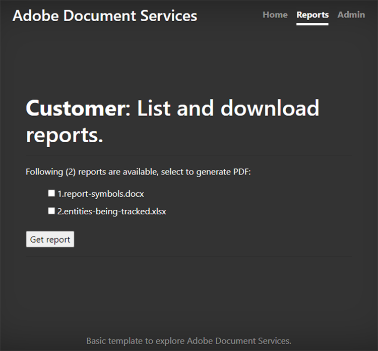

# Rapport maken en bewerken


Financiële, educatieve, marketing- en andere industrieën gebruiken PDF om data te delen met hun klanten en stakeholders. Met PDF kun je eenvoudig rijke documenten met tabellen, afbeeldingen en interactieve content delen in een indeling die iedereen kan bekijken. Met API&#39;s van [!DNL Adobe Acrobat Services] kunnen deze bedrijven deelbare PDF-rapporten genereren vanuit Microsoft Word, Microsoft Excel, afbeeldingen en andere verschillende documentindelingen.

Zeg u [ in werking stelt een sociaal media volgend bedrijf ](https://www.adobe.io/apis/documentcloud/dcsdk/on-demand-report-creation.html). Je klanten melden zich aan bij een met een wachtwoord beveiligd deel van je site om hun campagneanalytics te bekijken. Vaak willen ze deze statistieken delen met hun leidinggevenden, aandeelhouders, donoren of andere belanghebbenden. Downloadbare PDF-documenten zijn een fantastische manier voor je klanten om getallen, grafieken en meer te delen.

Door [ de Diensten API van de PDF ](https://www.adobe.io/apis/documentcloud/dcsdk/pdf-tools.html) in uw website op te nemen, kunt u PDF rapporten voor elke klant onderweg produceren. Je kunt PDF maken en deze vervolgens combineren in één handig rapport dat je klanten kunnen downloaden en doorgeven aan hun stakeholders.

## Wat je kunt leren

In deze praktische zelfstudie leert u hoe u PDF Services SDK kunt gebruiken in een Node.js- en Express.js-omgeving (met slechts enkele JavaScript-, HTML- en CSS-versies) om snel en eenvoudig PDF-georiënteerde functionaliteit toe te voegen aan een bestaande website. Deze website bevat een pagina waarop beheerders rapporten uploaden, een gebied waarin klanten een lijst met beschikbare rapporten weergeven en documenten selecteren die naar PDF moeten worden geconverteerd, en handige eindpunten om door het systeem gegenereerde PDF te downloaden.

## Relevante API&#39;s en bronnen

* [ de Diensten API van de PDF ](https://opensource.adobe.com/pdftools-sdk-docs/release/latest/index.html)

* [ PDF bedt API ](https://www.adobe.com/devnet-docs/dcsdk_io/viewSDK/index.html) in

## Campaign meldt het dashboard voor klanten

>[!NOTE]
>
>Deze zelfstudie gaat niet over de aanbevolen procedures voor Node.js of over het beveiligen van uw webtoepassingen. Sommige gebieden van de website zijn openbaar en documentnaamgeving is mogelijk niet productievriendelijk. Neem contact op met uw architecten en ingenieurs om te bespreken hoe u een systeem als dit het best kunt ontwerpen.

Hier hebt u een basistoepassing Express.js die een gebied van klantenrapporten en een beheerdersectie heeft. Deze toepassing kan rapporten weergeven voor social-mediacampagnes. Zo kunt u bijvoorbeeld zien hoe vaak op een advertentie wordt geklikt.

 te krijgen

U kunt dit project van de [ bewaarplaats GitHub ](https://github.com/afzaal-ahmad-zeeshan/express-adobe-pdf-tools) downloaden.

Laten we nu onderzoeken hoe we de rapporten publiceren.

## Rapporten uploaden

Om het eenvoudig te houden, gebruik je hier alleen het uploaden en verwerken van bestanden op basis van het systeem. In Express.js kunt u de fs-module gebruiken om alle beschikbare bestanden in een directory weer te geven.

Schakel op dezelfde pagina de beheerder in om rapportbestanden naar de server te uploaden, zodat klanten deze kunnen zien. Deze dossiers kunnen in vele verschillende formaten, zoals Microsoft Word, Microsoft Excel, HTML, en [ andere gegevensformaten ](https://opensource.adobe.com/pdftools-sdk-docs/release/latest/howtos.html#create-a-pdf) met inbegrip van grafiekdossiers zijn. De beheerpagina ziet er als volgt uit:


>[!NOTE]
>
>Beveilig uw URL&#39;s met een wachtwoord of gebruik het paspoortpakket vanuit npm om uw toepassing achter de verificatie- en machtigingslaag te beveiligen.

Wanneer de beheerder een bestand selecteert en uploadt, wordt het verplaatst naar een openbare opslagplaats waar andere personen het kunnen openen. U gebruikt dezelfde repository om documenten van de beheerpagina te publiceren en de beschikbare marketingrapporten voor klanten weer te geven. Deze code is:

```
router.get('/', (req, res) => {
try {
let files = fs.readdirSync('./public/documents/raw') // read the files
res.status(200).render("reports", { page: 'reports', files: files });
} catch (error) {
res.status(500).render("crash", { error: error });
}
});
```

Deze code geeft een overzicht van alle bestanden en geeft een weergave van de bestandslijst weer.

## Rapporten selecteren

Aan de gebruikerszijde hebt u een formulier waarmee klanten de documenten kunnen selecteren die ze in hun campagnerapport voor sociale media willen opnemen. Voor het gemak geeft u op de voorbeeldpagina alleen de documentnaam en een selectievakje weer om het document te selecteren. Klanten kunnen één of meerdere rapporten selecteren om te combineren in één PDF-document.

Voor een geavanceerdere gebruikersinterface kunt u hier ook een voorvertoning van het rapport weergeven.



## Een PDF-rapport genereren

Gebruik de PDF Services SDK om de PDF-rapporten te maken op basis van uw gegevensinvoer. De gegevens (zoals weergegeven in de bovenstaande schermafbeeldingen) kunnen afkomstig zijn van verschillende gegevensindelingen, zoals Microsoft Word, Microsoft Excel, HTML, afbeeldingen en meer. Installeer eerst het npm-pakket voor PDF Services SDK.

```
$ npm install --save @adobe/documentservices-pdftools-node-sdk
```

Alvorens te beginnen, moet u API geloofsbrieven hebben, [ vrij van Adobe ](https://opensource.adobe.com/pdftools-sdk-docs/release/latest/index.html#getcred). Gebruik uw [!DNL Acrobat Services] rekening [ vrij voor zes maanden dan betaal-als-u-gaat ](https://www.adobe.io/apis/documentcloud/dcsdk/pdf-pricing.html) voor enkel \$0.05 per documenttransactie.

Download het archiefbestand en extraheer het JSON-bestand voor referenties en de persoonlijke sleutel. In het voorbeeldproject plaatst u het bestand in de map src.


Nu u de aanmeldingsgegevens hebt ingesteld, kunt u de conversietaak PDF schrijven. Voor deze demonstratie moet u twee bewerkingen uitvoeren in de toepassing:

* Raw-documenten omzetten in PDF-bestanden

* Meerdere PDF-bestanden combineren in één rapport

De algemene procedure is vergelijkbaar voor het uitvoeren van elke bewerking. Het enige verschil is de service die u gebruikt. In de volgende code zet u het Raw-document om in een PDF-bestand:

```
async function createPdf(rawFile, outputPdf) {
try {
// configurations
const credentials = adobe.Credentials
.serviceAccountCredentialsBuilder()
.fromFile("./src/pdftools-api-credentials.json")
.build();
// Capture the credential from app and show create the context
const executionContext = adobe.ExecutionContext.create(credentials),
operation = adobe.CreatePDF.Operation.createNew();
// Pass the content as input (stream)
const input = adobe.FileRef.createFromLocalFile(rawFile);
operation.setInput(input);
// Async create the PDF
let result = await operation.execute(executionContext);
await result.saveAsFile(outputPdf);
} catch (err) {
console.log('Exception encountered while executing operation', err);
}
}
```

In de bovenstaande code leest u de referenties en maakt u de uitvoeringscontext. PDF Services SDK vereist de uitvoeringscontext om uw verzoeken te verifiëren.

Vervolgens voert u de bewerking PDF maken uit, waarmee u de Raw-documenten omzet in de PDF-indeling. Tot slot gebruikt u de parameter `outputPdf` om het rapport PDF te kopiëren. In het codevoorbeeld vindt u deze code onder het bestand src/helpers/pdf.js. Verderop in deze zelfstudie importeert u de module PDF en roept u deze methode aan.

Zoals in de vorige sectie is aangetoond, kunnen uw klanten naar de volgende pagina gaan om de rapporten te selecteren die zij in PDF willen omzetten:


Wanneer een klant een of meer van deze rapporten selecteert, maakt u het PDF-bestand.

Laten we eerst één PDF-bestand bekijken in actie. Wanneer de gebruiker één rapport selecteert, hoeft u het alleen maar om te zetten in PDF en de downloadkoppeling op te geven.

```
try {
console.log(`[INFO] generating the report...`);
await pdf.createPdf(`./public/documents/raw/${reports}`, `./public/documents/processed/output.pdf`);
console.log(`[INFO] sending the report...`);
res.status(200).render("download", { page: 'reports', filename: 'output.pdf' });
} catch(error) {
console.log(`[ERROR] ${JSON.stringify(error)}`);
res.status(500).render("crash", { error: error });
}
```

Deze code maakt een rapport en deelt de download-URL met de klant. Hier is de uitvoerwebpagina:


Hier is de uitvoer PDF:


Klanten kunnen meerdere bestanden selecteren om een gecombineerd rapport te genereren. Wanneer de klant meer dan één document selecteert, voert u twee bewerkingen uit: de eerste maakt een gedeeltelijke PDF voor elk document en de tweede combineert deze in één PDF-rapport.

```
async function combinePdf(pdfs, outputPdf) {
try {
// configurations
const credentials = adobe.Credentials
.serviceAccountCredentialsBuilder()
.fromFile("./src/pdftools-api-credentials.json")
.build();
// Capture the credential from app and show create the context
const executionContext = adobe.ExecutionContext.create(credentials),
operation = adobe.CombineFiles.Operation.createNew();
// Pass the PDF content as input (stream)
for (let pdf of pdfs) {
const source = adobe.FileRef.createFromLocalFile(pdf);
operation.addInput(source);
}
// Async create the PDF
let result = await operation.execute(executionContext);
await result.saveAsFile(outputPdf);
} catch (err) {
console.log('Exception encountered while executing operation', err);
}
}
```

Deze methode is beschikbaar onder het bestand src/helpers/pdf.js en wordt weergegeven als onderdeel van de module-export.

```
try {
console.log(`[INFO] creating a batch report...`);
// Create a batch report and send it back
let partials = [];
for (let index in reports) {
const name = `partial-${index}-${reports[index]}`;
await pdf.createPdf(`./public/documents/raw/${reports[index]}`, `./public/documents/processed/${name}`);
partials.push(`./public/documents/processed/${name.replace('docx', 'pdf').replace('xlsx', 'pdf')}`);
}
await pdf.combinePdf(partials, `./public/documents/processed/output.pdf`);
console.log(`[INFO] sending the combined report...`);
res.status(200).render("download", { page: 'reports', filename: 'output.pdf' });
} catch(error) {
console.log(`[ERROR] ${JSON.stringify(error)}`);
res.status(500).render("crash", { error: error });
}
```

Deze code genereert een gecompileerd rapport voor meerdere invoerdocumenten. De enige toegevoegde functie is de `combinePdf` -methode die een lijst maakt met padnamen voor PDF-bestanden en één uitvoerpad-PDF retourneert.

Je klanten van het dashboard voor social media kunnen nu relevante rapporten van hun account selecteren en deze downloaden als één handige PDF. Met dit dashboard kunnen ze het management en andere stakeholders laten zien, het succes van hun campagnes met data, tabellen en grafieken in een universeel, eenvoudig te openen indeling.

## Volgende stappen

Deze hands=on tutorial ging door hoe te om PDF Services API te gebruiken om klanten te helpen relevante rapporten als makkelijk te delen PDF downloaden. U hebt een Node.js-toepassing gemaakt om de kracht van de PDF Services-API voor PDF-rapportage en -leesservices weer te geven. De toepassing laat zien hoe uw klanten één rapportdocument downloaden of meerdere documenten combineren en samenvoegen tot één PDF-rapport.

Deze Adobe-aangedreven toepassing helpt uw [ klanten van het sociale media dashboard ](https://www.adobe.io/apis/documentcloud/dcsdk/on-demand-report-creation.html) en deelt de rapporten die zij hebben nodig, zonder zich het zorgen te maken als de ontvangers allemaal Microsoft Office of andere software hebben die op hun apparaat wordt geïnstalleerd. U kunt dezelfde technieken gebruiken in uw eigen toepassing om uw gebruikers te helpen documenten weer te geven, te combineren en te downloaden. Of bekijk de vele andere API’s van de Adobe om handtekeningen toe te voegen en bij te houden, en nog veel meer.

Om aan de slag te gaan, claimt u uw gratis [[!DNL Adobe Acrobat Services] ](https://www.adobe.io/apis/documentcloud/dcsdk/gettingstarted.html) -account en creëert u vervolgens aansprekende rapportage-ervaringen voor uw werknemers en klanten. Geniet van uw rekening voor zes maanden toen [ betaal-als-u-gaat ](https://www.adobe.io/apis/documentcloud/dcsdk/pdf-pricing.html) aangezien uw marketinginspanningen, enkel \$0.05 per documenttransactie uitbreiden.
