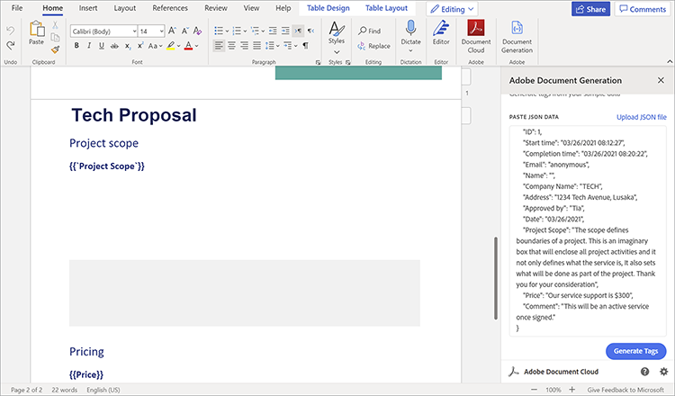
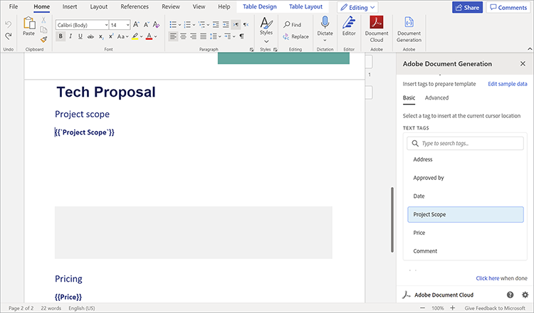

# Verkoopvoorstellen en contracten beheren


Verkoopvoorstellen vormen de eerste stap in het traject van een bedrijf naar klantenwerving. Net als bij alles, zijn de eerste impressies het laatst. Dus je eerste interactie met klanten stelt hun verwachtingen voor je bedrijf in. Uw voorstel moet beknopt, accuraat en handig zijn.

Contracten en voorstellen bevatten verschillende soorten gegevens binnen hun documentstructuur. Ze bevatten zowel dynamische gegevens (naam van de client, aantal aanhalingstekens, enzovoort) als statische gegevens (vaste tekst, zoals vaste mogelijkheden, teamprofielen en standaardvoorwaarden voor SOW). Het creëren van malplaatjedocumenten, zoals verkoopvoorstellen, impliceert vaak monotone taken, zoals manueel het vervangen van projectdetails in een boilerplate malplaatje. In dit leerprogramma, gebruikt u dynamische gegevens en workflows om een efficiënt proces te bouwen voor [&#x200B; het creëren van verkoopvoorstellen &#x200B;](https://developer.adobe.com/document-services/use-cases/agreements-and-contracts/sales-proposals-and-contracts).

## Wat je kunt leren

In deze praktische zelfstudie leert u hoe u dynamische gegevens en workflows kunt implementeren met behulp van verschillende gereedschappen, waarvan de belangrijkste [!DNL Adobe Acrobat Services] API&#39;s zijn. Deze API&#39;s worden gebruikt om verkoopvoorstellen en contracten voor jou en je bedrijf gemakkelijker te maken. Deze zelfstudie demonstreert praktische technieken voor het automatisch maken, samenvoegen en weergeven van PDF-documenten. Het handmatig uitvoeren van deze taken is tijdrovend en vervelend. Door gebruik te maken van [!DNL Acrobat Services] API&#39;s, kunt u de aan deze taken bestede tijd verkorten.

## Relevante API&#39;s en bronnen

* [&#x200B; Word van Microsoft &#x200B;](https://www.office.com/)

* [&#x200B; Node.js &#x200B;](https://nodejs.org/en/)

* [&#x200B; npm &#x200B;](https://www.npmjs.com/get-npm)

* [[!DNL Acrobat Services]  APIs &#x200B;](https://developer.adobe.com/document-services/homepage/)

* [&#x200B; de Generatie API van het Document van de Adobe &#x200B;](https://developer.adobe.com/document-services/apis/doc-generation)

* [&#x200B; Adobe Sign API &#x200B;](https://developer.adobe.com/adobesign-api/)

* [&#x200B; Tagger van de Generatie van het Document van de Adobe &#x200B;](https://opensource.adobe.com/pdftools-sdk-docs/docgen/latest/wordaddin.html#add-in-demo)

## Het probleem oplossen

Nu u de gereedschappen hebt geïnstalleerd, kunt u beginnen met het oplossen van het probleem. De voorstellen hebben zowel statische inhoud als dynamische inhoud die uniek is voor elke klant. Er treden knelpunten op omdat beide soorten gegevens noodzakelijk zijn telkens wanneer u een voorstel doet. Het is tijdrovend om de statische tekst in te voeren, zodat u deze gaat automatiseren en alleen handmatig met de dynamische gegevens van elke client gaat werken.

Eerst, creeer een vorm van de gegevensvangst in [&#x200B; Microsoft Forms &#x200B;](https://www.office.com/launch/forms?auth=1) (of uw aangewezen vormbouwer). Dit formulier is bedoeld voor de dynamische gegevens van klanten die worden toegevoegd aan een verkoopvoorstel. Vul dit formulier in met vragen om de benodigde gegevens van klanten op te halen, bijvoorbeeld bedrijfsnaam, datum, adres, projectbereik, prijzen en aanvullende opmerkingen. Om uw te bouwen, gebruik deze [ vorm ] (https://forms.office.com/Pages/ShareFormPage.aspx id=DQSIkWdsW0yxEjajBLZtrQAAAAAAAAAAAAAAAAAAAAAAAAAAAAAAAAAAAAAAAAAAAAAAAAAAAAAAAAAAAAAAAAAAAAAAA_G5UNEGj5UNEGJGj5UNEGJGJGJGJLTR0PLTR0PLLTR0pLCQCQCQCQ0GGGGGGG0pG2RC4u&amp;sharetoken=1AJeMavBAzzxuISRKmUy). Het doel is dat potentiële klanten het formulier invullen en vervolgens hun reacties exporteren als JSON-bestanden, die worden doorgegeven aan het volgende gedeelte van uw workflow.

In sommige formulierbuilders kunt u gegevens alleen exporteren als CSV-bestanden. Zo, zou u het nuttig kunnen vinden om [&#128279;](http://csvjson.com/csv2json) het geproduceerde dossier CSV in een JSON dossier om te zetten.

De statische gegevens worden opnieuw gebruikt in elk verkoopvoorstel. Zo, kunt u een malplaatje van het verkoopvoorstel in Microsoft Word gebruiken om de statische tekst te verstrekken. U kunt dit [&#x200B; malplaatje &#x200B;](https://1drv.ms/w/s!AiqaN2pp7giKkmhVu2_2pId9MiPa?e=oeqoQ2) gebruiken, maar u kunt uw tot stand brengen of een [&#x200B; malplaatje van de Adobe &#x200B;](https://developer.adobe.com/document-services/apis/doc-generation) gebruiken.

Nu, hebt u iets nodig dat zowel de dynamische gegevens van cliënten in het formaat JSON als de statische tekst in het malplaatje van Microsoft Word neemt om een uniek verkoopvoorstel voor een cliënt te maken. De [!DNL Acrobat Services] -API&#39;s worden gebruikt om de twee te verenigen en een PDF te genereren die kan worden ondertekend.

U kunt dit doen door tags te gebruiken. Tags zijn gebruiksvriendelijke tekenreeksen die getallen, woorden, arrays of zelfs complexe objecten kunnen vertegenwoordigen. Codes fungeren als plaatsaanduiding voor dynamische gegevens, in dit geval clientgegevens die in het formulier worden ingevoerd. Nadat u tags in de sjabloon hebt ingevoegd, kunt u formuliervelden uit het JSON-bestand toewijzen aan de Word-sjabloon.

## Tags gebruiken

Open uw malplaatje van het verkoopvoorstel en selecteer het **Tussenvoegsel** lusje. In de **toe:voegen-ins** groep, uitgezochte **krijgen toe:voegen-ins**. Dan, selecteer **toe:voegen-binnen de Generatie van het Document van 0&rbrace; Adobe om het toe te voegen.** Zodra toegevoegd, ziet u Tagger van de Generatie van het Document op het **Huis** lusje in de **Adobe** groep.

Op het **Begin** lusje in de **Adobe** groep, selecteer **de Generatie van het Document** om begonnen te worden het document etiketterend. Een nuttige demonstratievideo wordt weergegeven in een deelvenster aan de rechterkant van het venster.


Selecteer **worden begonnen**. U wordt vervolgens gevraagd voorbeeldgegevens te verstrekken. Plak het JSON-formulierreactiebestand in of upload het zoals hieronder weergegeven.



Selecteer **produceer Markeringen** om een lijst van gebieden van het JSON dossier te krijgen u plakte of uploadde. De tags worden hieronder weergegeven, in de rechterzijbalk.



Nadat u de codes hebt gegenereerd, kunt u deze in het document invoegen. Er worden codes aan het document toegevoegd op de locatie van de cursor. Zoals hierboven getoond, zou u de **markering van het Omvang van het Project** net onder de **het werkingsgebied van het Project** ondertitel moeten toevoegen. Deze manier, wanneer een cliënt het werkingsgebied van het project in de vorm ingaat, gaat hun reactie onder de **ondertitel van het Omvang van het Project**, die de markering vervangt u enkel toevoegde. Nadat u klaar bent met het toevoegen van codes, moet een deel van uw document er uitzien als de schermvastlegging hieronder.


## API&#39;s gebruiken

Ga naar de [!DNL Acrobat Services] APIs [&#x200B; homepage &#x200B;](https://developer.adobe.com/document-services/apis/doc-generation). Als u [!DNL Acrobat Services] API&#39;s wilt gaan gebruiken, hebt u aanmeldingsgegevens voor uw toepassing nodig. De rol neer al manier en selecteert **Proefversie van het Begin** om geloofsbrieven tot stand te brengen. U kunt deze diensten [&#x200B; gratis voor zes maanden gebruiken, dan betaal-als-u-gaat &#x200B;](https://developer.adobe.com/document-services/pricing/main) voor enkel $0.05 per documenttransactie, zodat betaalt u slechts voor wat u nodig hebt.

Selecteer **de Diensten API van de PDF** als uw dienst van keus en vul de andere details zoals hieronder getoond in.


Nadat u uw referenties hebt gemaakt, krijgt u enkele codevoorbeelden. Selecteer de voorkeurstaal (in deze zelfstudie wordt Node.js gebruikt). Uw API-referenties bevinden zich in een zip-bestand. Extraheer de bestanden naar PDFToolsSDK-Node.jsSamples.

Maak om te beginnen een lege map met de naam auto-doc\*\.\*\* Voer in de map de volgende opdracht uit om een Node.js-project te initialiseren: `npm init`. Noem uw project &quot;auto-doc&quot;*.*

In de map ./PDFToolsSDK-Node.jsSamples/adobe-dc-pdf-tools-sdk-node-samples, is er een bestand met de naam pdftools-api-credentials.json. Verplaats de map en private.key naar de map auto-doc. Deze bevat uw API-referenties. Maak in de map voor automatische documenten ook een submap met de naam &quot;resources&quot;. Het bevat de JSON-gegevens die van klanten worden ontvangen wanneer u een verkoopvoorstel genereert. Sla in dezelfde map de sjabloon voor het verkoopvoorstel op vanuit Microsoft Word.

Nu ben je klaar om wat magie te maken! Omdat u Node.js in deze zelfstudie gebruikt, moet u Node.js [!DNL Acrobat Services] SDK installeren. Voer hiertoe in de map auto-doc het garen @adobe/documentservices-pdftools-node-sdk toe.

Maak nu een bestand met de naam merge.js en plak de volgende code in het bestand.

```
javascript
const PDFToolsSdk = require('@adobe/documentservices-pdftools-node-sdk'),
fs = require('fs');
try {
// Initial setup, create credentials instance.
const credentials = PDFToolsSdk.Credentials
.serviceAccountCredentialsBuilder()
.fromFile("pdftools-api-credentials.json")
.build();
// Setup input data for the document merge process
const jsonString = fs.readFileSync('resources/Proposal.json'),
jsonDataForMerge = JSON.parse(jsonString);
// Create an ExecutionContext using credentials
const executionContext = PDFToolsSdk.ExecutionContext.create(credentials);
// Create a new DocumentMerge options instance
const documentMerge = PDFToolsSdk.DocumentMerge,
documentMergeOptions = documentMerge.options,
options = new documentMergeOptions.DocumentMergeOptions(jsonDataForMerge, documentMergeOptions.OutputFormat.PDF);
// Create a new operation instance using the options instance
const documentMergeOperation = documentMerge.Operation.createNew(options)
// Set operation input document template from a source file.
const input = PDFToolsSdk.FileRef.createFromLocalFile('resources/Proposal.docx');
documentMergeOperation.setInput(input);
// Execute the operation and Save the result to the specified location.
documentMergeOperation.execute(executionContext)
.then(result => result.saveAsFile('output/Proposal.pdf'))
.catch(err => {
if (err instanceof PDFToolsSdk.Error.ServiceApiError
|| err instanceof PDFToolsSdk.Error.ServiceUsageError) {
console.log('Exception encountered while executing operation', err);
} else {
console.log('Exception encountered while executing operation', err);
}
});
} catch (err) {
console.log('Exception encountered while executing operation', err);
}
```

Deze code haalt uw JSON-bestand op uit het Microsoft-formulier met behulp van de tags die u hebt gemaakt met [!DNL Acrobat Services] . Vervolgens worden de gegevens samengevoegd met de sjabloon voor het verkoopvoorstel die u in Microsoft Word hebt gemaakt om een gloednieuwe PDF te genereren. De PDF wordt opgeslagen in het nieuwe bestand./uitvoermap.

Ook, gebruikt de code [&#x200B; Adobe Sign API &#x200B;](https://developer.adobe.com/adobesign-api/) om beide bedrijven te hebben het geproduceerde verkoopvoorstel ondertekenen. Lees dit blogbericht voor een gedetailleerde uitleg van deze API.

## Volgende stappen

Je begon met een inefficiënt, vervelend proces dat automatisering nodig had. U ging van manueel het creëren van documenten voor elke cliënt aan het creëren van een gestroomlijnde werkschema om [&#x200B; het proces van het verkoopvoorstel te automatiseren en te vereenvoudigen &#x200B;](https://developer.adobe.com/document-services/use-cases/agreements-and-contracts/sales-proposals-and-contracts).

Met Microsoft Forms kreeg je kritieke data van je klanten die in hun unieke voorstellen zouden komen. U hebt een sjabloon voor een verkoopvoorstel gemaakt in Microsoft Word om de statische tekst op te geven die u niet telkens opnieuw wilt maken. Vervolgens hebt u [!DNL Acrobat Services] API&#39;s gebruikt om gegevens uit het formulier en de sjabloon samen te voegen om op een efficiëntere manier een PDF voor verkoopvoorstellen voor uw klanten te maken.

Deze praktische zelfstudie is slechts een glimp van wat er mogelijk is met deze API&#39;s. Ga naar de pagina met [[!DNL Adobe Acrobat Services] &#x200B;](https://www.adobe.io/apis/documentcloud/dcsdk/gettingstarted.html) API&#39;s voor meer oplossingen. Al deze tools zijn zes maanden gratis. Dan, betaal slechts $0.05 per documenttransactie op het [&#x200B; betaal-aangezien-u-gaat &#x200B;](https://developer.adobe.com/document-services/pricing/main) plan, zodat betaal u slechts aangezien uw team meer vooruitzichten aan uw verkooppijpleiding toevoegt.
