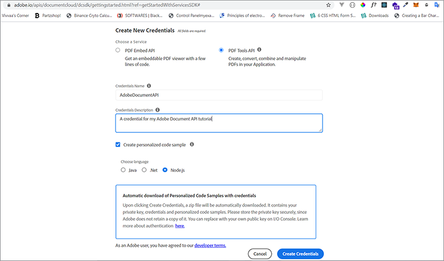

# Zoeken en indexeren


Organisaties moeten hun papieren documenten en gescande bestanden vaak digitaliseren. Overweeg dit [&#x200B; scenario &#x200B;](https://docs.google.com/document/d/11jZdVQAw-3fyE3Y-sIqFFTlZ4m02LsCC/edit). Een advocatenkantoor heeft duizenden juridische contracten die ze hebben gescand om digitale bestanden te maken. Zij willen bepalen of een van deze juridische overeenkomsten een bepaalde clausule bevat of een aanvulling vormt op de bepalingen die zij moeten herzien. Nauwkeurigheid is noodzakelijk voor nalevingsdoeleinden. De oplossing is het inventariseren van de digitale documenten, het doorzoeken van de tekst en het maken van een index om deze informatie te vinden.

De uitdaging om digitale archieven te creëren om informatie voor het uitgeven of stroomafwaartse verrichtingen terug te winnen is een nachtmerrie voor de meeste organisaties.

## Wat je kunt leren

In deze praktische zelfstudie wordt uitgelegd hoe de functies van [!DNL Adobe Acrobat Services] API&#39;s werken en eenvoudig kunnen worden gebruikt om documenten te archiveren en te digitaliseren. U verkent deze functies door een Express NodeJS-toepassing te maken en vervolgens [!DNL Acrobat Services] -API&#39;s te integreren voor archivering, digitalisering en documenttransformatie.

Om te volgen, hebt u [&#128279;](https://nodejs.org/) geïnstalleerd 0&rbrace; Node.js en een basisbegrip van Node.js en [&#x200B; ES6 syntaxis &#x200B;](https://www.w3schools.com/js/js_es6.asp) nodig.

## Relevante API&#39;s en bronnen

* [&#x200B; de Diensten API van de PDF &#x200B;](https://opensource.adobe.com/pdftools-sdk-docs/release/latest/index.html)

* [&#x200B; code van het Project &#x200B;](https://github.com/agavitalis/AdobeDocumentServicesAPIs.git)

## Projectinstelling

Stel eerst de mapstructuur voor de toepassing in. U kunt de broncode [&#x200B; hier terugwinnen &#x200B;](https://github.com/agavitalis/AdobeDocumentAPI.git).

## Directorystructuur

Maak een map met de naam AdobeDocumentServicesAPI&#39;s en open deze in een editor naar keuze. Maak een basisNodeJS-toepassing met de opdracht `npm init` aan de hand van deze mapstructuur:

```
AdobeDocumentServicesAPIs
config
default.json
controllers
createPDFController.js
makeOCRController.js
searchController.js
models
document.js
output
.gitkeep
routes
web.js
services
upload.js
views
index.hbs
ocr.hbs
search.hbs
index.js
```

U gebruikt MongoDB als een database voor deze toepassing. Daarom om te vormen, plaats uw standaardgegevensbestandconfiguraties in config/omslag, door het codefragment hieronder in het default.json dossier van deze omslag te kleven, dan voeg URL van uw gegevensbestand toe.

```
### config/default.json and config/dev.json
{ "DBHost": "YOUR_DB_URI" }
```

## Pakketinstallatie

Installeer nu enkele pakketten met de npm-installatieopdracht, zoals weergegeven in het codefragment hieronder:

```
{
    "name": "adobedocumentservicesapis",
    "version": "1.0.0",
    "description": "",
    "main": "index.js",
    "directories": {
    "test": "test"
    },
    "dependencies": {
    "body-parser": "^1.19.0",
    "config": "^3.3.6",
    "express": "^4.17.1",
    "hbs": "^4.1.1",
    "mongoose": "^5.12.1",
    "morgan": "^1.10.0",
    "multer": "^1.4.2",
    "path": "^0.12.7"
    },
    "devDependencies": {},
    "scripts": {
    "start": "set NODE_ENV=dev && node index.js"
    },
    "repository": {
    "type": "git",
    "url": "git+https://github.com/agavitalis/AdobeDocumentServicesAPIs.git"
    },
    "author": "Ogbonna Vitalis",
    "license": "ISC",
    "bugs": {
    "url": "https://github.com/agavitalis/AdobeDocumentServicesAPIs/issues"
    },
    "homepage": "https://github.com/agavitalis/AdobeDocumentServicesAPIs#readme"
}
```

```
###bash
npm install express mongoose config body-parser morgan multer hbs path pdf-parse
Ensure that the content of your package.json file is similar to this code snippet:
###package.json
{
```

Deze codefragmenten installeren de toepassingsgebiedsdelen, met inbegrip van de de sjabloonmotor van Handlebars voor de mening. In de scripttag configureert u de runtimeparameters van de toepassing.

## [!DNL Acrobat Services] API&#39;s integreren

[!DNL Acrobat Services] bevat drie API&#39;s:

* Adobe PDF Services API

* Adobe PDF Embed-API

* Adobe-API voor documentgeneratie

Deze API&#39;s automatiseren het genereren, manipuleren en transformeren van PDF-inhoud via een set cloudgebaseerde webservices.

Om de geloofsbrieven te krijgen moet u [&#x200B; registreren &#x200B;](https://www.adobe.com/go/dcsdks_credentials?ref=getStartedWithServicesSDK) en het werkschema voltooien. PDF Insluiter-API is gratis. De PDF Services API en de Document Generation API zijn zes maanden gratis. Wanneer uw proef beëindigt, kunt u [&#x200B; betalen-als-u-gaat &#x200B;](https://developer.adobe.com/document-services/pricing/main) bij slechts $0.05 per documenttransactie. Je betaalt alleen als je bedrijf groeit en meer contracten verwerkt.



Nadat u de aanmelding hebt voltooid, wordt er een codevoorbeeld gedownload naar uw pc met uw API-referenties. Extraheer dit codevoorbeeld en plaats de bestanden private.key en pdftools-api-credentials.json in de hoofdmap van uw toepassing.

Nu, installeer [&#x200B; PDF Services Node.js SDK &#x200B;](https://www.npmjs.com/package/@adobe/documentservices-pdftools-node-sdk) door het ` npm install --save @adobe/documentservices-pdftools-node-sdk ` bevel in werking te stellen gebruikend de terminal in de wortelfolder van de toepassing.

## Een PDF maken

[!DNL Acrobat Services] steunt de verwezenlijking van PDF van de documenten van Microsoft Office (Word, Excel, en PowerPoint) en andere [&#x200B; gesteunde dossierformaten &#x200B;](https://opensource.adobe.com/pdftools-sdk-docs/release/latest/howtos.html#create-a-pdf) zoals .txt, .rtf, .bmp, .jpg, .gif, .tiff, en .png.

Als u PDF-documenten wilt maken van de ondersteunde bestandsindelingen, gebruikt u dit formulier om de documenten te uploaden. U kunt tot de HTML en CSS dossiers voor de vorm op [&#x200B; GitHub &#x200B;](https://github.com/agavitalis/AdobeDocumentServicesAPIs.git) toegang hebben.


Voeg nu de volgende codefragmenten toe aan het bestand controllers/createPDFController.js. Met deze code wordt het document opgehaald en omgezet in een PDF.

De oorspronkelijke bestanden en het getransformeerde bestand worden opgeslagen in een map in uw toepassing.

```
const PDFToolsSdk = require('@adobe/documentservices-pdftools-node-sdk');
/*
* GET / route to show the createPDF form.
*/
function createPDF(req, res) {
//catch any response on the url
let response = req.query.response
res.render('index', { response })
}
/*
* POST /createPDF to create a new PDF File.
*/
function createPDFPost(req, res) {
let filePath = req.file.path;
let fileName = req.file.filename;
try {
// Initial setup, create credentials instance.
const credentials = PDFToolsSdk.Credentials
.serviceAccountCredentialsBuilder()
.fromFile("pdftools-api-credentials.json")
.build();
// Create an ExecutionContext using credentials and create a new operation
instance.
const executionContext = PDFToolsSdk.ExecutionContext.create(credentials),
createPdfOperation = PDFToolsSdk.CreatePDF.Operation.createNew();
// Set operation input from a source file.
const input = PDFToolsSdk.FileRef.createFromLocalFile(filePath);
createPdfOperation.setInput(input);
// Execute the operation and Save the result to the specified location.
createPdfOperation.execute(executionContext)
.then((result) => {
result.saveAsFile('output/createPDFFromDOCX.pdf')
//download the file
res.redirect('/?response=PDF Successfully created')
})
.catch(err => {
if (err instanceof PDFToolsSdk.Error.ServiceApiError
|| err instanceof PDFToolsSdk.Error.ServiceUsageError) {
console.log('Exception encountered while executing operation',
err);
} else {
console.log('Exception encountered while executing operation',
err);
}
});
} catch (err) {
console.log('Exception encountered while executing operation', err);
}
}
//export all the functions
module.exports = { createPDF, createPDFPost };
```

Dit codefragment vereist [&#x200B; PDF Services Node.js SDK &#x200B;](https://www.npmjs.com/package/@adobe/documentservices-pdftools-node-sdk). Gebruik de functies:

* createPDF, waarin het geüploade documentformulier wordt weergegeven

* createPDFPost, die het geüploade document omzet in een PDF

De getransformeerde PDF-documenten worden opgeslagen in de uitvoermap, terwijl het oorspronkelijke bestand wordt opgeslagen in de uploadmap.

## Tekstherkenning gebruiken

OCR (optische tekenherkenning) converteert afbeeldingen en gescande documenten naar doorzoekbare bestanden. U kunt API&#39;s, afbeeldingen en gescande documenten van [!DNL Acrobat Services] omzetten in doorzoekbare PDF. Nadat u een OCR-bewerking hebt uitgevoerd, kunt u het bestand bewerken en doorzoeken. U kunt de inhoud van het bestand opslaan in een gegevensopslagruimte voor indexering en andere toepassingen.

Herinneren dat het zoeken en indexeren van gescande documenten essentieel is voor veel organisaties waar bestandsbeheer en informatieverwerking essentieel zijn. De OCR-functie elimineert deze uitdagingen.

Om deze functie te implementeren, moet u een uploadformulier ontwerpen dat vergelijkbaar is met het bovenstaande. Dit keer beperkt u het formulier tot PDF-bestanden, aangezien u de OCR-functie alleen kunt gebruiken voor PDF-documenten.

Hier is het uploadformulier voor dit voorbeeld:


Als u nu de geüploade PDF wilt bewerken en enkele OCR-bewerkingen wilt uitvoeren, voegt u het codefragment hieronder toe aan het bestand controllers/makeOCRController.js. Deze code implementeert het OCR-proces op een geüpload bestand en slaat het bestand vervolgens op in het bestandssysteem van uw toepassing.

```
const fs = require('fs')
const pdf = require('pdf-parse');
const mongoose = require('mongoose');
const Document = require('../models/document');
const PDFToolsSdk = require('@adobe/documentservices-pdftools-node-sdk');
/*
* GET /makeOCR route to show the makeOCR form.
*/
function makeOCR(req, res) {
//catch any response on the url
let response = req.query.response
res.render('ocr', { response })
}
/*
* POST /makeOCRPost to create a new PDF File.
*/
function makeOCRPost(req, res) {
let filePath = req.file.path;
let fileName = req.file.filename;
try {
// Initial setup, create credentials instance.
const credentials = PDFToolsSdk.Credentials
.serviceAccountCredentialsBuilder()
.fromFile("pdftools-api-credentials.json")
.build();
// Create an ExecutionContext using credentials and create a new operation
instance.
const executionContext = PDFToolsSdk.ExecutionContext.create(credentials),
ocrOperation = PDFToolsSdk.OCR.Operation.createNew();
// Set operation input from a source file.
const input = PDFToolsSdk.FileRef.createFromLocalFile(filePath);
ocrOperation.setInput(input);
// Execute the operation and Save the result to the specified location.
ocrOperation.execute(executionContext)
.then(async (result) => {
let newFileName = `createPDFFromDOCX-${Math.random() * 171}.pdf`;
await result.saveAsFile(`output/${newFileName}`);
let documentContent = fs.readFileSync(
require("path").resolve("./") + `\\output\\${newFileName}`
);
pdf(documentContent)
.then(function (data) {
//Creates a new document
var newDocument = new Document({
documentName: fileName,
documentDescription: description,
documentContent: data.text,
url: require("path").resolve("./") + `\\output\\${newFileName}`
});
//Save it into the DB.
newDocument.save((err, docs) => {
if (err) {
res.send(err);
} else {
//If no errors, send it back to the client
res.redirect(
"/makeOCR?response=OCR Operation Successfully performed on
the PDF File"
);
}
});
})
.catch(function (error) {
// handle exceptions
console.log(error);
});
})
.catch(err => {
if (err instanceof PDFToolsSdk.Error.ServiceApiError
|| err instanceof PDFToolsSdk.Error.ServiceUsageError) {
console.log('Exception encountered while executing operation',
err);
} else {
console.log('Exception encountered while executing operation',
err);
}
});
} catch (err) {
console.log('Exception encountered while executing operation', err);
}
}
//export all the functions
module.exports = { makeOCR, makeOCRPost };
```

U hebt de SDK van [!DNL Acrobat Services] Node en de modules mongans, pdf-parse en fs en het schema van uw documentmodel nodig. Deze modules zijn nodig om de inhoud van het getransformeerde bestand op te slaan in een MongoDB-database.

Maak nu twee functies: maak OCR om het geüploade formulier weer te geven en maak vervolgens OCRPost om het geüploade document te verwerken. Sla het oorspronkelijke formulier op in een database en sla het getransformeerde formulier vervolgens op in de uitvoermap van uw toepassing.

De door de Adobe verschafte gegevens uit het bestand pdftools-api-credentials.json worden in elk geval geladen voordat het bestand wordt getransformeerd.

>[!NOTE]
>
>De OCR-functie ondersteunt alleen PDF-documenten.

Voeg ook het codefragment hieronder toe aan het bestand Modes/Document.js van uw toepassing.

Definieer in het codefragment een monomodel en beschrijf vervolgens de documenteigenschappen die in de database moeten worden opgeslagen. Indexeer ook het veld documentContent om het zoeken naar tekst eenvoudig en efficiënt te maken.

```
const mongoose = require("mongoose");
const Schema = mongoose.Schema;
//Document schema definition
var DocumentSchema = new Schema(
{
documentName: { type: String, required: false },
documentDescription: { type: String, required: false },
documentContent: { type: String, required: false },
url: { type: String, required: false },
status: {
type: String,
enum : ["active","inactive"],
default: "active"
}
},
{ timestamps: true }
);
//for text search
DocumentSchema.index({
documentContent: "text",
});
//Exports the DocumentSchema for use elsewhere.
module.exports = mongoose.model("document", DocumentSchema);
```

## Tekst zoeken

Nu implementeert u een eenvoudige zoekfunctie waarmee gebruikers eenvoudige tekstzoekopdrachten kunnen uitvoeren. U kunt ook downloadfuncties toevoegen om het downloaden van PDF-bestanden mogelijk te maken.

Voor deze functionaliteit zijn een eenvoudig formulier en eenvoudige kaarten nodig om het zoekresultaat weer te geven. U kunt de ontwerpen voor de vorm en de kaarten op [&#x200B; GitHub &#x200B;](https://github.com/agavitalis/AdobeDocumentServicesAPIs.git) vinden.

De onderstaande schermafbeelding illustreert de zoekfunctie en de zoekresultaten. U kunt alle zoekresultaten downloaden.


Als u de zoekfunctie wilt implementeren, maakt u een bestand searchController.js in de controllermap van uw toepassing en plakt u het onderstaande codefragment:

```
const fs = require('fs')
const mongoose = require('mongoose');
const Document = require('../models/document');
/*
* GET / route to show the search form.
*/
function search(req, res) {
//catch any response on the url
let response = req.query.response
res.render('search', { response })
}
/*
* POST /searchPost to search the contents of your saved file.
*/
function searchPost(req, res) {
let searchString = req.body.searchString;
Document.aggregate([
{ $match: { $text: { $search: searchString } } },
{ $sort: { score: { $meta: "textScore" } } },
])
.then(function (documents) {
res.render('search', { documents })
})
.catch(function (error) {
let response = error
res.render('search', { response })
});
}
//export all the functions
module.exports = { search, searchPost, downloadPDF };
```

Implementeer nu een downloadfunctie om het downloaden mogelijk te maken van de documenten die door de zoekopdracht van een gebruiker worden geretourneerd.

## Documenten downloaden

Het implementeren van een downloadfunctie is vergelijkbaar met wat u al hebt gedaan. Voeg het volgende codefragment toe na de functie searchPost in het bestand controllers/earchController.js:

```
/*
* POST /downloadPDF To Download PDF Documents.
*/
async function downloadPDF(req, res) {
console.log("here")
let documentId = req.params.documentId
let document = await Document.findOne({_id:documentId});
res.download(download.link);
}
```

## Volgende stappen

In deze praktische zelfstudie integreerde u [!DNL Acrobat Services] API&#39;s in een Node.js-toepassing en gebruikte u de API ook om een documenttransformatie te implementeren waarmee bestanden worden omgezet in PDF. U hebt een OCR-functie toegevoegd waarmee afbeeldingen en gescande bestanden doorzoekbaar zijn. Vervolgens hebt u de bestanden in een map opgeslagen zodat ze kunnen worden gedownload.

Vervolgens hebt u een zoekfunctie toegevoegd om de documenten die zijn geconverteerd naar tekst te doorzoeken op OCR. Tot slot hebt u een downloadfunctie geïmplementeerd waarmee u deze bestanden gemakkelijk kunt downloaden. Met uw voltooide toepassing kan een juridisch bedrijf veel gemakkelijker specifieke tekst zoeken en verwerken.

Het gebruik van [!DNL Acrobat Services] voor documenttransformatie wordt ten zeerste aanbevolen vanwege de robuustheid en gebruiksvriendelijkheid in vergelijking met andere services. U kunt snel een account maken waarmee u kunt profiteren van de functies van [!DNL Acrobat Services] API&#39;s voor documenttransformatie en -beheer.

Nu u een goed inzicht hebt in het gebruik van [!DNL Acrobat Services] API&#39;s, kunt u uw vaardigheden verder ontwikkelen met oefening. U kunt de opslagplaats klonen die in deze zelfstudie wordt gebruikt en experimenteren met enkele van de vaardigheden die u zojuist hebt geleerd. Nog beter, u kunt proberen om deze toepassing opnieuw op te bouwen terwijl u de onbeperkte mogelijkheden van [!DNL Acrobat Services] API&#39;s onderzoekt.

Klaar om het delen en reviseren van documenten in uw eigen app in te schakelen? Meld u aan voor uw [[!DNL Adobe Acrobat Services] &#x200B;](https://www.adobe.io/apis/documentcloud/dcsdk/gettingstarted.html)
ontwikkelaarsaccount. Geniet van een zes maanden vrije proef, dan [&#x200B; betaal-als-u-gaat &#x200B;](https://developer.adobe.com/document-services/pricing/main) voor enkel \$0.05 per documenttransactie aangezien uw zaken groeit.
